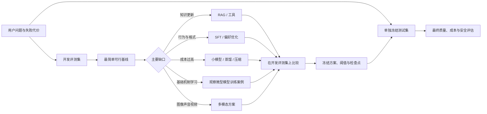

# 实际模型案例

路线说明：承接基础闭环和方法选择；本路线通过预设项目档案，从真实问题反推模型、数据、系统和评测。学习者审查决策和证据，不实际构建、训练或部署系统。

## 先决定要解决什么

一个完整项目不是 `准备数据 -> 开始训练`，而是：

## 项目类型与目的

| 项目 | 适合解决 | 推荐起点 | 不应承诺 |
|---|---|---|---|
| 微型模型训练案例 | 学懂训练机制、验证证据链 | 预生成 tiny-llm 记录与小语料摘要 | 获得通用聊天能力或生产质量 |
| 领域任务小模型 | 分类、抽取、路由、受限生成 | 小基座 + 开发评测集 + 单独冻结测试集 | 靠参数记住持续变化的全部事实 |
| 领域知识系统 | 私有文档、当前政策、有引用问答 | 检索基线 + 生成模型 | RAG 自动保证资料和答案正确 |
| 多模态任务系统 | 图片、语音、文档、视频中的感知与生成 | 现成编码器或多模态基座 | 一个总分代表所有模态能力 |

## 项目案例

### 案例 A：工单路由基线

目标是把工单分到固定类别，并识别“信息不足”。当前案例先比较关键词规则、Embedding 检索加固定模板、现成模型加 3 条示例；只有这些基线不足时，才进入训练或微调。验收重点是总准确率、高代价类别召回、P95 端到端延迟和权限边界，而不是回答是否像聊天机器人。

### 案例 B：带引用的私有文档问答

目标是回答组织内部文档问题，并精确指出证据。系统由文档解析、切分、检索、重排、上下文组装、生成、引用核验和权限检查组成。分别评测检索是否找到证据、回答是否使用证据、无证据时是否拒答。

### 案例 C：教师到学生的低成本助手

先在开发评测集上确认较强教师有效，再选择可部署学生。比较原始学生、回答蒸馏、logit/特征蒸馏（可获得时）、量化和最终服务版本；方案冻结后，再用单独测试集检查质量、延迟、吞吐、显存和成本。

## 案例目录

1. [问题合同与两套评测集](01-问题合同与冻结验收集.md)：先定义用户问题、失败代价，并分开开发评测与最终测试证据。
2. [基线阶梯与方法选择](02-基线阶梯与方法选择.md)：从普通程序逐级比较到训练和蒸馏。
3. [数据、模型与系统联合设计](03-数据模型系统联合设计.md)：画出接口、版本和失败责任层。
4. [质量、性能与安全验收](04-质量性能与安全验收.md)：建立三条同时成立的上线条件。
5. [项目提案、里程碑与复现](05-项目提案里程碑与复现.md)：审查正式项目过程中的证据缺口。

## 案例边界

- 从零训练项目用于理解机制，不应与商业通用模型进行不公平比较。
- 训练集、验证集和测试集若按同一文档或相邻时间泄漏，漂亮分数没有意义。
- 生成样例不能替代成批评测，平均分不能隐藏高代价类别的失败。
- 模型质量、应用系统质量和部署性能必须分开归因。
- 课程提供已经准备好的设计、日志和结果；学习者不运行训练、不调用服务，也不提交外部材料。

进入案例：[训练过程案例](../../02-第3周实战/)、[小模型与蒸馏](../小模型与蒸馏/)、[幻觉与可靠性](../幻觉与可靠性/)。
