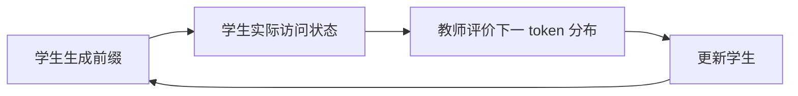

# 模型蒸馏

> **学习导航**：承接教师、学生、开发评测集和冻结测试集；本课区分回答、logit、特征与策略蒸馏，并用三个候选概率手算一次软目标损失；完成后应能选择教师提供什么信号、学生学习什么以及怎样防止复制错误。

## 先看最容易实现的回答蒸馏

教师读取一条售后对话并产生目标 JSON。经过格式校验、规则检查、去重和必要的人工复核后，这些输入输出对成为学生的 SFT 数据。

这类方法只需要看到教师回答，因此闭源 API 也可能使用，但必须遵守服务条款与数据许可。学生学到的是教师在这些输入上的输出行为，不会自动获得教师的全部能力。

## Logit 蒸馏多提供了什么

假设下一个 token 只有三个候选。教师给出：

```text
退款 0.70    咨询 0.20    投诉 0.10
```

学生当前给出：

```text
退款 0.45    咨询 0.35    投诉 0.20
```

只用硬标签时，学生只看到“退款是正确答案”。使用教师软分布时，学生还能看到教师认为“咨询”比“投诉”更接近当前样本。

把教师概率记为 $p_T$，学生概率记为 $p_S$，最简单的软目标交叉熵是：

```formula-story
{
  "ariaLabel": "每个候选的学生概率先取负对数形成惊讶度，再由教师对同一候选的概率加权，所有候选汇聚成蒸馏损失",
  "title": "教师决定每一项有多重要，学生概率决定这一项罚多重",
  "goal": "候选 i 必须对齐；-log pS 衡量学生对该候选的低概率代价，pT 再按教师分布分配权重。",
  "coversNext": 2,
  "pattern": "merge",
  "items": [
    { "label": "0.70×[-ln0.45]", "name": "退款项约 0.56", "detail": "教师最重视，学生概率仍偏低", "tone": "blue", "arrow": "计入总损失" },
    { "label": "0.20×[-ln0.35]", "name": "咨询项约 0.21", "detail": "保留次优候选的软关系", "tone": "orange", "arrow": "计入总损失" },
    { "label": "0.10×[-ln0.20]", "name": "投诉项约 0.16", "detail": "教师权重较小但不等于完全忽略", "tone": "rose", "arrow": "计入总损失" }
  ],
  "result": { "label": "L_KD≈0.93", "name": "教师软分布对学生的交叉熵", "detail": "固定教师时，最小化它等价于最小化 KL(pT||pS)", "tone": "green" },
  "example": { "label": "硬标签差异", "text": "硬标签只保留‘退款’，软目标还告诉学生咨询比投诉更接近教师偏好。" },
  "counterfactual": { "label": "拿掉 pT", "text": "三个候选被同等计罚，不再表达教师分布；若学生对教师非零项给 0，理论损失会发散。" },
  "boundary": "教师错误会被忠实加权；逐 token 对齐还要求兼容词表，实际方法常另加温度与真实标签 loss。"
}
```

$$
L_{KD}=-\sum_i p_T(i)\log p_S(i)
$$

这几项各自不可混用：$p_T(i)$ 是教师分给候选 $i$ 的权重，$p_S(i)$ 是学生给同一候选的概率，求和把所有对齐候选的代价合并。因为 $0<p_S(i)\le 1$ 时 $\log p_S(i)\le0$，前面的负号把“教师重视但学生概率低”变成较大的正损失。

| 删项或边界 | 直接后果 |
|---|---|
| 去掉 $p_T(i)$ | 各候选不再按教师分布加权，目标不再表达“像教师” |
| 去掉负号后仍最小化 | 目标失去下界：只要把某个 $p_T(i)>0$ 候选的 $p_S(i)$ 推近 0，该项就趋向负无穷，而不是逼近教师分布 |
| 某项 $p_T(i)>0$ 但 $p_S(i)=0$ | $\log0$ 使理论损失发散到正无穷；实现用 log-softmax 等稳定计算，不能靠事后随意加常数掩盖 |
| 教师把错误候选赋予高概率 | 公式会忠实传递这份错误权重；公式本身不会判断教师是否正确 |

代入三个具体候选，使用自然对数：

$$
L_{KD}\approx 0.70\times0.80+0.20\times1.05+0.10\times1.61=0.93
$$

在固定教师分布时，最小化该交叉熵等价于最小化 $\mathrm{KL}(p_T\|p_S)$，因为只依赖教师的熵项对学生参数是常数；这才是“更接近教师”的数学依据。实际方法常加入温度，并把蒸馏 loss 与真实标签 loss 加权；温度和权重必须通过验证集选择，不能把某组默认值当作普遍最优。

逐 token 对齐通常要求教师和学生拥有兼容的 tokenizer 与词表。若切分完全不同，“教师第 5 个 token”无法直接对应“学生第 5 个 token”，此时更适合先做回答级蒸馏，或使用专门的跨词表对齐方法。

## 四类蒸馏信号

| 类型 | 教师提供 | 所需访问 | 主要限制 |
|---|---|---|---|
| 回答蒸馏 | 最终文本、标签或 JSON | 只需输出 | 信息较少，容易复制教师错误 |
| Logit 蒸馏 | 全词表概率或 logits | 通常需模型内部输出 | 词表对齐、存储和计算成本高 |
| 特征蒸馏 | 隐藏状态、注意力或中间层 | 需访问内部张量 | 层数和维度不同时需要投影与配对规则 |
| 策略/推理蒸馏 | 搜索轨迹、验证结果、偏好或动作 | 需环境、判分器或轨迹 | 奖励漏洞和错误推理会一起进入数据 |

例如教师隐藏维度为 4096、学生为 1024 时，不能直接逐坐标相减。需要一个 `4096 -> 1024` 或反向的可训练投影，并说明比较的是哪一层、哪些位置和哪种归一化。

## 离策略与在策略：学生在哪些状态上学习

回答蒸馏通常先让教师生成固定答案，学生在这些教师轨迹上做 SFT。这属于离策略蒸馏：训练数据来自教师曾经走过的状态。它实现简单，但学生推理时会从自己的输出继续生成；一旦前面犯错，后续状态可能与训练轨迹越来越不同，这叫暴露偏差。

在策略蒸馏则让学生先生成自己的回答前缀，再请教师对这些学生真实访问的状态给出逐 token 分布或奖励：



它能把监督放到学生真正会遇到的错误附近，但代价更高，也不保证强教师一定有效。学生与教师的高概率 token 区域若严重错位，或教师没有提供学生未见的新能力，训练可能停滞甚至退化。

想继续研究这类失败机制，进入 [教师越强越好吗](../在策略蒸馏深读/01-教师越强越好吗.md)；第一次学习只需记住：蒸馏方式不仅由“教师给什么信号”决定，也由“这些信号在哪一方生成的状态上计算”决定。

## 教师数据不是天然真值

教师可能产生错误事实、错误推理、格式污染、过长解释和同一种偏见。数据管线至少要做：结构校验、可执行验证、去重、敏感信息处理、困难样本抽查和与测试集隔离。

有确定答案的任务优先使用规则或程序验证器；主观任务需要多人标准或明确 rubric。不能再用同一个教师兼任出题、生成答案和最终裁判，然后声称学生接近教师就是成功。

## 贯穿案例的预设对照

课程路线用四组汇总结果进行教学对照：未做当前任务训练的学生基线、只用人工标签的 SFT 学生、加入教师回答的蒸馏学生、教师本身；另以汇总记录说明 logit 蒸馏。这里不是可下载的训练产物或完整运行日志。

蒸馏成功的结论必须同时满足：学生相对原始基线有稳定提升；关键任务不低于质量底线；成本或延迟确实改善；失败没有集中转移到高风险样本。蒸馏不要求学生在所有能力上复制教师，也通常做不到无损复制。

## 方法边界

教师更大、分数更高或逐 token 信号更密，都不能单独保证学生学得更好。词表兼容、学生容量、数据覆盖、教师新增能力、学生访问状态和轨迹长度都可能限制可学习性；所有结论必须与原始学生、普通 SFT 和独立测试集比较。
