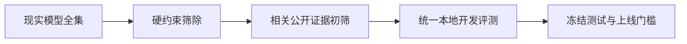

# 按应用场景建立候选池

> **学习导航**：承接证据梯度；本课不按厂商排总榜，而按语言、模态、系统边界、风险和资源建立候选池；完成后应能解释为什么同一模型会在一个场景入选、在另一个场景被硬约束淘汰。

## 本课目标

- 用硬约束、关键能力和系统代价三轮筛选候选。
- 为 RAG、代码、Agent、多模态、本地隐私和高风险任务选择不同评测重点。
- 把“更强模型”改写成“在指定合同下证据更合适的运行配置”。

## 为什么要学这一课

没有一个公共 benchmark 同时代表中文合同、仓库修复、视觉 OCR、工具权限、24 GB 显存和医疗拒答。把所有能力求平均会奖励“多数题略好”，却可能掩盖关键场景完全失败。正确做法是先按任务建候选池，再在池内比较。

## 三轮筛选

1. **硬约束**：模态、语言、许可证、数据出域、硬件、上下文和工具接口。违反即淘汰。
2. **相关证据**：只看与场景相近的任务切片、独立复测和可复现作者实验，形成 3–6 个候选。
3. **本地验收**：统一提示、harness、预算和系统版本，比较任务质量、尾延迟、成本、安全及失败样本。

候选池不宜无限扩大。若公开证据无法把 20 个模型缩到少数几个，应先补合同，而不是把所有模型都部署一遍。

## 场景一：中文知识与办公助手

优先检查中文指令、长文档、表格/图片输入、引用、结构化输出和拒答，而不是英文综合题平均分。Qwen3.5、GLM-4.7/5.2、DeepSeek V4 Flash、Kimi K3 等当前版本可按资源和许可进入候选池；是否入选仍取决于具体权重、托管边界和本地样本。

必须分桶：简短问答、政策细节、多文档冲突、信息不足、超长输入、敏感字段和格式约束。窗口能放下 1M token 不能替代证据定位、引用忠实度与延迟测量。

## 场景二：RAG 与企业搜索

不要一开始只比较生成模型。先验证：

| 层 | 优先指标 | 失败后先改什么 |
|---|---|---|
| Embedding 召回 | Recall@k、Hit@k、全部必要证据齐全率、语言/领域/长度切片 | 切分、查询改写、向量模型、索引 |
| Reranker | nDCG@k、MRR、关键证据进入上下文率 | 候选数、重排模型、截断策略 |
| 生成 | 答案正确、引用忠实、拒答 | 提示、证据组织、生成模型 |
| 端到端 | 任务成功、p95、成本、越权率 | 整条链共同定位 |

一个更大的生成模型无法找回检索阶段根本没有召回的文档。一个高召回检索器也不能保证回答真正使用证据。

## 场景三：代码补全与仓库 Agent

代码补全关注当前文件、语言和低延迟；仓库修复还依赖搜索、编辑、测试、依赖和长任务恢复。候选至少分两组：

- **单轮代码模型**：测 pass@1、编译/测试、补全延迟和安全规则。
- **代码 Agent 运行配置**：把模型与 harness、仓库 revision、工具、最大步数、重试、容器和时间预算一起测。

Qwen3.5、DeepSeek V4 Flash、GLM-5.2、Kimi K3、Mistral Small 4 和 gpt-oss 等可以依据官方接口形成候选；厂商报告的 Agent 表格若使用不同 harness 或超长输出预算，只能作为初筛证据。

## 场景四：视觉、文档与实时多模态

先确定真实输入：图片、扫描 PDF、视频、音频，还是 OCR 后的文本。原生图文模型不自动擅长小字、复杂表格、长视频或实时语音。候选应按子任务分层：

- 图片理解：物体、空间、图表、视觉事实与幻觉。
- 文档理解：OCR、版面、阅读顺序、表格、跨页引用。
- 音频：ASR、事件理解、说话人、噪声与流式延迟。
- 视频：抽帧策略、时间顺序、长程证据与成本。

Qwen3.5、Gemma 4、Ministral 3、Mistral Small 4、Kimi K3 等模型卡声明的模态不同，必须核对具体变体；对 OCR 或 ASR 有硬要求时，专用模型也应进入候选池。

## 场景五：本地、边缘与隐私

筛选顺序通常是：许可证和数据边界 → 权重/运行内存与 KV Cache → 目标精度支持 → 任务质量 → 并发与功耗。官方声称“16 GB 内存可运行”只说明某种权重和配置可能装得下，不说明你的上下文、并发和速度达标。

| 资源情形 | 候选策略 | 必须验证 |
|---|---|---|
| 手机/边缘 | 小型专用模型或小型多模态变体 | 峰值内存、热限制、首响应、离线能力 |
| 单张消费级 GPU | 8B–20B 级或低激活 MoE 的受支持量化 | 量化回归、KV Cache、并发、工具兼容 |
| 多卡工作站 | 中型稠密或较大稀疏模型 | 张量/专家并行通信和实际 goodput |
| 集群服务 | 超大 MoE、长上下文、路由组合 | 总拥有成本、故障恢复和版本治理 |

参数范围只是粗略导航，不是显存公式。总参数、激活参数、权重存储、运行激活和 KV Cache 必须分别核算。

## 场景六：高风险决策

医疗、金融、法律、人事、安全和儿童场景不能按综合平均分直接选型。至少需要：

- 关键类别的敏感度、特异度、误报和漏报代价；
- 人群、语言、设备、地区与时间切片；
- 置信度校准、拒答和人工升级规则；
- 隐私、权限、审计日志、红队与回滚；
- 专业人员定义的参考标准和责任边界。

此时模型可能只负责检索、草拟或风险提示，最终决策仍由规则或有资质的人完成。高榜单分数不能扩大模型被授权的职责。

## 一张场景候选卡

| 记录项 | 示例写法 |
|---|---|
| 硬约束 | 中文图文、本地部署、Apache-2.0/MIT 候选、24 GB 显存 |
| 关键能力 | 表格字段抽取、引用、JSON、证据不足时拒答 |
| 公开证据 | 官方模型卡 C 级；独立文档复测 B 级 |
| 待测切片 | 低清扫描、跨页表格、冲突政策、24K–64K 输入 |
| 系统预算 | 20 并发，端到端 p95 < 5 秒 |
| 淘汰规则 | 任一敏感字段外传；关键字段 Recall < 98% |

## 本课验收

1. 为什么企业 RAG 选型不能只比较聊天模型总分？
2. 同一个代码模型用于补全和仓库 Agent 时，评测配置有什么不同？
3. 模型卡写“支持图像”后，为什么仍需单独测 OCR、表格和空间关系？
4. 在高风险场景中，哪类红线应先于综合平均分？

## 方法边界

- 场景分类帮助选择指标，不能替代真实用户样本和专业责任审查。
- 同一组织内不同产品也可能需要不同候选池，不能共享一个永久冠军。
- 参数规模和官方内存示例只能用于初筛，不能替代目标引擎与负载测试。
- 专用组件增加系统复杂度，收益必须用端到端结果验证。

上一课：[判断榜单与结论有多可信](03-判断榜单与结论有多可信.md) · 下一课：[2026-08 开放权重模型现状](05-2026-08开放权重模型现状.md)
