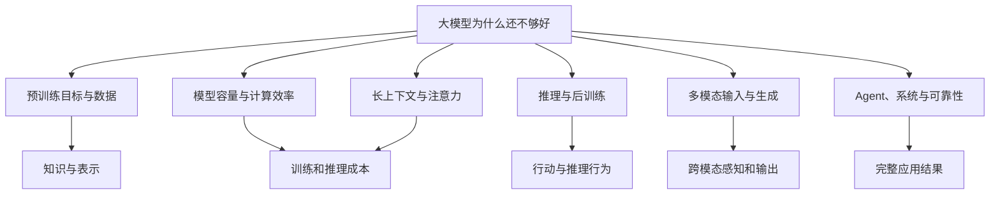

# 论文知识图谱

地图说明：本页按研究问题连接 GLM、Kimi、DeepSeek、Qwen 的代表论文；选择一个你关心的瓶颈，再进入对应的逐篇材料。

## 先建立全局图像

同一篇论文可以连接多个问题，但进入课程时先抓住一个主问题。这样才能区分“模型本身改变了什么”和“整个系统组合后表现如何”。

## 预训练目标与数据

**先看现象**：模型没有天生的“理解目标”。训练数据、遮挡方式、下一个 token 目标和多语言配比不同，会形成不同的能力与盲区。

推荐课件：

- [GLM：生成式预训练的空白填充](GLM深读/01-GLM预训练目标.md)
- [DeepSeek LLM：开放基座的训练账本](DeepSeek深读/01-DeepSeek-LLM基础模型.md)
- [Qwen：多语言通用基座起点](Qwen深读/01-Qwen基础模型.md)
- [GLM-130B：开放规模化训练](GLM深读/02-GLM-130B规模化.md)

比较时重点观察：模型预测什么、哪些位置可见、数据来自哪里、词表如何切分，以及评测是否真的覆盖目标语言和任务。

## 模型容量与计算效率

**先看现象**：总参数增大可以增加容量，但每个 token 访问多少参数、专家怎样分布、跨卡通信多少，才决定真实计算账本。

推荐课件：

- [DeepSeekMoE：专家如何专门化](DeepSeek深读/02-DeepSeekMoE专家路由.md)
- [DeepSeek-V2：MLA 与经济型 MoE](DeepSeek深读/03-DeepSeek-V2-MoE与MLA.md)
- [Kimi K2：原生 Agent 基座](Kimi深读/03-Kimi-K2原生Agent.md)
- [DeepSeek-V3：规模化训练系统](DeepSeek深读/04-DeepSeek-V3规模化训练.md)

比较时分开总参数、激活参数、FLOPs、显存、通信和吞吐。参数更多不等于每 token 一定更贵，也不等于能力必然更强。

## 长上下文与注意力

**先看现象**：上下文窗口写着 128K 或 1M，不代表模型能无损找到远处信息，也不代表服务速度可以接受。

推荐课件：

- [MoBA：可组合的块稀疏注意力](Kimi深读/02-MoBA稀疏注意力.md)
- [Kimi Linear：混合注意力](Kimi深读/04-Kimi-Linear混合注意力.md)
- [GLM-5：长任务与稀疏注意力](GLM深读/05-GLM-5长任务.md)
- [Kimi K3：KDA 与混合注意力](Kimi深读/06-Kimi-K3技术报告/02-KDA与混合注意力.md)

比较时追踪：每个 token 能访问哪些历史、状态存在哪里、KV Cache 怎样变化、稀疏选择可能漏掉什么。

## 推理与后训练

**先看现象**：更长的思考文字不等于更可靠的推理。真正的变化来自训练数据、奖励、验证器、搜索和推理预算的组合。

推荐课件：

- [Kimi k1.5：长思维链强化学习](Kimi深读/01-k1.5长思维链强化学习.md)
- [DeepSeek-R1：推理能力的强化学习](DeepSeek深读/05-DeepSeek-R1推理强化学习.md)
- [Qwen3：思考模式与推理后训练](Qwen深读/05-Qwen3思考模式与推理.md)
- [GLM-4.5：通用模型变成智能体](GLM深读/04-GLM-4.5智能体.md)
- [在策略蒸馏论文课程](../在策略蒸馏深读/)

比较时分清训练期 rollout 与推理期采样，并检查奖励是否真的能验证目标任务。

## 多模态输入与生成

**先看现象**：图像、音频和视频不能简单塞进文本词表。不同模态需要编码器、连接器、主干和输出头共同工作。

推荐课件：

- [Qwen2-VL：任意分辨率的视觉输入](Qwen深读/03-Qwen2-VL视觉编码.md)
- [Janus：理解与生成的视觉分工](DeepSeek深读/06-Janus统一视觉生成.md)
- [Kimi K2.5：原生多模态与 Agent Swarm](Kimi深读/05-Kimi-K2.5原生多模态.md)
- [Qwen2.5-Omni：端到端多模态交互](Qwen深读/06-Qwen2.5-Omni原生多模态.md)
- [Kimi K3：预训练、长上下文与原生多模态](Kimi深读/06-Kimi-K3技术报告/04-预训练长上下文与原生多模态.md)

比较时分别检查感知、对齐、推理和生成，不用一个总分掩盖 OCR、小字、音频延迟或视觉幻觉。

## Agent、系统与可靠性

**先看现象**：最终任务结果不只由模型权重决定。工具协议、上下文管理、重试、验证器、推理引擎、网络和硬件都会改变结果。

推荐课件：

- [ChatGLM：从基座到可用对话](GLM深读/03-ChatGLM对话对齐.md)
- [GLM-4.5：通用模型变成智能体](GLM深读/04-GLM-4.5智能体.md)
- [Kimi K2：原生 Agent 基座](Kimi深读/03-Kimi-K2原生Agent.md)
- [DeepSeek-V3：规模化训练系统](DeepSeek深读/04-DeepSeek-V3规模化训练.md)
- [Kimi K3：基础设施与评测](Kimi深读/06-Kimi-K3技术报告/06-基础设施与评测.md)

比较时把裸模型、带工具模型和完整应用分开；同时记录成功率、失败类型、延迟、成本和安全边界。

## 模型系列入口

如果你想理解一个团队怎样连续解决问题，可以进入：

- [GLM 系列演进](04-GLM系列演进.md)
- [Kimi 系列演进](05-Kimi系列演进.md)
- [DeepSeek 系列演进](06-DeepSeek系列演进.md)
- [Qwen 系列演进](07-Qwen系列演进.md)

系列名称只是纵向索引。真正可以迁移到其他模型的知识，是问题、机制、信息流、实验条件和失败边界之间的连接。
