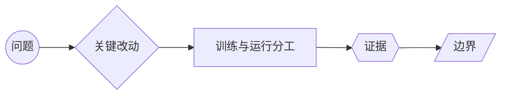

# 如何读懂一篇论文

论文阅读的目标不是把 PDF 读完，也不是把术语和实验表背下来。真正留下来的认知，应该能在合上页面后重新画出一条因果链：**现实中的失败 → 论文改动 → 模型如何处理 → 证据为何成立 → 什么时候会失效**。

## 先建立一张“认知骨架图”

每篇论文都先压缩成五个节点。节点不是摘要的小标题，而是之后遇到新模型时可以反复复用的思考顺序：

读完一篇后，五个节点应该分别能用一两句话说清：

| 节点 | 要问的问题 | 合格的记忆形式 |
|---|---|---|
| 问题 | 旧方法在哪个真实场景失败？ | 一个现象，而不是“性能不够”四个字 |
| 改动 | 论文具体改了信息流、目标、数据还是系统？ | 一个可以指给别人看的模块或步骤 |
| 分工 | 哪些能力在训练时写入权重，哪些只在推理时发生？ | 一组“训练期 / 运行期”对照 |
| 证据 | 哪个实验支持作者主张，条件是什么？ | 一个数字 + 数据集/预算/基线 |
| 边界 | 哪些场景没有被证明，或会付出什么代价？ | 一个反例或失效条件 |

单篇深读页顶部的五节点图会把这五件事固定在视线中。节点内容来自论文目录里的导读字段，正文仍然保留完整的解释、公式和证据账本。

## 三遍阅读法

### 第一遍：定位问题，不急着懂公式

先看标题、摘要、引言最后一段、第一张总览图和结论。只回答三句话：

1. 这篇论文要解决哪个具体失败？
2. 以前的方法为什么不够？
3. 作者声称改变了哪一层？

这一遍的产物只有一句“问题—改动”句子。例如：“长上下文的全注意力读写太贵，所以论文让每个 query 只访问一部分历史块。”如果还说不出这句话，不要继续抄公式。

### 第二遍：沿信息流走一遍

回到方法图和关键公式，按输入到输出的顺序追踪：数据怎样进入、在哪个模块改变、训练损失落在哪里、推理时还需要什么缓存或工具。遇到符号先写形状和角色，再读推导；不要把训练目标、参数更新和本次解码混成一件事。

这一遍应该能回答：

- 输入是什么，输出是什么，中间表示的形状怎样变化？
- 新模块替代了哪一条旧路径，保留了哪一条路径？
- 训练时改变了权重，还是只改变了推理时的选择/调度？

### 第三遍：只追证据和边界

把论文里的每个强结论改写成一张小证据卡：

| 主张 | 证据 | 成立条件 | 没有证明什么 |
|---|---|---|---|
| 方法降低了成本 | 对比表中的吞吐、显存或延迟 | 上下文长度、batch、精度、硬件 | 换负载后是否仍然更快 |
| 方法提高了能力 | 指定 benchmark 或人工评测 | 数据、提示、推理预算、工具 | 开放世界是否更可靠 |

优先读消融、基线、评测设置和限制，不要只读排行榜。论文报告的是“在这些条件下得到的结果”，不是脱离条件的模型性格。

## 推荐的课程顺序

论文区同时提供站内课件和原始论文，两个入口的职责不同：课件先把概念和视觉骨架搭起来，原文再用来核对方法、数字和限制。推荐这样走：

页面底部的“上一节/下一节”连接当前目录中的相邻文章；论文系列的推荐学习顺序仍以系列路线页为准。

1. 先从[论文知识图谱](02-跨系列问题地图.md)选择一个研究问题，不要随机点产品名。
2. 从[模型系列入口](./#模型系列入口)选择一条推荐路线，先读标为主线的第一篇，建立共同语言。
3. 在单篇课件顶部先看五节点图，再读正文；需要核对时点击“论文原文”打开 PDF 或官方报告。
4. 读完主线后，再回到[论文材料库与学习进度](01-论文库.md)，按同一研究问题比较分支论文。

四条主线的入口： [GLM](04-GLM系列演进.md)、[Kimi](05-Kimi系列演进.md)、[DeepSeek](06-DeepSeek系列演进.md)、[Qwen](07-Qwen系列演进.md)。系列页的“站内深读”进入课程，“论文原文”进入一手材料；不要把两种链接当成同一个页面。

## 让图像变成记忆

图不是把五段文字换成彩色框。它要承担三个记忆钩子：

- **位置钩子**：问题永远在最左，边界永远在最右，回忆时先找因果方向。
- **形状钩子**：改动、训练/运行、证据和边界使用不同形状，帮助区分“机制”“条件”和“结论”。
- **对比钩子**：至少保留一个旧路径与新路径的对照，以及一个支持结论的数字。

单篇页的“闭卷回放”会暂时隐藏当前节点的解释。先用自己的话复述，再逐个点击节点核对；五个节点全部核对后，回放时间只保存在当前浏览器，并提示下一次复习时间。这样做的目的不是增加一道题，而是让大脑从“识别答案”切换到“主动重建结构”。

建议在三个时间点回放同一张图：初读结束时、第二天、完成同系列下一篇后。每次只需 30 秒；如果五个节点能串成一句完整的话，才算真的把论文接入了知识图谱。

## 合上页面后的五个验收问题

1. 这篇论文解决的失败现象是什么？能否举一个具体输入或负载？
2. 它改变了哪一条信息流？旧路径还保留吗？
3. 哪些结果来自训练后的权重，哪些来自推理预算、工具或部署系统？
4. 论文最有说服力的数字是什么？它绑定了哪些条件？
5. 给出一个方法可能失效或收益消失的场景。

如果只能复述标题和结论，说明还停留在“看过”；如果能画出五节点图并说出一个边界，才开始形成可迁移的理解。
