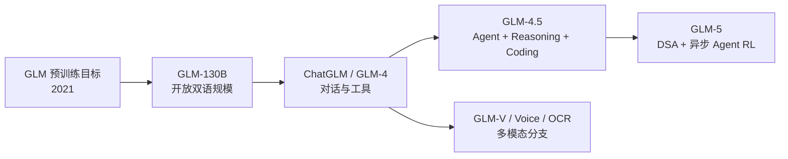

# GLM 系列选读地图

地图说明：本页是 GLM 论文深读的唯一系列总览，不把整个系列压成一篇文章。先按下方问题链定位，再进入逐篇深读。

> **怎么读**：路线页负责“为什么按这个顺序”，深读页负责“这一篇到底做了什么”。推荐从 [GLM：生成式预训练的空白填充](GLM深读/01-GLM预训练目标.md) 开始；GLM-V、Voice、OCR 等分支先留在[论文库](01-论文库.md)查阅。

## 为什么先读 GLM

GLM 系列展示了同一条问题链怎样从预训练目标，延伸到双语基座、对话、工具、推理和多模态。下面是学习顺序，不代表各代单线继承，也不把能力变化归因于一个机制。GLM-5 的 Agent 表现来自模型、后训练、环境和服务的共同作用。

## 推荐路线

| 顺序 | 站内深读 | 论文原文 | 观察点 |
|---:|---|---|---|
| 1 | [GLM](GLM深读/01-GLM预训练目标.md) | [arXiv 2103.10360](https://arxiv.org/abs/2103.10360) | 自回归空白填充怎样同时利用双向上下文？ |
| 2 | [GLM-130B](GLM深读/02-GLM-130B规模化.md) | [arXiv 2210.02414](https://arxiv.org/abs/2210.02414) | 开放双语规模化训练的稳定性和并行账本是什么？ |
| 3 | [ChatGLM 家族](GLM深读/03-ChatGLM对话对齐.md) | [arXiv 2406.12793](https://arxiv.org/abs/2406.12793) | 对话后训练、工具调用和版本家族如何连接？ |
| 4 | [GLM-4.5](GLM深读/04-GLM-4.5智能体.md) | [arXiv 2508.06471](https://arxiv.org/abs/2508.06471) | Agent、推理和代码能力的训练与评测是否被分开？ |
| 5 | [GLM-5](GLM深读/05-GLM-5长任务.md) | [arXiv 2602.15763](https://arxiv.org/abs/2602.15763) | 稀疏注意力、异步 RL 和软件工程长任务如何共同工作？ |
| 6 | 分支选读 | [GLM-4.5V](https://arxiv.org/abs/2507.01006) · [GLM-4-Voice](https://arxiv.org/abs/2412.02612) | 多模态分支怎样改变输入、输出和评测？ |

## 三个核心连接

### 1. 从“空白填充”到“下一 token”不是简单换公式

原始 GLM 把生成式目标与双向上下文结合，但后续版本未必沿用完全相同的目标。阅读时画出训练样本、可见位置、预测位置和损失范围，再到 D08 对照 token、位置编码与标签。

### 2. Agent 能力不是模型分数的同义词

GLM-4.5/5 把 Agent、推理和代码放在一起报告。证据卡必须分开：裸模型回答、带思考预算的模型、带工具的 harness、完整软件工程任务。一个模型在 SWE 任务上更强，可能来自更好的轨迹数据、工具循环、上下文压缩或更高预算，不能只归因给参数量。

### 3. 稀疏注意力解决的是计算路径，不是事实性

GLM-5 的 DSA 与伴读论文 IndexCache 都关注长上下文访问效率，但 IndexCache 不是 GLM-5 的独立消融，也不证明已随产品部署。这些方法可降低计算或缓存成本，却不保证知识完整、证据可用、回答忠实或工具安全。

## 研读时要记录的数字

- 训练 token、上下文长度、激活参数和总参数分别是多少？
- DSA 的稀疏访问、索引复用和全注意力基线在什么长度上比较？
- 异步 RL 改变的是采样/训练的等待关系、训练稳定性，还是最终能力？
- Agent 评测是否包含真实工具、失败重试、长轨迹和成本？

## 反例

如果一个 GLM-5 部署在 4K 短请求、小 batch、强工具缓存的场景中，DSA 的长上下文优势可能不构成端到端收益；如果工具 API 本身占据 90% 延迟，优化 decode 内核也不会让用户体验按同样比例变快。

## 继续阅读

- 需要架构效率：进入[跨系列问题地图](02-跨系列问题地图.md)的路线 A。
- 需要 Agent 训练：先读[基座审计与任务边界](../模型后训练/01-基座审计与任务边界.md)和[生成为什么不保证事实](../幻觉与可靠性/01-生成为什么不保证事实.md)。
- 需要视觉或语音：进入[从模态到张量](../多模态基础/01-从模态到张量.md)，再读 GLM-V、GLM-4-Voice 和 GLM-OCR。
