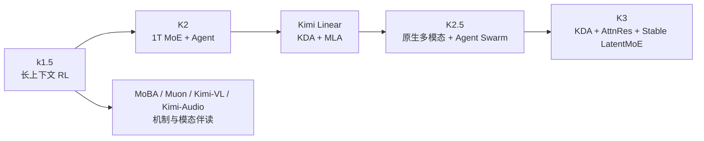

# Kimi 系列选读地图

地图说明：本页是 Kimi 论文深读的唯一系列总览；逐篇机制分析进入对应深读页。

> **怎么读**：先进入[Kimi k1.5：长思维链强化学习](Kimi深读/01-k1.5长思维链强化学习.md)，再读 MoBA、K2、Kimi Linear、K2.5 和[Kimi K3 技术报告](Kimi深读/06-Kimi-K3技术报告.md)。K3 仍是一篇论文，只是报告密度较高，因此在单篇课内继续拆成子课。

## 为什么先读 Kimi

Kimi 系列适合观察架构与训练怎样互相塑造，材料覆盖长上下文 RL、MoE、Muon、Agent、混合注意力和多模态。下面是阅读路线，不表示后一版本的变化由前一机制单独造成。不同材料类型也要分开核对证据。

## 推荐路线

| 顺序 | 站内深读 | 论文原文 | 观察点 |
|---:|---|---|---|
| 1 | [Kimi k1.5](Kimi深读/01-k1.5长思维链强化学习.md) | [arXiv 2501.12599](https://arxiv.org/abs/2501.12599) | 长 CoT、部分轨迹、策略优化和多模态 RL 怎样协同？ |
| 2 | [MoBA](Kimi深读/02-MoBA稀疏注意力.md) | [arXiv 2502.13189](https://arxiv.org/abs/2502.13189) | block 级稀疏注意力减少了什么，边界是什么？ |
| 3 | [Kimi K2](Kimi深读/03-Kimi-K2原生Agent.md) | [arXiv 2507.20534](https://arxiv.org/abs/2507.20534) | 1T MoE、MuonClip 和 Agent 后训练的组合证据如何拆分？ |
| 4 | [Kimi Linear](Kimi深读/04-Kimi-Linear混合注意力.md) | [arXiv 2510.26692](https://arxiv.org/abs/2510.26692) | KDA 与全局 MLA 的混合比例怎样影响质量和 TPOT？ |
| 5 | [Kimi K2.5](Kimi深读/05-Kimi-K2.5原生多模态.md) | [技术报告 PDF](https://github.com/MoonshotAI/Kimi-K2.5/blob/master/tech_report.pdf) | 视觉文本持续预训练和 Agent Swarm 是怎样的训练/系统问题？ |
| 6 | [Kimi K3](Kimi深读/06-Kimi-K3技术报告.md) | [arXiv 2607.24653](https://arxiv.org/abs/2607.24653) | 93 层、KDA/Gated MLA、LatentMoE 和 1M 上下文怎样串联？ |

按需伴读：[Attention Residuals](https://arxiv.org/abs/2603.15031)单独解释深度扩展为何需要新的跨层信息通路，可在 K3 的 AttnRes 子课前后阅读，不占主线编号。

## 三个核心连接

### 1. 固定状态不是“记住全部历史”

KDA 不逐 token 保存完整 KV 历史，而维护固定形状的递归状态。这可降低缓存和读写成本，也会产生压缩误差。K3 报告中的 `69 个 KDA 层 + 24 个 Gated MLA 层 = 93 层` 是该模型配置，不是 KDA 的通用比例；固定状态也不是全局注意力的无损替代。

### 2. 总参数和激活参数必须分开

K2 的 1T 是总参数，约 32B 是每 token 激活参数：这是同一模型的两种口径。K3 的数字必须单列，不能与 K2 拼接。比较 MoE 时，还要同时记录路由、共享专家、通信、显存、精度和上下文；参数量本身不能证明能力更强。

### 3. K2.5/K3 的“原生多模态”要沿接口看

“原生多模态”不等于所有模态共用文本词表。视觉输入可以是连续特征，也可以离散化；阅读时要标出编码器、视觉表示、连接方式、语言主干、训练阶段和输出头。图像、视频、工具和生成还需分别评测。

## 反例

在短上下文、低并发、没有 KDA 专用内核的环境中，Kimi Linear 的理论读写优势不一定成为端到端优势；在 Agent Swarm 中，如果子任务拆分造成重复上下文和协调等待，单次模型速度提升也可能被系统开销抵消。

## 深读案例

[Kimi K3 技术报告](Kimi深读/06-Kimi-K3技术报告.md)用一篇总览和若干子课拆解信息流、KDA、AttnRes、LatentMoE、预训练、多模态、后训练和评测。先完成前面的路线，再进入 K3，更容易看清哪些设计来自此前路线，哪些是新的组合证据。
