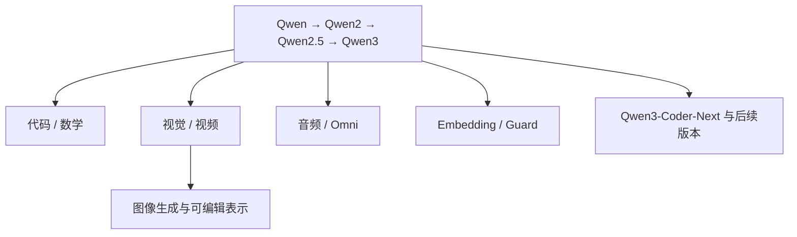

# Qwen 系列选读地图

地图说明：本页是 Qwen 论文深读的唯一系列总览；逐篇正文负责解释通用主干、视觉、代码、推理和 Omni 的接口差异。

> **怎么读**：先读 [Qwen：多语言通用基座起点](Qwen深读/01-Qwen基础模型.md)，再按通用、视觉、代码、推理、Omni 路线选读；音频、Embedding、Guard、图像生成仍在[论文库](01-论文库.md)中按证据等级维护。

## 为什么先读 Qwen

Qwen 展示了模型家族怎样分化：基础报告讲主干，专项报告讲代码、数学和检索，VL 与 Omni 讲跨模态，Qwen3Guard 讲安全判定，Qwen-Image 讲图像生成。这些只是阅读入口，不证明模型在所有任务上都有效。

## 推荐路线

| 顺序 | 站内深读 | 论文原文 | 观察点 |
|---:|---|---|---|
| 1 | [Qwen](Qwen深读/01-Qwen基础模型.md) | [arXiv 2309.16609](https://arxiv.org/abs/2309.16609) | 通用文本主干从哪里开始，词表、数据和规模怎样定义基线？ |
| 2 | [Qwen2.5](Qwen深读/02-Qwen2.5通用主干.md) | [arXiv 2412.15115](https://arxiv.org/abs/2412.15115) | “更好的模型”究竟是预训练还是后训练带来的？ |
| 3 | [Qwen2-VL](Qwen深读/03-Qwen2-VL视觉编码.md) | [arXiv 2409.12191](https://arxiv.org/abs/2409.12191) | 图像变成什么表示，为什么分辨率会改变成本？ |
| 4 | [Qwen2.5-Coder](Qwen深读/04-Qwen2.5-Coder代码模型.md) | [arXiv 2409.12186](https://arxiv.org/abs/2409.12186) | 专门化数据怎样提升代码，又可能损伤什么？ |
| 5 | [Qwen3](Qwen深读/05-Qwen3思考模式与推理.md) | [arXiv 2505.09388](https://arxiv.org/abs/2505.09388) | thinking/non-thinking 是什么层面的选择？ |
| 6 | [Qwen2.5-Omni](Qwen深读/06-Qwen2.5-Omni原生多模态.md) | [arXiv 2503.20215](https://arxiv.org/abs/2503.20215) | 文本、图像、音频和视频怎样进入同一交互闭环？ |

主线之外，可按研究问题选读：

- 代码与数学：[Qwen2.5-Math](https://arxiv.org/abs/2409.12122)、[Qwen3-Coder-Next](https://arxiv.org/abs/2603.00729)
- 视觉：[Qwen-VL](https://arxiv.org/abs/2308.12966)、[Qwen3-VL](https://arxiv.org/abs/2511.21631)
- 音频与全模态：[Qwen-Audio](https://arxiv.org/abs/2311.07919)、[Qwen3-Omni](https://arxiv.org/abs/2509.17765)
- 检索、安全与生成：[Qwen3 Embedding](https://arxiv.org/abs/2506.05176)、[Qwen3Guard](https://arxiv.org/abs/2510.14276)、[Qwen-Image](https://arxiv.org/abs/2508.02324)

其他材料见[论文材料库](01-论文库.md)。

## 三个核心连接

### 1. 词表不是多模态万能接口

Qwen 的文本主干使用文本 tokenizer；视觉、音频和视频可先变成连续特征，也可离散化，再经连接器或统一序列进入主干。阅读 VL 与 Omni 时，要分别画出输入、形状、对齐和输出头，不能预设它们共用文本词表。

### 2. thinking 与 non-thinking 是行为/推理预算的选择

Qwen3 的 thinking/non-thinking 是运行时模式选择，不是“模型随机变聪明”。它可能同时受后训练策略、提示格式、推理 token、解码和服务控制影响。评测必须记录模式、预算、是否使用工具和是否包含答案验证；否则不同模式的分数没有可比性。

### 3. 分支模型的评测任务不同

代码要看编译、测试和仓库级修改；数学要看答案与过程验证；视觉要看小字、布局和空间关系；音频要看噪声、口音和时间对齐；Embedding 要看检索召回与排序；Guard 要看误拒和漏放。一个 Qwen 总分不能代表所有分支。

## 版本空白也要记录

Qwen3.6 和 QwQ 目前只有官方仓库或博客，故标为“发布说明”；核查时也未找到可靠的 Qwen3.5 官方仓库或独立报告，因此暂不收录。正式一手材料出现后再更新。

## 反例

Qwen-VL 在图表问答上领先，不代表长文本、音频或检索也领先；Qwen3-Coder-Next 在仓库级 Agent 任务上变好，也不能推出基础文本能力全面提升。
