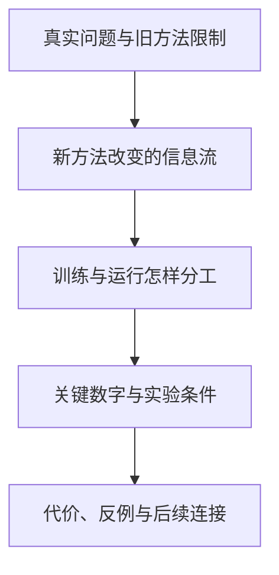

# 论文研读

学习导航：不知道论文名时，按研究问题找；已经关注某个模型家族时，按模型系列找；知道论文名时，直接在材料库搜索。选定系列后，侧栏会只显示该系列的路线、材料目录和逐篇课程。

## 从哪里进入

| 你的目标 | 入口 | 进入后会看到什么 |
|---|---|---|
| 第一次读论文，不知道怎么留下认知 | [如何读懂一篇论文](03-如何读懂一篇论文.md) | 三遍阅读法、五节点记忆图和闭卷回放 |
| 不知道该先学哪篇 | [论文知识图谱](02-跨系列问题地图.md) | 按研究问题连接代表论文 |
| 想查某个模型或主题 | [论文材料库与学习进度](01-论文库.md) | 可按系列、主题和材料类型筛选的目录 |
| 想看一个模型家族怎样演进 | [模型系列入口](#模型系列入口) | 系列路线、材料目录和逐篇课程 |
| 已经知道要读哪篇 | [论文材料库与学习进度](01-论文库.md) | 搜索材料并直接进入站内课程或原文 |

## 按研究问题学习

论文不是按产品发布时间才能理解。先选择瓶颈，再比较不同团队的回答：

- [预训练目标与数据](02-跨系列问题地图.md#预训练目标与数据)：模型最初在学什么，数据与目标怎样决定能力边界？
- [模型容量与计算效率](02-跨系列问题地图.md#模型容量与计算效率)：MoE、低精度和并行如何改变参数量与计算成本？
- [长上下文与注意力](02-跨系列问题地图.md#长上下文与注意力)：模型怎样减少历史访问、缓存和带宽压力？
- [推理与后训练](02-跨系列问题地图.md#推理与后训练)：奖励、验证器、蒸馏和推理预算怎样改变行为？
- [多模态输入与生成](02-跨系列问题地图.md#多模态输入与生成)：图像、音频和视频怎样进入模型，输出头又如何分工？
- [Agent、系统与可靠性](02-跨系列问题地图.md#agent、系统与可靠性)：模型、工具、调度、硬件和安全边界怎样组成完整系统？

## 模型系列入口

先进入一个系列的路线页，理解推荐顺序；需要查漏时打开材料目录；随后直接进入同一系列下的逐篇课程。侧边栏也按这个顺序展开，不再把“系列学习”和“单篇课件”拆成两套入口。

| 系列 | 从这里开始 | 观察重点 |
|---|---|---|
| GLM | [从空白填充到长任务 Agent](04-GLM系列演进.md) | 预训练目标、规模化、对话、Agent、稀疏注意力 |
| Kimi | [从长思维链到 K3](05-Kimi系列演进.md) | 强化学习、长上下文、MoE、Agent、多模态 |
| DeepSeek | [从开放基座到推理与视觉](06-DeepSeek系列演进.md) | MoE、MLA、训练系统、推理 RL、视觉生成 |
| Qwen | [从多语言基座到 Omni](07-Qwen系列演进.md) | 通用主干、代码、视觉、思考模式、实时多模态 |

系列路线页回答“为什么按这个顺序”，逐篇课程回答“这篇具体解决了什么”。材料目录还保留分支论文、模型卡和发布说明，但不会把它们伪装成主线课。进入系列后无需再判断“系列文章”和“单篇课件”的区别：它们都在同一份局部目录中。

## 每篇课程怎样学习

每篇课程都从一个真实困难开始，并在正文前先建立一张五节点认知图，然后依次建立：

五节点图不是摘要装饰，而是每次回放时的固定坐标。先看图，再读正文；读完后用“闭卷回放”从问题讲到边界，最后打开原文核对数字和限制。

论文库中的其他材料仍然可以查看原文和课程导读；发布说明、模型卡与仓库说明会明确标记，不会被伪装成完整论文。

## 跨系列专题

- [在策略蒸馏论文](../在策略蒸馏深读/)：沿教师能力、学生访问状态和长轨迹三个矛盾理解策略蒸馏。

Kimi K3 已归入[Kimi 单篇论文课](Kimi深读/06-Kimi-K3技术报告.md)。报告较长，所以在该论文内部继续展开子课，不再另设顶层专题入口。

## 完成一篇后

完成一篇论文课件，不要求下载代码或逐字读完整篇 PDF。你应该能闭卷回答：

1. 它试图解决什么真实失败，旧方法为什么不够？
2. 输入经过哪些模块，论文具体改变了哪一步？
3. 哪些变化在训练时写入权重，哪些只在本次运行时发生？
4. 哪个数字支持作者的结论，它在什么条件下成立？
5. 这个方法牺牲了什么，什么场景下可能失效？

接下来回到[论文知识图谱](02-跨系列问题地图.md)，把这篇论文连接到同一问题下的另一种方案。
