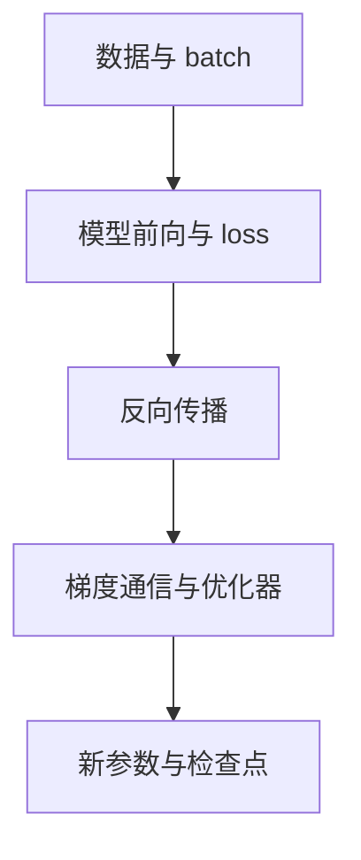
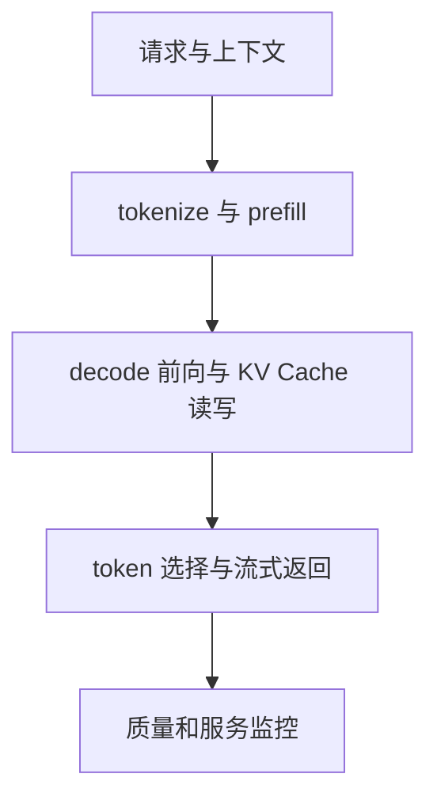

# AI Infra 全栈责任地图

> **学习导航**：承接 D07 的一次模型运行和 D10 的规模化训练；本课把应用与产品、模型算法、框架与算子、编译与运行时、训练与推理引擎、集群系统和硬件串成两条完整链；完成后应能从一个性能现象定位应该向哪一层要证据。

## 本课目标

- 画出一次推理请求和一次训练更新分别穿过哪些系统层。
- 用输入、动作、输出和指标描述每层责任。
- 避免把“GPU 利用率低”“模型很慢”直接归因到某个单一组件。

## 为什么要学这一课

同一个“慢”可能来自排队、分词、长 prompt、算子、显存带宽、KV Cache、通信、存储或故障恢复。没有全栈地图，初学者容易把问题都归给参数量，或误以为推理引擎决定答案质量。

## 两条不能混在一起的链

训练链把数据逐步变成新的参数与检查点：

推理链把静态参数逐步变成用户看到的输出：

训练产生的检查点会进入推理链；推理监控发现的失败样例又可以回到数据与评测流程。两条链相互连接，但一次普通推理不会现场更新参数。

训练链会更新参数，推理链通常不会。推理系统可以改变执行速度、批处理顺序和缓存方式，却不会凭空把新事实写进权重。

## 责任合同

| 层 | 输入 | 主要动作 | 输出与关键指标 |
|---|---|---|---|
| 应用与产品 | 用户请求、权限、SLO | 组装上下文、检索、工具、限流和流式返回 | 任务成功率、端到端延迟、错误与成本 |
| 模型算法 | token、隐藏状态、参数 | attention、MLP、MoE、量化或推测解码规则 | logits、FLOPs、激活与 KV 规模 |
| 框架与算子 | 张量和计算图 | 选择 kernel、自动求导、算子融合 | kernel 时间、图中断、数值正确性 |
| 编译与运行时 | 图、形状、设备资源 | 图编译、内存规划、kernel 启动和数据搬运 | 启动开销、峰值内存、CPU/GPU 等待 |
| 训练与推理引擎 | batch、请求、缓存、并行配置 | 调度、连续批处理、分页缓存、检查点 | TTFT、TPOT、吞吐、重算与 OOM |
| 集群系统 | 多卡任务、网络、存储 | 集合通信、拓扑放置、容错和恢复 | 通信占比、尾延迟、失败恢复时间 |
| 硬件 | kernel、张量和数据流 | 计算、HBM 读写、互联和存储 I/O | 峰值算力、带宽、容量、能耗与温度 |

每层都只能解释自己负责的部分。模型算法能说明理论计算量，却不能单独解释真实 P99；硬件标称算力能给出上限，却不能证明软件已经生成合适 kernel。

## 一个请求怎样穿过全栈

假设用户提交 4000-token 文档并要求生成 200 token 摘要：

1. 应用层校验权限、拼接文档和系统提示，并进入请求队列。
2. CPU 完成 tokenizer；推理引擎决定何时接纳请求。
3. prefill 处理 4000 个输入 token，建立各层 KV Cache，主要影响 TTFT。
4. 基础自回归路径中，decode 前向读取权重与历史 K/V、产生下一轮 logits；token 选择后通常接受 1 个 token，循环耗时主要影响 TPOT。
5. 调度器把它和其他请求组成动态 batch；长 prefill 可能干扰正在 decode 的请求。
6. 若模型跨卡，层内张量或专家 token 还要通信；拓扑不匹配会增加等待。
7. 应用层流式返回并记录是否满足 SLO，而不是只记录 GPU tokens/s。

## 同一现象的四种根因

| 现象：TTFT 变差 | 区分证据 | 重点排查层 |
|---|---|---|
| 请求到 GPU 前已经等待很久 | 队列时间、并发、限流记录 | 应用与产品 / 训练与推理引擎 |
| 输入突然变长 | prompt 长度分桶、prefill kernel 时间 | 应用与产品 / 模型算法 / 训练与推理引擎 |
| tokenizer 或检索耗时上升 | CPU profile、检索耗时、网络记录 | 应用与产品 / 训练与推理引擎 |
| 多卡 prefill 同步等待 | 通信时间、拓扑、最慢 rank | 集群系统 / 硬件 |

只看“GPU 利用率 60%”无法区分这四种原因。正确问题是：时间花在哪一段，哪一层持有什么可反驳证据？

## 预设案例观察

下面是一条 4,000-token 摘要请求的冻结时间线。各段时间不能简单相加成端到端延迟，因为通信可能与计算部分重叠：

| 时间段 | 耗时 | 观察证据 | 重点排查层 |
|---|---:|---|---|
| 接纳前排队 | 84 ms | GPU 尚未收到请求，队列深度为 11 | 应用与产品 / 训练与推理引擎 |
| tokenize | 12 ms | 单核 CPU 接近满载 | 应用与产品 / 训练与推理引擎 |
| prefill | 138 ms | GPU kernel 时间占主导 | 模型算法 / 框架与算子 / 硬件 |
| 多卡通信 | 26 ms | 最慢 rank 等待 9 ms | 集群系统 / 硬件 |
| 逐 token decode | 200 token 共 4.8 s | 平均 TPOT 为 24 ms | 模型算法 / 训练与推理引擎 / 硬件 |
| 流式返回 | 首块额外 18 ms | 网关缓冲后才发送 | 应用与产品 |

“换更强 GPU”解释不了 84 ms 排队和 18 ms 网关缓冲；“优化 tokenizer”也解释不了 4.8 s 的 decode。应先针对占比和证据选择单变量实验。

## 本课验收

1. 训练链和推理链最根本的状态变化差别是什么？
2. 为什么 GPU 利用率低不能直接推出“换更强 GPU”？
3. vLLM 一类推理引擎主要影响哪些指标，不负责创造哪些能力？
4. 一次长 prompt 请求的 TTFT 上升，至少要检查哪四段时间？

## 方法边界

分层是定位工具，不是严格组织架构。真实系统可能把框架、编译、运行时和引擎集成在同一项目中；同一优化也可能跨层生效。最终结论必须落到目标版本、形状、负载和硬件的测量记录。

下一课：[指标与容量账本](01-指标与容量账本.md)
