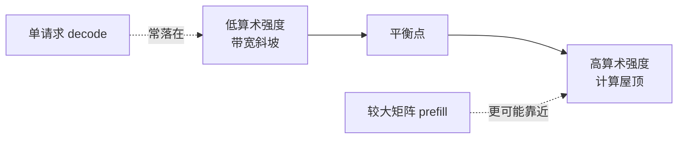

# 计算、带宽与内存墙

> **学习导航**：承接容量账本；本课比较 prefill 与逐 token decode 的资源特征；完成后应能说明为什么标称 FLOPs 高不代表生成一定快。

## 本课目标

用“计算多少、搬运多少、数据在哪一层内存”解释计算受限和带宽受限，并用 Roofline 为慢请求选择测量项。

## 本课核心判断

**理论 FLOPs 不等于端到端延迟；带宽、kernel、布局和 batch 决定量化、融合与批处理的实际收益。**

## prefill 与 decode

- **prefill** 一次处理整段输入，常能形成较大的矩阵计算，计算利用率相对高。
- **decode** 在基础逐 token 路径中每轮通常只接受一个新 token，却要读取大量权重和历史 KV Cache，常更受显存带宽与低 batch 限制；推测解码等实现可能批量验证候选，不能把“一个 token”当成所有引擎的硬性规则。

这也是为什么长提示常会推高 TTFT。TPOT 是输出阶段相邻 token 的平均等待时间，它本身不是累积量；输出越长，更多次逐 token 等待会累积为更长的总生成延迟。

## 算术强度直觉

算术强度是计算量与数据搬运量的比值：

$$
\text{arithmetic intensity}=\frac{\text{FLOPs}}{\text{bytes moved}}.
$$

它可理解为“每搬运 1 字节数据做了多少计算”。同一权重被更多请求共同使用时，batch 可能提高复用与吞吐；但 batch 过大又会增加排队和显存占用。

## Roofline 把两个上限画在一起

硬件可达到的性能同时受两条上限约束：峰值计算能力，以及显存带宽乘以算术强度。任务在左侧时，加更多计算单元也可能继续等数据；任务在右侧时，减少 FLOPs 或提高矩阵单元利用更可能有效。

“prefill 计算受限、decode 带宽受限”是常见倾向，不是模型名称自带标签。batch、序列长度、量化格式、GQA、kernel 和硬件变化后，位置会移动。

## 数据并不只住在 HBM

| 位置 | 容量与速度直觉 | 课程里要问什么 |
|---|---|---|
| 寄存器与片上缓存 | 很快但很小 | 中间结果能否就地复用，是否因资源过多降低并发 |
| 共享内存或片上 SRAM | 比 HBM 更靠近计算单元 | 分块计算能否减少往返 HBM |
| HBM | 容量较大、带宽高，但远慢于片上访问 | 权重、激活和 KV 每步搬了多少 |
| 主机内存与存储 | 容量更大、距离更远 | 卸载、数据读取或检查点是否成为瓶颈 |

FlashAttention 类方法的核心教学意义，是重排分块计算并减少注意力中间结果反复写回 HBM；它不改变 softmax 注意力要表达的数学关系。算子融合也类似：收益来自少启动 kernel、少保存中间张量和少搬数据。

## 优化作用位置

| 优化 | 主要作用 | 可能不生效的原因 |
|---|---|---|
| 量化 | 减少权重与缓存搬运 | 反量化开销、缺少目标 kernel |
| 算子融合 | 减少中间写回和启动 | 图被打断、形状不支持 |
| Flash Attention 类 kernel | 改善注意力内存访问 | 硬件、精度或形状不支持 |
| 增大 batch | 提高硬件利用与吞吐 | 延迟、显存和长短请求干扰 |
| 图捕获或图编译 | 减少 CPU 调度与 kernel 启动 | 动态形状、图中断、首次编译和额外显存 |

## 预设案例观察

两份快照来自同一模型、硬件和软件版本；“高/低”只表示本次形状下的相对倾向：

| 快照 | 负载 | 计算单元利用 | 显存带宽利用 | 队列时间 | 主要现象 | 最有区分力的下一步 |
|---|---|---:|---:|---:|---|---|
| A：首 token 慢 | 输入 4,096，batch 16 | 92% | 61% | 3 ms | 大矩阵 kernel 占 prefill 78% | 固定请求，比较支持的低精度矩阵 kernel |
| B：逐 token 慢 | 输出 512，并发 2 | 24% | 88% | 2 ms | 每步读取权重与 KV，TPOT 41 ms | 固定模型，增大并发到 8 后比较 TPOT 与带宽 |

A 更像计算受限，B 更像搬运受限；两者排队时间都很小。若 B 增大并发后吞吐提高但单请求 TPOT 恶化，就说明批处理改变了利用率，也改变了服务取舍，而不是“问题已经解决”。

## 本课验收

1. 为什么 decode 常比 prefill 更容易受显存带宽限制？
2. 理论 FLOPs 降低为什么不保证延迟同比例降低？
3. 增大 batch 带来哪两个相反影响？
4. 量化没有加速时，应继续检查哪些软件条件？
5. FlashAttention 为什么可以不改变注意力语义却减少显存访问？
6. 同一个 decode 任务增大 batch 后，Roofline 位置为什么可能右移？

## 方法边界

“计算受限”与“带宽受限”是主要倾向，不是永远不变的标签。模型形状、batch、硬件和 kernel 改变后，瓶颈也会移动。

上一课：[指标与容量账本](01-指标与容量账本.md) · 下一课：[推理引擎与解码执行](03-推理引擎与解码执行.md)
