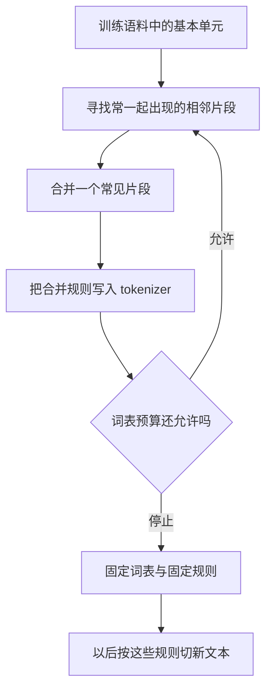
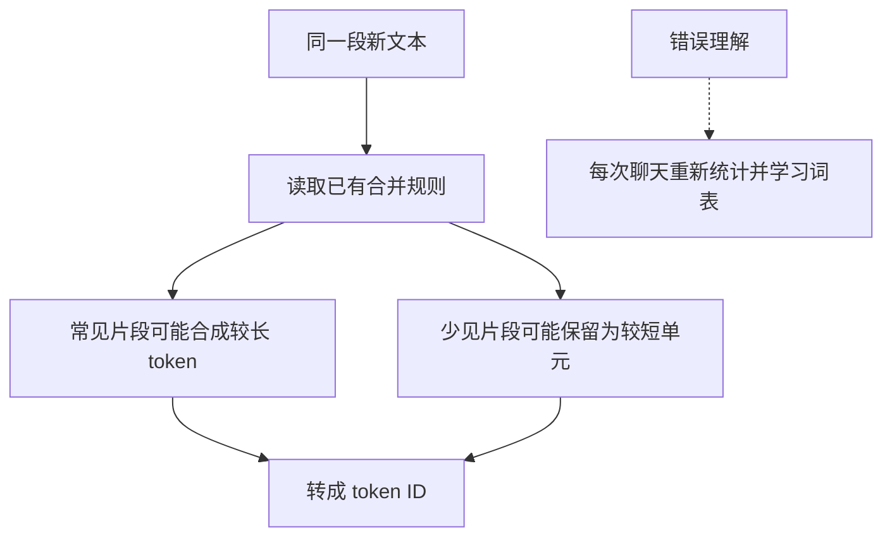
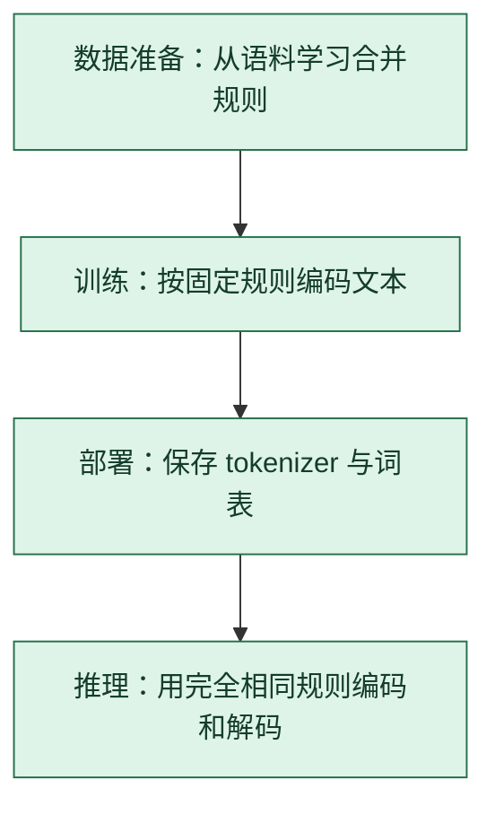

# BPE 分词：把常见片段收进词表

> **看图目标**：看完能指出 BPE 的“学习合并规则”和“按规则切文本”是两个阶段，并解释它不会在每次聊天时重新训练。

## 为什么需要它

模型不能直接接收任意文字，又不可能为每句话准备一个完整词条。BPE 在“只按最小单元切”和“把所有词都收进词表”之间找一个可复用的片段集合。

## 主图

眼睛只追两件事：前半段从语料学习规则，后半段使用已经固定的规则。模型训练和日常推理通常共享同一套 tokenizer 资产。

## 对照图

“常见”描述的是训练 tokenizer 时的语料统计，不保证某个词必然是一个 token，也不表示词表装下了模型的知识。

## 生命周期位置

BPE 规则通常在模型训练前确定，随后贯穿训练和推理。换 tokenizer 会改变 token 序列和词表映射，不能只替换一个前端小工具而继续假设模型权重完全兼容。

## 同一位置的不同选择

| 编码选择 | 怎样形成单元 | 常见效果与代价 |
|---|---|---|
| BPE | 反复合并高频相邻单元 | 规则直观，词表与切分依语料而变 |
| WordPiece | 按语言模型式目标选择子词 | 常用于部分编码器模型，训练准则与 BPE 不同 |
| Unigram | 从候选子词集中删减并选择切分 | 可保留多种候选概率，训练过程更复杂 |
| 字符或字节级 | 使用更基础的固定单元 | 未登录问题少，但序列通常更长 |

## 采用判断

| 采用前后要问 | BPE 的答案 |
|---|---|
| 主要优势 | 用有限词表复用常见片段，能表示未作为完整词条出现的新词 |
| 主要局限 | 切分主要由语料频率驱动，不保证符合词义或人类分词习惯；更换规则会破坏既有权重兼容性 |
| 适合考虑 | 从头训练模型或确有新语言、领域和词表效率需求时 |
| 不适合直接采用 | 已有 checkpoint 的 tokenizer 已固定，或只是想让模型临时理解几个新词时 |
| 采用后必须检查 | 往返编码、特殊 token、不同语言平均序列长度、未知字节处理，以及训练与推理规则一致性 |

## 看图复述

遮住正文，只看三张图回答：

1. 哪一段会改变合并规则，哪一段只读取规则？
2. 新词没有作为完整词条出现时，为什么仍可能被编码？
3. tokenizer 固定后，模型参数会因此自动固定吗？
4. BPE 规则在哪个节点学习，又在哪些节点被重复使用？

能说出“先学片段规则，再重复使用规则；片段不是知识”即可。继续深入看 [D08：训练数据与分词器](../01-14天理论课/D08-训练数据与分词器.md)。

## 方法边界

- 图省略了字节、字符、预切分、特殊 token 和不同 BPE 实现的差异。
- BPE 只定义切分与 ID 映射，不保证语义完整，也不决定模型答案是否正确。
- 换 tokenizer 通常会改变 ID 与序列长度，不能把旧权重当作天然兼容。
