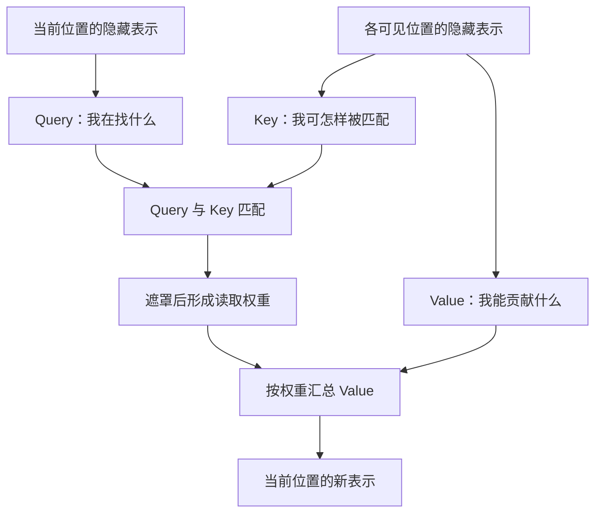
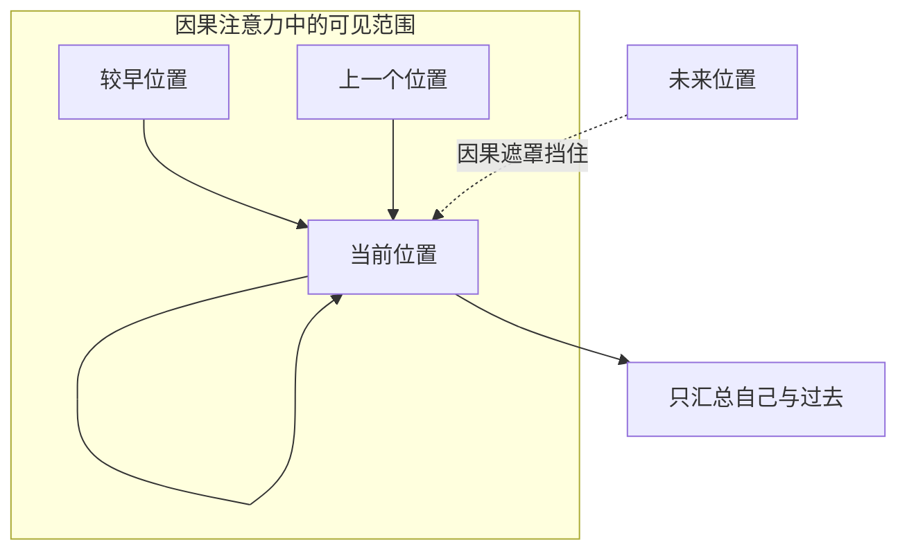
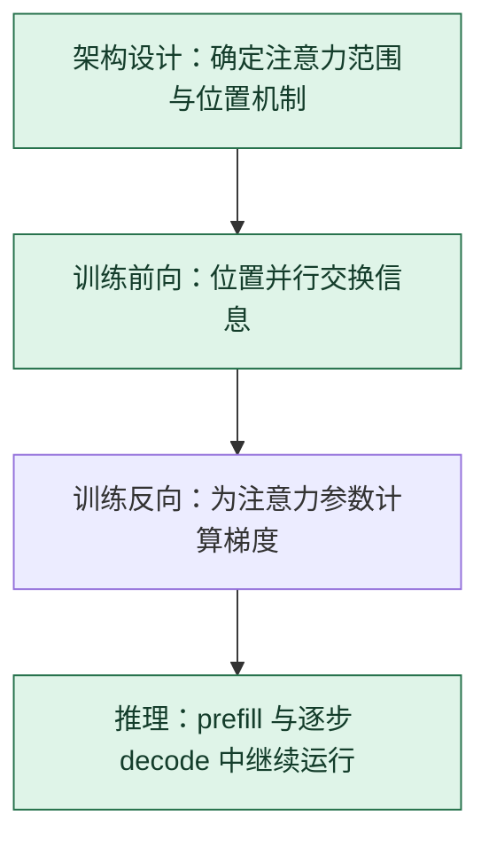

# 自注意力：先匹配，再搬运信息

> **看图目标**：看完能沿图说出 Query、Key、Value 的分工，并指出因果遮罩是在汇总前限制可见范围。

## 为什么需要它

一个 token 的含义常依赖同一序列里的其他位置。自注意力让每个位置根据当前需要，动态决定从哪些可见位置取信息，而不是把整段文字压成一个固定摘要。

## 主图

关键动作只有两个：先用 Query 和 Key 决定“看多少”，再把对应 Value 汇入当前位置。Key 用于匹配，Value 才是被搬运的内容。

## 为什么不是随便设计的

| 拿掉什么 | 立即发生什么 | 机制边界 |
|---|---|---|
| Key 或 Query | 失去“当前需要”与“可匹配地址”的两方比较，只剩固定混合规则 | Q/K 分工解释动态寻址，不证明权重是完整因果解释 |
| Value | 有匹配分却没有要搬运的内容 | Key 不能自动兼任内容；标准实现用独立投影 |
| 因果遮罩 | 较早位置在训练时能读取未来 token，next-token 目标泄漏 | 编码器双向注意力不需要同一种因果遮罩 |
| $1/\sqrt{d_k}$ | 高维点积典型尺度随 $\sqrt{d_k}$ 增长，softmax 更易饱和 | 完整推导见 [D05](../01-14天理论课/D05-注意力机制.md#scaled-dot-product-proof)；质量影响仍需消融 |

## 对照图

训练时可以并行计算多个位置，但每个位置仍受同一可见性规则约束。“并行”不等于“读取未来答案”。

## 生命周期位置

自注意力是模型内部的**结构组件**，训练和推理都会运行；反向传播只在训练时为它计算梯度，KV Cache 则主要优化推理执行。

## 同一位置的不同选择

| 序列混合选择 | 谁能读取谁 | 常见效果与代价 |
|---|---|---|
| 全局自注意力 | 每个位置读取全部允许位置 | 关系直接，长序列计算与缓存较高 |
| 局部或稀疏注意力 | 只读窗口或选定位置 | 成本更低，可能漏掉直接远距离关系 |
| 线性注意力或状态递推 | 把历史压入可递推状态 | 长序列更省，但信息保留方式改变 |
| RNN / 状态空间主干 | 状态按序列推进 | 流式自然，不再使用同样的两两注意力图 |

## 采用判断

| 采用前后要问 | 自注意力的答案 |
|---|---|
| 主要优势 | 位置能按当前内容动态读取其他可见位置，训练时也容易并行处理多个位置 |
| 主要局限 | 全局注意力的计算、显存和 KV Cache 会随序列增长；注意力权重也不是完整因果解释 |
| 适合考虑 | 任务确实需要内容相关的跨位置交互，且训练与部署预算能覆盖相应上下文长度时 |
| 不适合直接采用 | 只因为它是主流，或目标是极低延迟、超长流式状态且没有做稀疏或混合方案比较时 |
| 采用后必须检查 | 不同长度上的质量、遮罩正确性、显存、TTFT、TPOT、KV Cache 占用与越界输入表现 |

## 看图复述

遮住正文，只看三张图回答：

1. 匹配发生在哪两类对象之间？
2. 真正被加权汇总的是 Key 还是 Value？
3. 因果遮罩改变的是可见关系、模型参数，还是词表？
4. 自注意力在训练和推理中都会运行吗？

能说出“Q/K 决定权重，权重搬运 V，遮罩限制未来”即可。继续深入看 [D05：注意力机制](../01-14天理论课/D05-注意力机制.md)。

## 方法边界

- 图只画一个头和一个当前位置，省略多头组合、位置机制、残差、归一化与 MLP。
- 注意力权重是信息汇总的一部分，不是完整的人类可读因果解释。
- 不同注意力变体会改变匹配、可见范围、缓存或计算方式，不能都压成同一实现。
