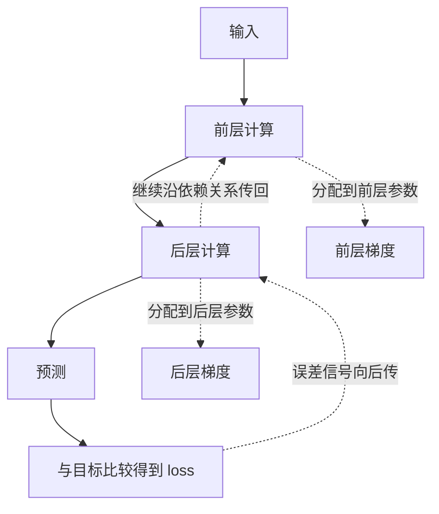
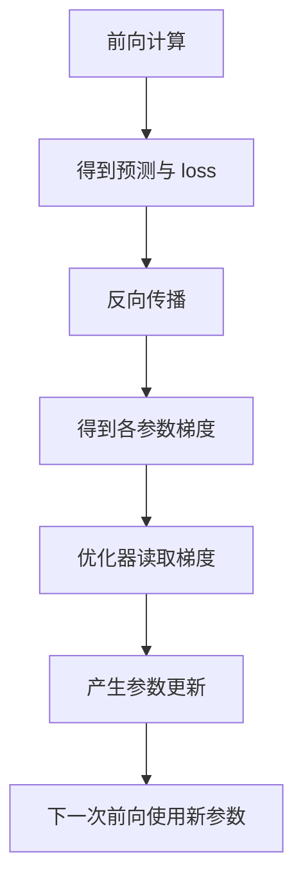
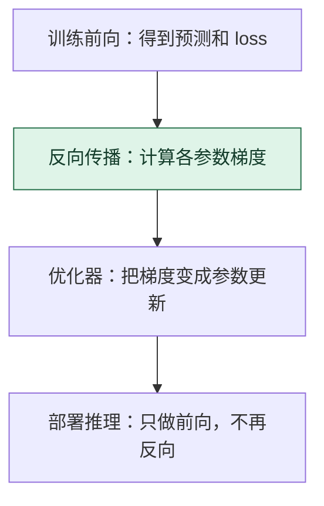

# 反向传播：把一处误差分配回沿途参数

> **看图目标**：看完能区分前向计算、反向传播和优化器更新，并说明反向传播的产物是梯度，不是新参数。

## 为什么需要它

模型输出错了，只知道“错”还不够。训练需要判断每一层、每组参数对这个误差的局部影响，反向传播负责沿计算图把这种影响逐层传回去。

## 主图

实线是前向产生预测，虚线是反向追踪局部影响。反向传播利用前向时留下的计算关系，不是在模型里播放一遍倒放视频。

## 对照图

图中三段责任不能合并：前向回答“现在预测什么”，反向回答“各参数局部影响多大”，优化器回答“参数实际怎样改”。

## 生命周期位置

反向传播只位于需要学习参数的训练节点。普通在线推理读取固定权重，不会因为生成了一次回答就自动反向更新。

## 同一位置的不同选择

| 梯度获取方式 | 适用特点 | 常见效果与代价 |
|---|---|---|
| 反向模式自动微分 | 输出目标少、参数很多的深层网络 | 一次反向得到大量参数梯度，但需保存或重算前向信息 |
| 前向模式自动微分 | 输入方向少、输出较多的特定问题 | 按方向推进导数，不是大网络训练的常规替代 |
| 数值差分 | 用微小扰动近似检查梯度 | 易懂但代价高、误差大，主要用于小规模核验 |

## 采用判断

| 采用前后要问 | 反向传播的答案 |
|---|---|
| 主要优势 | 能在一次反向过程中高效得到大量参数对目标的梯度，是深层网络训练的基础工具 |
| 主要局限 | 需要保存或重算前向信息，受显存、数值稳定、梯度消失或爆炸以及可微计算图限制 |
| 适合考虑 | 目标可微、参数需要从数据学习，并且能建立可靠前向计算图时 |
| 不适合直接采用 | 只做固定权重推理，或关键过程不可微、只能黑盒访问且没有合适替代估计时 |
| 采用后必须检查 | loss 是否有限、梯度是否缺失或异常、梯度范数、激活显存、训练速度与验证集变化 |

## 看图复述

遮住正文，只看三张图回答：

1. loss 位于前向末端还是反向末端？
2. 反向传播结束后，首先得到的是梯度还是更新后的权重？
3. 没有记录前向依赖关系，反向还知道该沿哪条路分配吗？
4. 普通部署推理为什么不需要这一步？

能把三段责任按顺序说清即可。继续深入看 [D04：神经网络如何学习](../01-14天理论课/D04-神经网络如何学习.md)。

## 方法边界

- 图省略了链式法则、张量形状、自动微分、激活保存与梯度累积。
- 梯度只描述当前位置的局部变化趋势，不保证一步找到全局最好参数。
- 梯度异常可能来自数据、数值精度、结构或实现，不能只凭一张流程图定位。
