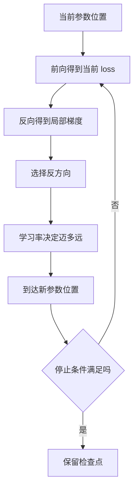
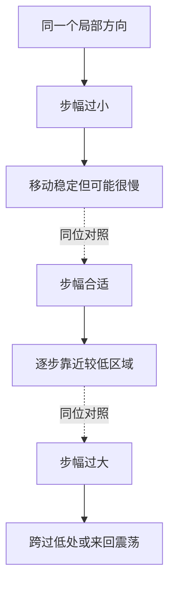
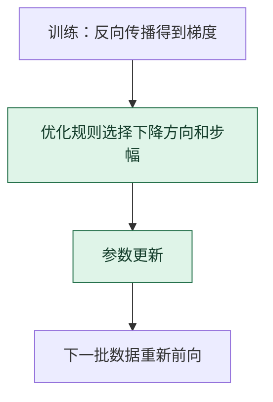

# 梯度下降：沿局部下坡方向反复试探

> **看图目标**：看完能解释梯度给方向、学习率给步幅，并指出梯度下降是一种迭代过程，不是一次跳到最低点。

## 为什么需要它

反向传播给出了参数附近的局部方向，但参数还没有改变。梯度下降把这个方向转成一步更新，再通过新的前向结果判断是否继续。

## 主图

这是一个反复观察、更新、再观察的闭环。每一步只利用当前位置附近的信息，因此路线可能弯曲，也可能经过平台或不稳定区域。

## 对照图

虚线表示三种步幅结果的对照，不表示依次尝试。学习率不是“越大越聪明”的旋钮。它只控制更新幅度，还会和批次噪声、调度策略、优化器状态共同作用。

## 生命周期位置

梯度下降属于训练更新节点；模型架构决定梯度沿什么计算图产生，优化方法决定拿到梯度后怎样迈步。

## 同一位置的不同选择

| 更新选择 | 怎样使用梯度 | 常见效果与代价 |
|---|---|---|
| 全批量梯度下降 | 汇总整个训练集再更新 | 方向稳定，但每步代价很高 |
| 随机或小批量 SGD | 用样本或小批次估计方向 | 更新有噪声，计算和泛化特性不同 |
| Momentum | 累积历史方向减少来回摆动 | 多一份状态，仍需调学习率 |
| AdamW | 适配各方向尺度并解耦权重衰减 | 深度学习常用，但状态更多且不保证总是最好 |

## 采用判断

| 采用前后要问 | 梯度下降的答案 |
|---|---|
| 主要优势 | 把局部梯度转成可反复执行的参数更新，能扩展到大量参数和小批量数据 |
| 主要局限 | 只利用局部方向，对学习率、噪声、曲率和初始化敏感，不保证到达全局最好位置 |
| 适合考虑 | 有可微目标、稳定梯度和可重复验证的训练任务时 |
| 不适合直接采用 | 没有验证集、停止条件或基线，只期待训练 loss 下降自动带来产品效果时 |
| 采用后必须检查 | 训练与验证曲线、更新幅度、梯度范数、学习率阶段、过拟合和检查点回退能力 |

## 看图复述

遮住正文，只看三张图回答：

1. 梯度和学习率分别负责什么？
2. 为什么同一个方向也可能因为步幅不同得到不同结果？
3. 新参数出现以后，为什么还要重新做前向与反向？
4. 梯度下降在生命周期中修改的是结构还是权重？

能说出“方向、步幅、重复验证”即可。需要带数字的补救练习时再看 [梯度下降：旋钮下山](../04-图解与数字漫画/梯度下降-旋钮下山.md)。

## 方法边界

- 图用“下坡”表达局部优化，不表示真实参数空间只有二维或存在唯一谷底。
- 训练 loss 下降不等于验证效果、可靠性或真实任务表现同步改善。
- AdamW 等优化器会改变怎样组合梯度与状态，但仍需独立评测最终模型。
