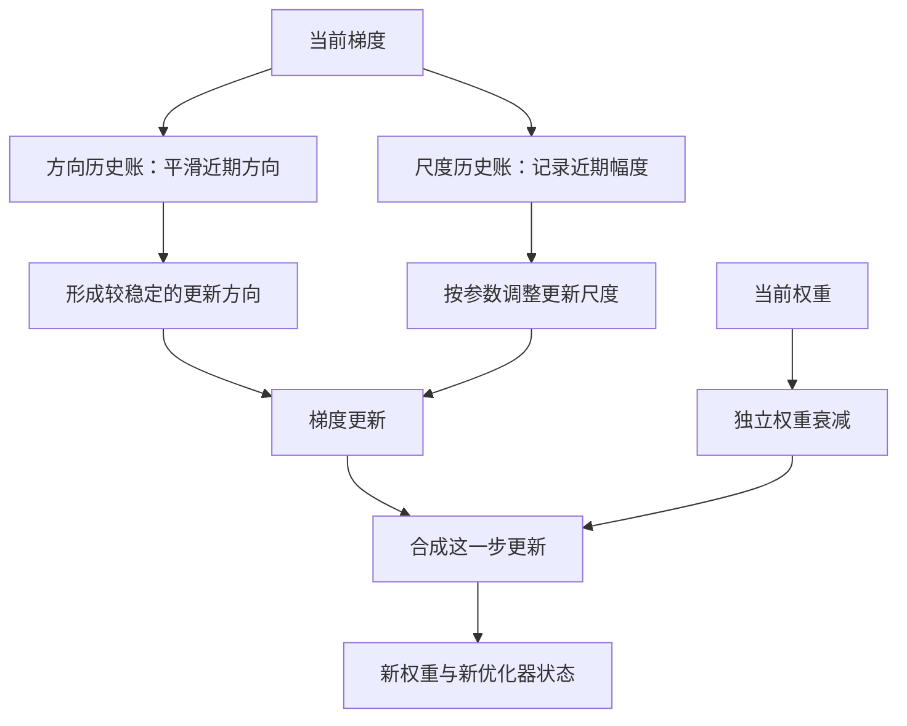
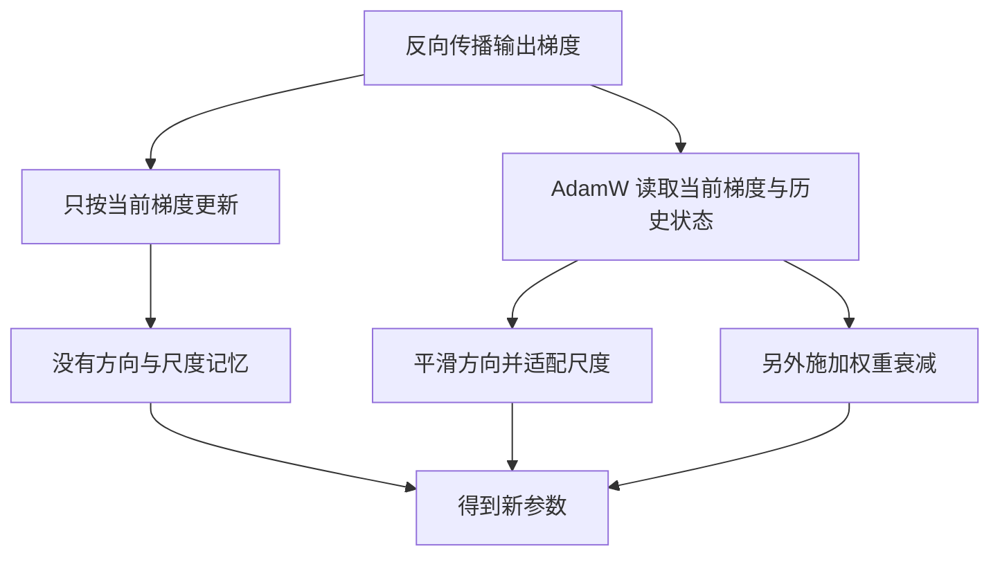
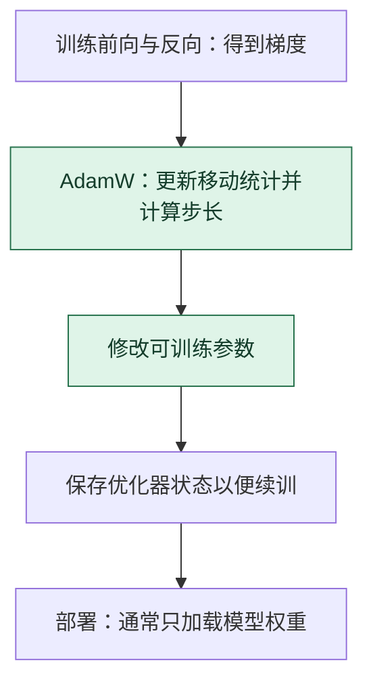

# AdamW 优化器：把当前梯度放进两本历史账

> **看图目标**：看完能指出 AdamW 同时参考方向历史、尺度历史和独立权重衰减，并说明它不负责计算 loss 或梯度。

## 为什么需要它

只看当前一步的梯度，容易被批次噪声带偏；所有参数用同一种固定步幅，也可能让更新忽快忽慢。AdamW 用历史状态调整每个参数的更新，并把权重衰减与梯度适配分开处理。

## 主图

两本“账”是记忆桥梁：一份帮助平滑方向，一份帮助适配尺度。真实实现保存的是与参数对应的数值状态，不是自然语言记录。

## 对照图

AdamW 是“怎样更新”的规则，不会自动选择好学习率，也不会保证训练更快、泛化更好或避免全部不稳定。

## 生命周期位置

AdamW 只负责训练更新。部署推理通常不需要 AdamW 的移动统计；它也不决定 CNN、Transformer 或其他网络的前向结构。

## 同一位置的不同选择

| 优化器选择 | 更新特点 | 常见效果与代价 |
|---|---|---|
| SGD | 直接沿小批量梯度更新 | 状态少，可能需要更细致的学习率设计 |
| Momentum SGD | 累积历史方向 | 可减少摆动，仍共享较粗的全局步幅 |
| Adam | 按一阶与二阶统计适配尺度 | 收敛常较快，权重衰减处理与 AdamW 不同 |
| AdamW | 适配尺度并解耦权重衰减 | 大模型常用，额外优化器状态占用内存 |

## 采用判断

| 采用前后要问 | AdamW 的答案 |
|---|---|
| 主要优势 | 能按历史梯度统计适配不同方向的更新尺度，并把权重衰减单独处理 |
| 主要局限 | 优化器状态占用较多内存，仍强烈依赖学习率、调度、权重衰减分组和数值精度 |
| 适合考虑 | Transformer 等深层网络训练，需要较稳的自适应更新且内存预算允许时 |
| 不适合直接采用 | 只因它常见就跳过 SGD、Momentum 或低状态优化器基线，或设备装不下优化器状态时 |
| 采用后必须检查 | 学习率与更新范数、异常梯度、衰减参数分组、优化器状态恢复、验证集和旧能力回归 |

## 看图复述

遮住正文，只看三张图回答：

1. 哪两个分支来自当前梯度，哪个分支来自当前权重？
2. 反向传播与 AdamW 的交接物是什么？
3. 只保存模型权重而不保存优化器状态，为什么未必能原样续训？
4. 部署推理时为什么通常不加载 AdamW 状态？

能说出“梯度进入两类历史状态，权重衰减单独处理”即可。继续深入看 [D09：一次完整训练循环](../01-14天理论课/D09-训练任务内部的一次完整循环.md)。

## 方法边界

- 图省略偏差修正、数值稳定项、参数组、学习率调度和混合精度细节。
- 权重衰减不是把所有参数简单拉到相同大小，实际项目常对部分参数关闭衰减。
- 优化器状态会增加训练内存与检查点体积，部署推理通常不需要携带这些状态。
