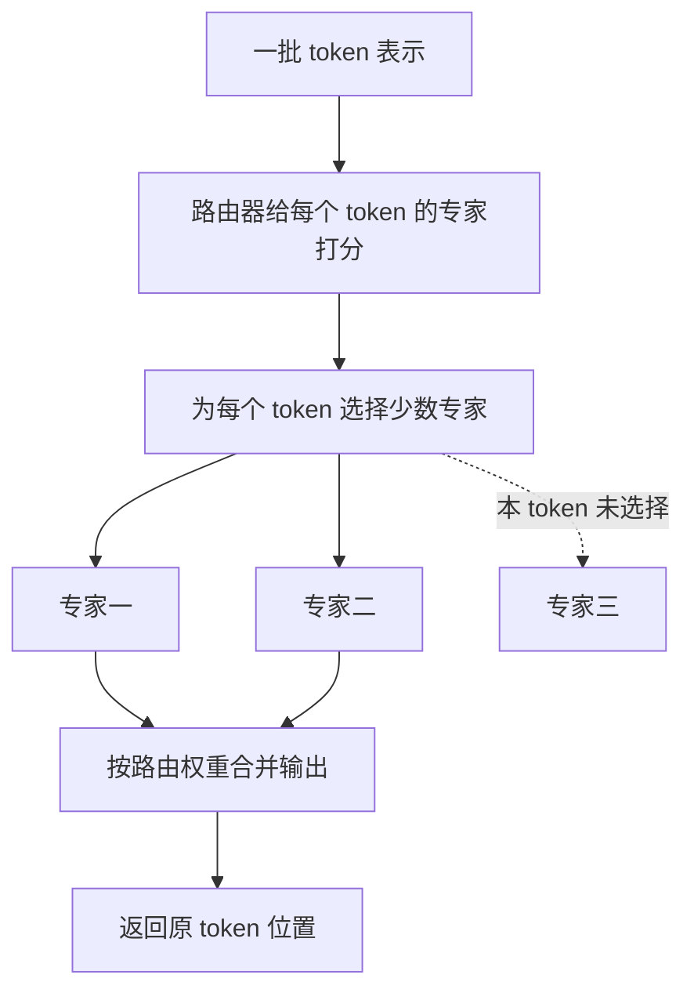
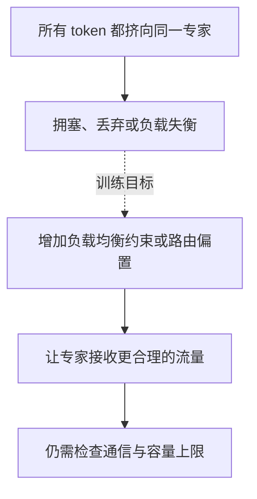
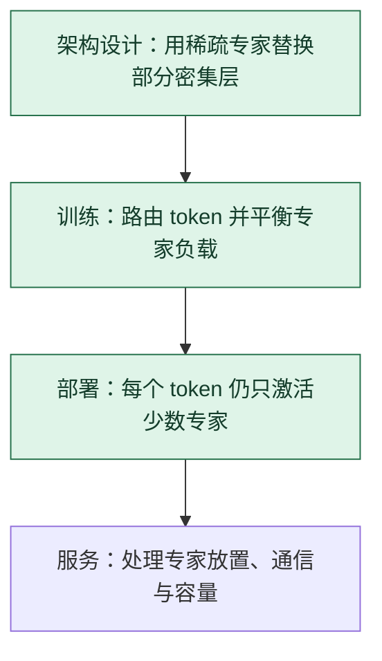

# MoE 专家路由：每个 token 只走少数分支

> **看图目标**：看完能指出路由器按 token 选择专家、专家输出再被合并，并解释“总参数多”不等于“每个 token 都使用全部参数”。

## 为什么需要它

模型想增加容量，若每个 token 都经过全部计算分支，计算和通信会迅速上升。稀疏 MoE 把前馈计算分成多个专家，让路由器为每个 token 只激活少数专家。

## 主图

路由发生在 token 级别。同一句话里的不同 token 可以去不同专家；这里的“专家”通常是模型内部的子网络，不是多个完整聊天模型投票。

## 为什么不是随便设计的

稀疏 MoE 同时需要路由分数、top-k 选择、容量规则和负载约束：前两者决定每个 token 用谁，后两者避免少数专家被挤爆。

| 拿掉什么 | 立即发生什么 |
|---|---|
| 路由器 | 所有 token 只能走固定专家或全部专家，失去输入相关的稀疏选择 |
| top-k 稀疏选择 | 若调用全部专家，激活计算重新接近密集层；总参数大不再伴随少激活 |
| 容量与溢出规则 | 热门专家可能收到设备无法容纳的 token，系统没有确定处理办法 |
| 负载约束 | 路由可能塌到少数专家；是否真的塌缩和质量影响仍要看训练统计 |

“每 token 激活参数少”只由路由结构说明，不等于通信少、延迟低或质量高。

## 对照图

路由质量不只看“选得像不像”。还要看专家负载、容量限制、跨设备通信以及最终任务效果。

## 生命周期位置

MoE 是模型内部结构选择，训练和推理都执行路由。它增加的不是一个后训练步骤，而是改变每层 token 会经过哪些参数。

## 同一位置的不同选择

| 层结构选择 | 每个 token 使用的参数 | 常见效果与代价 |
|---|---|---|
| 密集 MLP | 所有 token 经过同一组完整参数 | 执行规则简单，总容量与每 token 计算绑定 |
| 稀疏 MoE | 路由到少数专家 | 总参数可增大，但有负载、通信和路由稳定问题 |
| 共享专家 + 路由专家 | 固定共享路径再加少数专门路径 | 保留公共能力，也增加组合与调度复杂度 |

## 采用判断

| 采用前后要问 | MoE 的答案 |
|---|---|
| 主要优势 | 可以扩大模型总容量，同时让每个 token 只激活少数专家 |
| 主要局限 | 引入路由不稳定、专家负载不均、token 丢弃、跨设备通信和部署复杂度 |
| 适合考虑 | 容量扩展是明确瓶颈，且训练集群和推理引擎能高效放置、通信与调度专家时 |
| 不适合直接采用 | 小模型、低并发或严格低延迟场景，尚未证明密集模型基线受容量而非数据限制时 |
| 采用后必须检查 | 专家负载、路由熵、丢弃比例、激活参数、跨设备通信、尾延迟与不同领域的专家偏置 |

## 看图复述

遮住正文，只看三张图回答：

1. 路由器面对的是整个句子、每个 token，还是最终答案？
2. 未被某 token 选择的专家是否仍属于模型总参数？
3. 为什么专家选择更稀疏也不代表系统一定更快？
4. MoE 是只在训练时使用，还是训练与推理都会运行？

能说出“按 token 选少数专家、合并输出、同时治理负载”即可。继续深入看 [DeepSeekMoE：专家如何专门化](../06-拓展知识库/论文研读/DeepSeek深读/02-DeepSeekMoE专家路由.md)。

## 方法边界

- 图只画稀疏 MoE；MoE 是更宽的架构类别，并非所有实现都采用同一种路由与专家结构。
- 专家名称不天然对应人类可读领域，不能仅凭少数 token 给专家贴固定语义标签。
- 激活参数减少不等于显存、通信、延迟和成本按相同比例下降。
