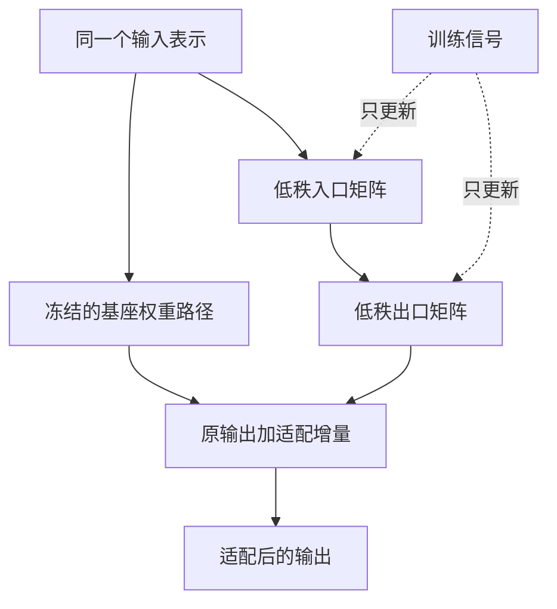
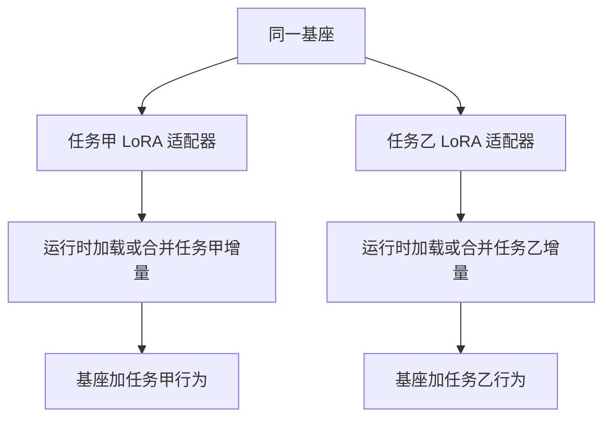
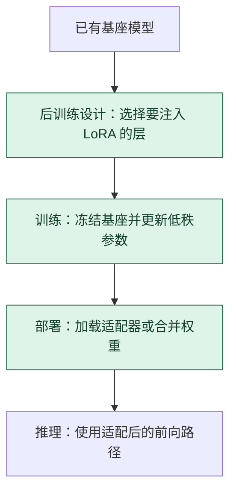

# LoRA 低秩适配：冻结大墙，只训练一条窄旁路

> **看图目标**：看完能指出基座权重保持冻结、低秩矩阵形成增量，并解释 LoRA 减少的是可训练参数，不自动等于推理模型变小。

## 为什么需要它

全参数微调要为大量权重保存梯度和优化器状态。LoRA 假设任务适配所需的权重变化可以由较少方向表达，于是在选定线性层旁增加一条低秩更新路径。

## 主图

主路径仍执行原来的基座变换；旁路只学习一个增量。所谓“低秩”指增量经过较窄的中间方向，不是把原权重随意裁掉一块。

## 为什么不是随便设计的

LoRA 把权重增量写成两个窄矩阵的乘积，`ΔW=sBA`。因为乘积的秩不超过中间维 `r`，可训练更新只能落在至多 `r` 个独立方向上。

| 改掉什么 | 立即发生什么 |
|---|---|
| 去掉 $A$ 或 $B$ | 乘积更新不存在，基座冻结时该层不能适配 |
| 让 `r` 达到完整维度 | 不再利用低秩约束节省参数；仍可能是因式分解参数化 |
| 去掉缩放 $s$ | 等于采用固定缩放 1，更新幅度与秩的关系改变，但算法并非数学上不可运行 |
| 不冻结基座 | 变成“全参数更新 + LoRA 分支”的另一训练方案，不再具有原本的可训练参数边界 |

低秩只限制更新空间，不保证目标任务所需更新本来就是低秩；质量要与全参数及其他适配基线对照。

## 对照图

多个小适配器可以共享一个基座，但它们必须与基座版本、目标层和配置匹配。小文件不是天然可插到任意模型上的通用补丁。

## 生命周期位置

LoRA 位于已有模型的适配节点，改变“哪些参数可训练”。它不规定训练目标；同一个 LoRA 参数化可以配合 SFT、偏好优化等不同目标。

## 同一位置的不同选择

| 适配选择 | 更新范围 | 常见效果与代价 |
|---|---|---|
| 全参数微调 | 通常允许全部基座参数更新 | 容量大，训练显存、存储与回归风险更高 |
| LoRA | 训练选定层的低秩增量 | 参数与版本成本低，表达容量受秩和注入位置影响 |
| Adapter | 插入小型可训练模块 | 模块边界清楚，可能增加推理路径 |
| 提示或前缀调优 | 学习输入侧连续提示 | 参数更少，对复杂任务的容量可能受限 |

## 采用判断

| 采用前后要问 | LoRA 的答案 |
|---|---|
| 主要优势 | 大幅减少可训练参数、训练显存和任务版本存储，便于同一基座维护多个适配器 |
| 主要局限 | 表达容量受秩、注入层和基座能力限制；适配器与基座版本必须严格匹配 |
| 适合考虑 | 基座能力基本够用、资源有限、任务较聚焦或需要保存多个领域版本时 |
| 不适合直接采用 | 任务需要改变模型结构、补足基座缺失能力，或全参数基线已证明有必要时 |
| 采用后必须检查 | 基座与适配器版本、可训练参数范围、任务质量、旧能力回归、合并前后差异和服务延迟 |

## 看图复述

遮住正文，只看三张图回答：

1. 训练信号更新哪条路径，哪条路径保持冻结？
2. LoRA 文件里保存的是完整基座还是适配增量？
3. 为什么训练参数少不能直接推出推理一定更快？
4. LoRA 位于从基座模型到部署之间的哪个节点？

能说出“冻结基座、训练低秩增量、运行时组合”即可。继续深入看 [D11：让基座适应任务](../01-14天理论课/D11-SFT、LoRA与QLoRA.md)。

## 方法边界

- 图省略秩、缩放、dropout、目标模块选择以及是否合并权重等配置。
- 低秩假设并不保证所有任务都能用很小适配器达到全参数微调效果。
- LoRA 改变训练范围，不替代数据许可、回归评测、安全检查和基座审计。
