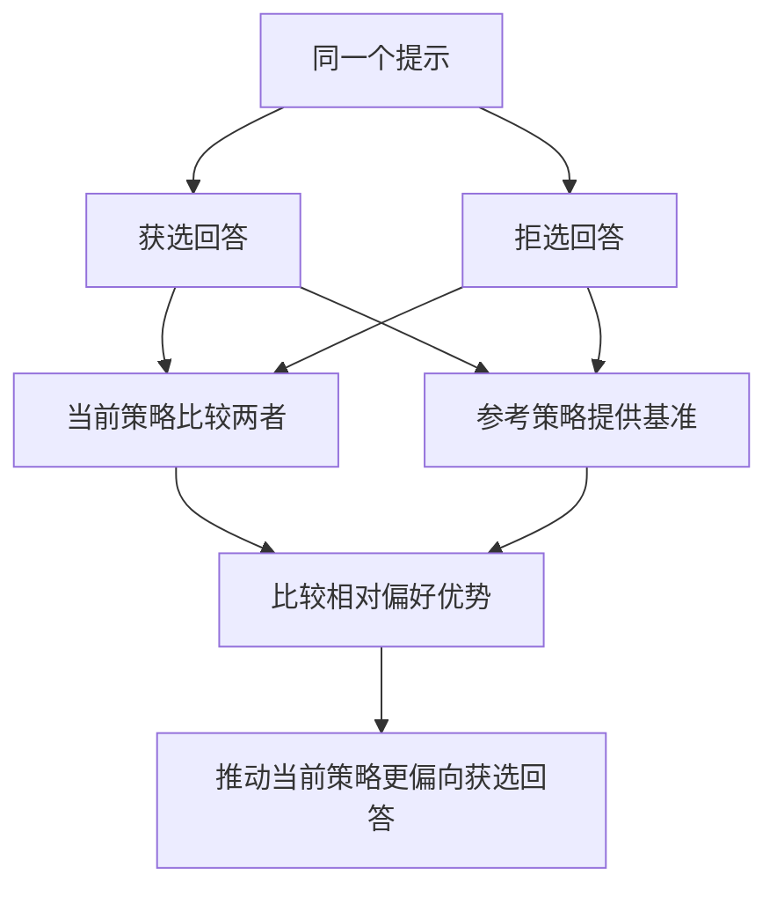
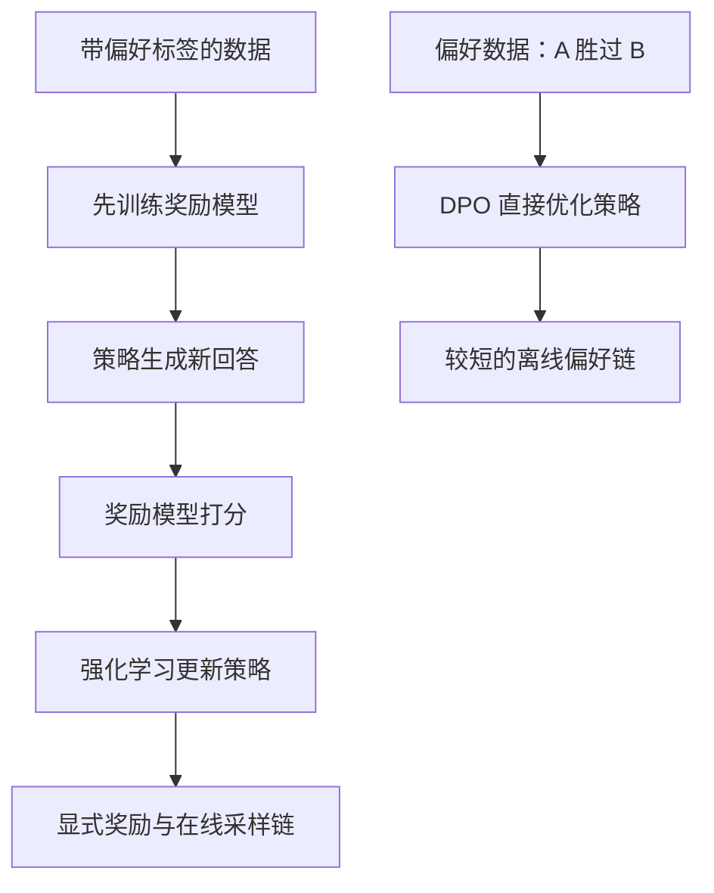
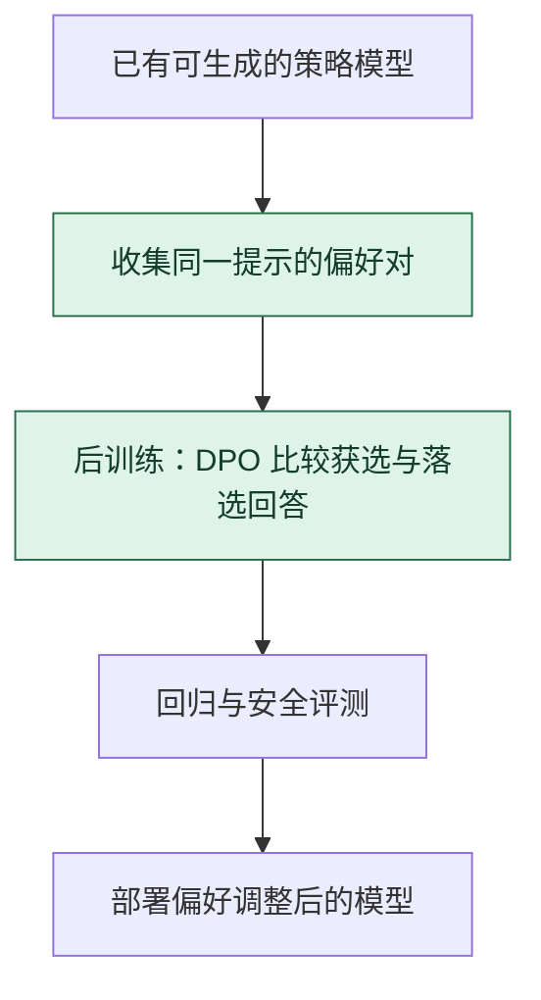

# DPO 偏好优化：让获选回答相对更有优势

> **看图目标**：看完能指出 DPO 使用同一提示下的获选与拒选回答，并说明参考策略用于限制相对变化，而不是替模型判断事实。

## 为什么需要它

监督微调通常告诉模型“照这个答案学”，偏好数据则表达“这两个答案中更喜欢哪一个”。DPO 把成对偏好直接变成策略优化信号，不必先训练一个显式奖励模型再运行在线强化学习循环。

## 主图

DPO 关注的是成对回答在当前策略与参考策略下的相对关系。参考策略像一条锚线，帮助限制策略不要只为偏好标签无限漂移。

## 为什么不是随便设计的

DPO 比较同一提示下“获选减拒选”的策略对数概率差，再减去参考策略的同类差值；强度系数控制偏好推动与贴近参考之间的尺度。

| 拿掉什么 | 立即发生什么 |
|---|---|
| 获选或拒选任一回答 | 成对偏好差无法计算，退回只有单边示范的其他目标 |
| 同一提示条件 | 差值混入不同问题难度，不能解释成同题偏好 |
| 参考策略项 | 目标不再衡量“相对参考改变了多少”，约束含义改变 |
| 强度系数 | 等于把尺度固定为某个隐含值，不是自动得到合适偏好强度 |

公式证明的是哪些概率比被推动，不证明偏好标签等于事实真值，也不证明安全和旧能力不会退化。

## 对照图

两条路线不是“新旧版本”的简单替代关系。它们需要的数据、计算、可探索状态和风险都不同，应由任务与证据决定。

## 生命周期位置

DPO 通常发生在 SFT 或可用基座之后，属于偏好后训练。它改变模型参数，不是在线生成时临时挑选回答的解码策略。

## 同一位置的不同选择

| 偏好路线 | 主要监督与更新 | 常见效果与代价 |
|---|---|---|
| 只做 SFT | 学习示范回答 | 流程简单，但不直接利用成对偏好 |
| 奖励模型 + PPO | 先学奖励，再用在线采样强化学习 | 可利用在线轨迹，系统和稳定性更复杂 |
| DPO | 直接用偏好对比较策略与参考模型 | 流程较短，效果依赖偏好数据与超参数 |
| 规则或拒答层 | 推理时约束输出 | 不更新模型偏好能力，适合承担硬边界 |

## 采用判断

| 采用前后要问 | DPO 的答案 |
|---|---|
| 主要优势 | 直接利用成对偏好更新策略，不必先训练独立奖励模型再运行完整在线强化学习循环 |
| 主要局限 | 对偏好对质量、参考策略和强度超参数敏感，可能放大风格偏好、偏置或遗忘 |
| 适合考虑 | 已有可用基座或 SFT 模型，并能获得一致、覆盖目标场景的高质量偏好对时 |
| 不适合直接采用 | 偏好含义不清、标签者分歧未审计，或任务需要在线探索和可验证长轨迹反馈时 |
| 采用后必须检查 | 偏好胜率、参考模型距离、旧能力回归、回答长度与风格偏移、安全红线和分群表现 |

## 看图复述

遮住正文，只看三张图回答：

1. 一条 DPO 训练样本至少包含怎样的回答关系？
2. 当前策略与参考策略各承担什么角色？
3. DPO 没有显式奖励模型，是否等于不需要偏好质量与独立评测？
4. DPO 是后训练方法还是在线解码方法？

能说出“成对偏好、相对参考、直接更新策略”即可。继续深入看 [偏好优化与可验证奖励](../06-拓展知识库/模型后训练/03-偏好优化与可验证奖励.md)。

## 方法边界

- 图省略概率比、温度系数、数据采样和不同 DPO 变体。
- 偏好标签可能带有噪声、群体偏差或任务口径缺失，算法不会自动修复它们。
- 更贴合偏好不等于事实更正确、更安全或所有能力都不退化。
