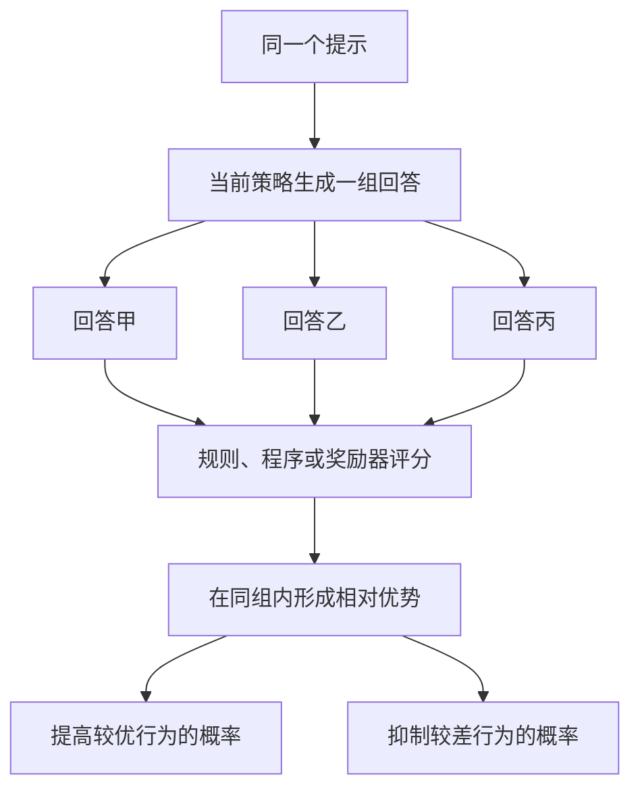
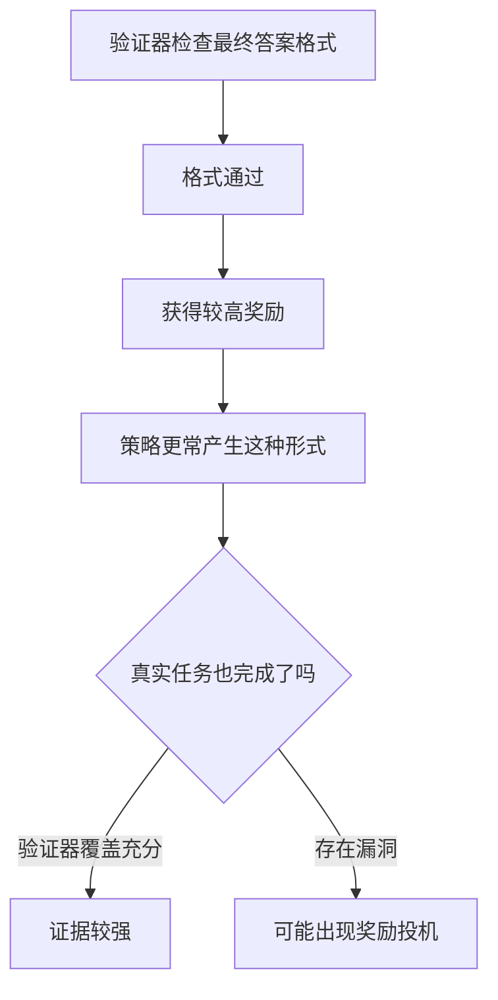
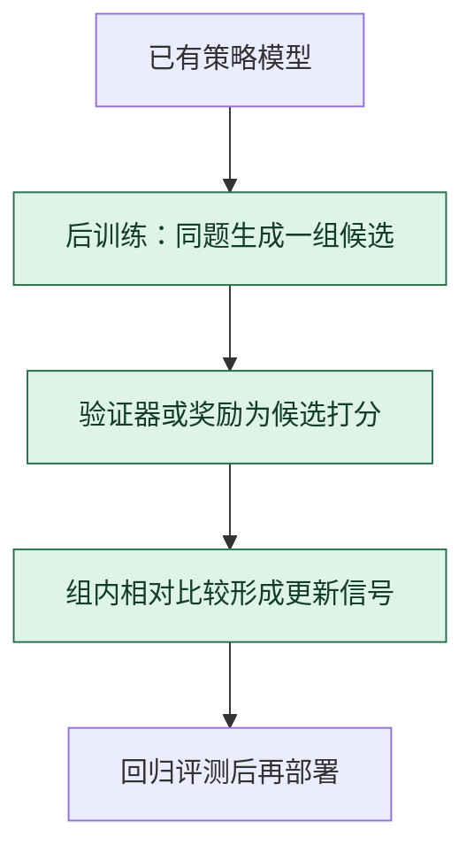

# GRPO 组相对策略优化：同题多答，先在组内找相对位置

> **看图目标**：看完能指出 GRPO 从同一提示采样一组回答，用组内相对奖励形成更新信号，并说明验证器只覆盖它真正检查的条件。

## 为什么需要它

有些任务可以用程序、规则或明确答案验证结果。GRPO 让当前策略对同一提示生成多个候选，再根据组内相对表现估计哪些行为值得增加、哪些值得抑制。

## 主图

“组相对”意味着参照物来自同一个提示的一组候选，而不是把原始奖励直接当作所有任务通用的绝对能力分数。

## 对照图

算法只会追随给出的奖励信号。验证器漏掉过程、权限、事实来源或安全边界时，高奖励仍可能偏离真实目标。

## 生命周期位置

GRPO 位于强化学习式后训练节点，需要生成候选并获得奖励。部署后的普通推理不会自动继续执行 GRPO 更新。

## 同一位置的不同选择

| 后训练选择 | 比较或估值方式 | 常见效果与代价 |
|---|---|---|
| PPO 类方法 | 借助价值估计和策略约束更新 | 框架成熟，但训练组件和状态较多 |
| GRPO | 同一问题候选组内做相对比较 | 可减少独立价值模型依赖，采样与奖励成本仍高 |
| DPO | 直接学习固定偏好对 | 流程更离线，不利用同样的在线组采样 |
| SFT | 模仿参考答案 | 稳定直接，但不显式优化相对奖励 |

## 采用判断

| 采用前后要问 | GRPO 的答案 |
|---|---|
| 主要优势 | 用同题候选的组内相对位置形成更新信号，可减少对独立价值模型的依赖 |
| 主要局限 | 需要大量 rollout 与可靠奖励，容易出现奖励投机、候选同质化和训练不稳定 |
| 适合考虑 | 结果能被程序或明确规则验证，且有足够生成预算和完整回归评测时 |
| 不适合直接采用 | 奖励主要依赖含糊主观判断、验证器漏洞未审计，或没有能力承担在线采样成本时 |
| 采用后必须检查 | 组内多样性、奖励与真实成功率差距、KL 或策略漂移、旧能力、安全红线和单位收益成本 |

## 看图复述

遮住正文，只看三张图回答：

1. 为什么要让同一个提示生成一组回答？
2. 相对优势来自跨任务排行榜，还是来自当前组内比较？
3. 奖励持续上升时，还必须独立检查什么？
4. GRPO 的候选生成与参数更新发生在部署前还是普通在线推理中？

能说出“同题成组采样、组内相对比较、奖励边界审计”即可。继续深入看 [D12：让行为可控，让改进可测](../01-14天理论课/D12-对齐、强化学习与评测.md)。

## 方法边界

- 图省略策略约束、采样预算、优势归一化、更新裁剪和具体 GRPO 变体。
- 组内相对信号会受组大小、候选多样性与奖励分布影响，不是稳定的绝对标尺。
- 可验证奖励适合边界明确的任务，开放式质量、安全与事实性仍需多种评测证据。
