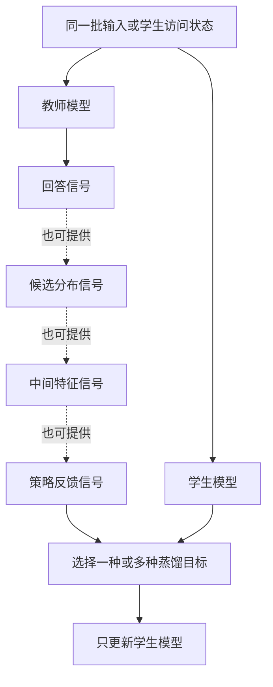
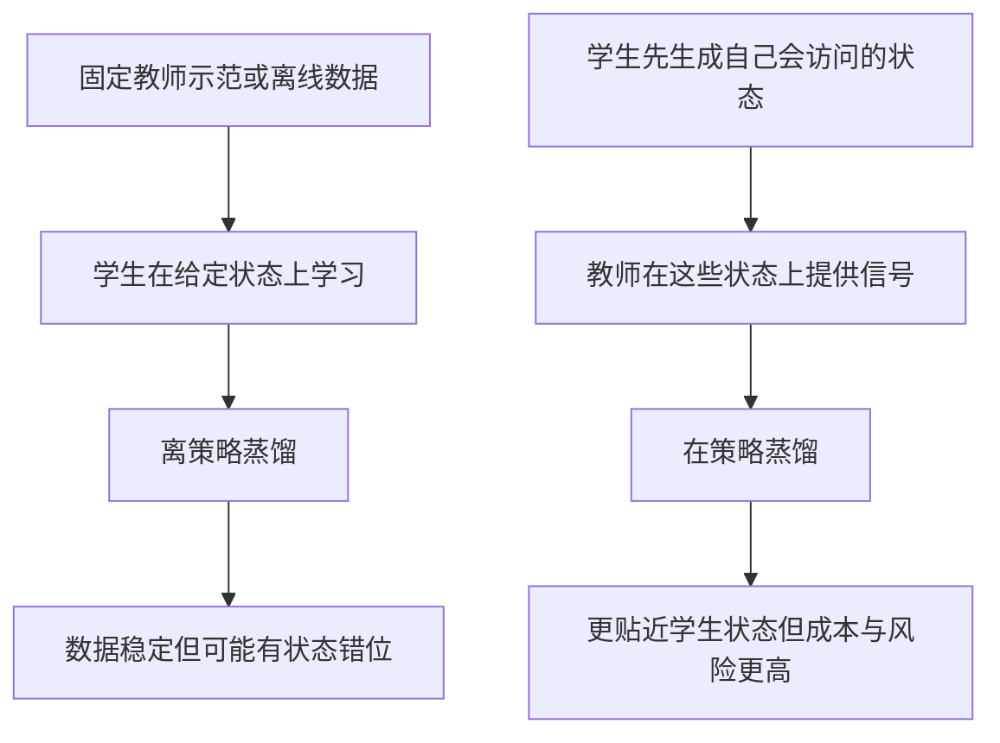
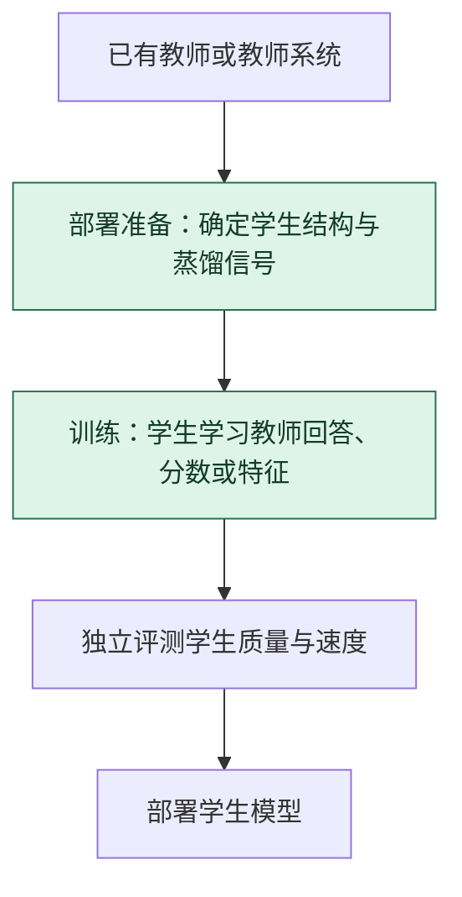

# 知识蒸馏：教师提供信号，学生重新学习

> **看图目标**：看完能区分回答蒸馏、logit 蒸馏、特征蒸馏与策略蒸馏，并说明蒸馏不是复制教师权重。

## 为什么需要它

大模型可能质量较好但成本过高。知识蒸馏让较小的学生模型学习教师产生的信号，希望在受限容量与成本下保留对目标任务有用的行为。

## 主图

虚线把教师可提供的信号纵向排开，不表示必须依次使用。学生仍用自己的结构和参数完成训练；选择哪种信号取决于可访问接口、任务目标、成本与许可边界。

## 对照图

离策略和在策略描述信号来自什么状态分布，不等于“旧算法”和“新算法”，也不保证教师越强学生就学得越好。

## 生命周期位置

蒸馏常服务于压缩或能力迁移，但它本身仍是一段训练。它与量化、剪枝可以组合，不能简单视为三选一。

## 同一位置的不同选择

| 蒸馏选择 | 教师提供什么 | 常见效果与代价 |
|---|---|---|
| 回答蒸馏 | 最终生成或标签 | 数据易保存，但丢失教师对其他候选的判断 |
| Logit 蒸馏 | 候选分数分布 | 信号更丰富，需要访问并存储教师分数 |
| 特征蒸馏 | 中间表示 | 对结构兼容要求更高 |
| 在策略蒸馏 | 学生先生成状态，再请教师指导 | 更贴近学生会访问的状态，教师调用成本更高 |

## 采用判断

| 采用前后要问 | 知识蒸馏的答案 |
|---|---|
| 主要优势 | 能把教师的回答、分布或特征迁移到更小学生，以换取更低部署成本 |
| 主要局限 | 学生容量有限且会继承教师偏差；教师接口、许可、状态分布和信号存储都会限制方案 |
| 适合考虑 | 已有可信教师、明确学生预算和目标任务，并能比较蒸馏前后的质量成本曲线时 |
| 不适合直接采用 | 教师本身未验收、无权使用教师信号，或学生结构小到无法承载目标能力时 |
| 采用后必须检查 | 学生与教师质量差距、罕见样本、长尾能力、安全偏差、延迟、吞吐和总教师调用成本 |

## 看图复述

遮住正文，只看三张图回答：

1. 蒸馏过程中谁提供信号，谁更新参数？
2. 最终回答相同是否表示 logit、特征和策略信号也相同？
3. 在策略路线为什么更贴近学生会遇到的状态？
4. 蒸馏服务于压缩，但为什么它本身仍是一段训练？

能说出“教师给信号、学生重学、状态来源决定蒸馏类型”即可。继续深入看 [模型蒸馏](../06-拓展知识库/小模型与蒸馏/03-模型蒸馏.md)。

## 方法边界

- 图省略各蒸馏损失、温度、层对齐、token 对齐和混合数据比例。
- 学生容量、词表、结构或状态分布不匹配时，教师信号可能难以吸收。
- 蒸馏不会自动消除教师的偏差、幻觉和安全问题，也不保证能力无损。
