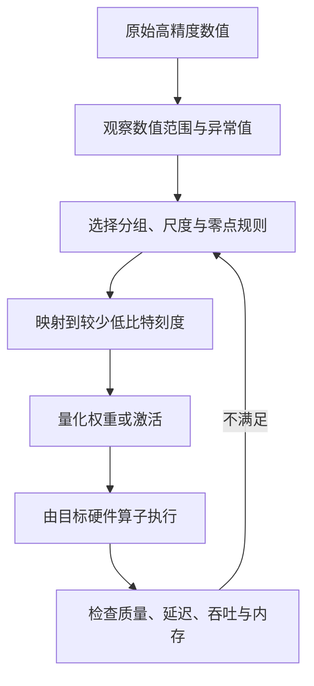
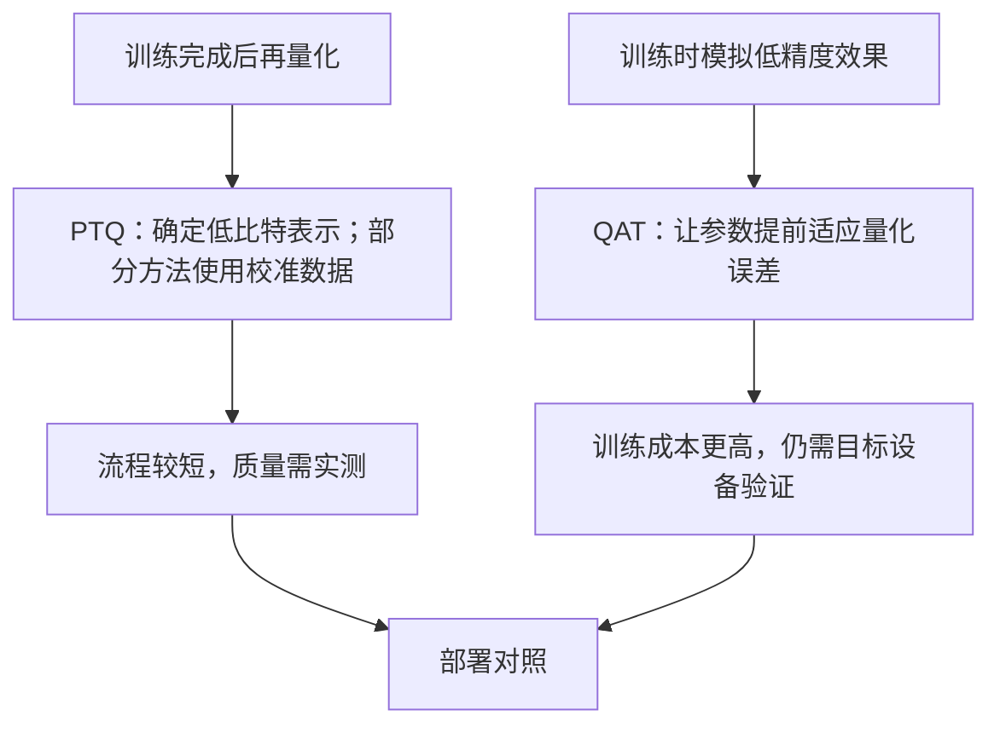
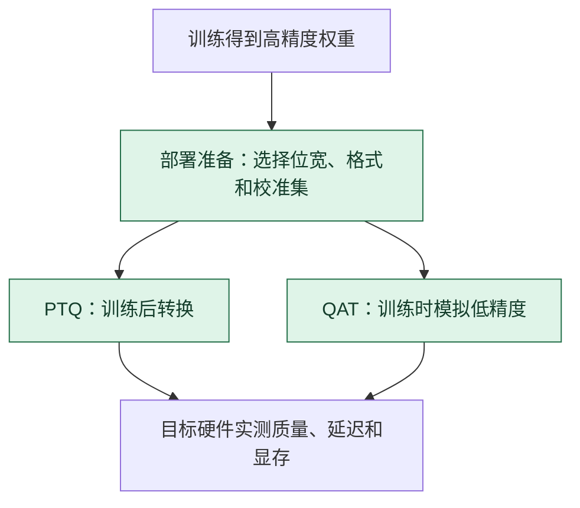

# 模型量化：把宽刻度换成窄刻度

> **看图目标**：看完能指出量化常包含范围或尺度确定、低比特表示和运行时算子支持，并解释文件变小不等于所有硬件上同比加速。

## 为什么需要它

模型权重和激活常占用大量存储与数据搬运带宽。量化用更少 bit 表示数值，希望降低这些成本，同时把由刻度变粗带来的误差控制在任务可接受范围内。

## 主图

量化不是单纯把文件后缀改小。刻度怎样分组、哪些对象量化、运算时是否反量化，以及硬件是否支持目标格式，都会改变结果。

## 对照图

两条路线都必须在同一模型、数据、引擎、硬件和指标口径下比较。位宽只是配置，不是性能结论。

## 生命周期位置

量化主要位于压缩部署节点；QAT 会把低精度影响提前带回训练。是否加速取决于硬件和算子支持，不只取决于 bit 数。

## 同一位置的不同选择

| 数值执行选择 | 何时适配低精度 | 常见效果与代价 |
|---|---|---|
| 高精度或混合精度 | 保留较高精度执行 | 质量基线稳，显存和带宽成本较高 |
| PTQ | 训练后用统计或校准确定量化规则 | 改造快，低 bit 下可能掉质量 |
| QAT | 训练时模拟目标量化误差 | 适应性更强，需要额外训练和实现支持 |
| 权重量化 / 权重激活量化 | 只压权重或连激活一起压 | 收益与误差、内核支持各不相同 |

## 采用判断

| 采用前后要问 | 模型量化的答案 |
|---|---|
| 主要优势 | 减少权重和部分运行张量的存储、带宽与显存占用，在受支持硬件上可能提升吞吐 |
| 主要局限 | 低比特误差会伤害部分任务，真实加速依赖格式、算子、批次和硬件内核支持 |
| 适合考虑 | 部署瓶颈确实是显存或带宽，并且目标设备有成熟低精度执行路径时 |
| 不适合直接采用 | 只根据 bit 数推断速度，尚未保留高精度基线或没有代表性校准和验收集时 |
| 采用后必须检查 | 分任务质量、异常值层、显存、模型加载、TTFT、TPOT、吞吐、功耗和高精度回退方案 |

## 看图复述

遮住正文，只看三张图回答：

1. 为什么部分量化方法需要观察范围或准备校准数据？
2. PTQ 与 QAT 的主要区别发生在训练前后哪个阶段？
3. 权重文件变小以后，为什么仍要在目标设备测延迟和质量？
4. PTQ 和 QAT 分别怎样跨过训练与部署节点？

能说出“选择刻度、低比特表示、硬件执行、联合验收”即可。继续深入看 [压缩、部署与对照实验](../06-拓展知识库/小模型与蒸馏/04-压缩部署与对照实验.md)。

## 方法边界

- 图省略对称或非对称量化、逐张量或逐通道量化、混合精度与具体数值格式。
- 并非所有 PTQ 都需要代表性校准数据；例如 RTN 类方法可以直接从权重确定量化参数。
- 权重、激活和 KV Cache 可以有不同量化策略，不能只说一个“模型位宽”。
- 质量变化依赖模型、任务与校准数据；压缩比例不能直接推导加速比例。
