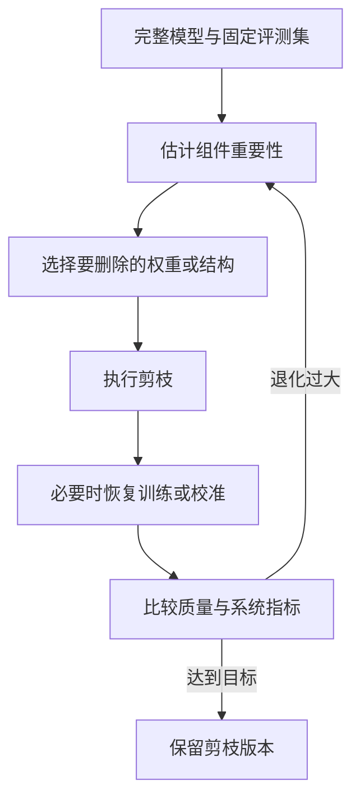
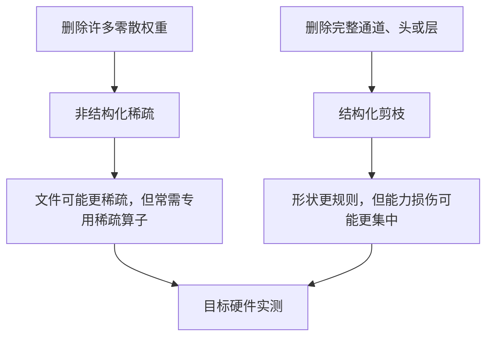
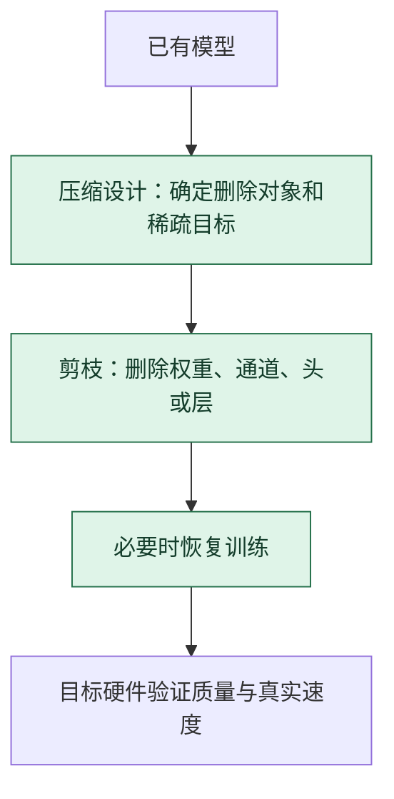

# 模型剪枝：删掉一部分，还要证明机器少做了事

> **看图目标**：看完能区分非结构化剪枝与结构化剪枝，并说明稀疏权重只有被软件和硬件利用时才可能转成真实加速。

## 为什么需要它

模型中部分权重、通道、注意力头或层可能对目标任务贡献较小。剪枝尝试移除这些部分，以减少存储或计算，但删除后必须重新验证质量与运行成本。

## 主图

剪枝不是一次性的“清垃圾”。重要性标准可能看局部权重，也可能看激活、梯度或结构影响；每次删减都要回到同一评测口径。

## 为什么不是随便设计的

剪枝必须同时回答“删谁、按什么分数删、删后怎样执行”。重要性分数只是一种代理，真正约束来自删除后计算图仍合法且目标质量可接受。

| 拿掉什么 | 立即发生什么 |
|---|---|
| 重要性或选择规则 | 删除退化为随机操作，不能针对冗余结构 |
| 结构一致性约束 | 删通道或头后相邻张量形状可能不兼容 |
| 稀疏内核支持 | 权重虽为 0，普通密集算子仍可能执行同样乘加 |
| 剪后校准或微调 | 删除造成的分布偏移不被补偿；是否需要取决于稀疏程度和任务 |

参数计数减少能证明模型表示变稀疏，不能证明目标设备延迟同比下降。

## 对照图

“零很多”和“速度更快”之间隔着存储格式、内核、批次、硬件与调度。结构规整更容易执行，也不表示质量风险一定更小。

## 生命周期位置

剪枝通常在已有模型上做压缩，也可在训练中逐步施加。出现零值只是结构变化，只有运行时真正跳过计算才可能获得速度收益。

## 同一位置的不同选择

| 剪枝选择 | 删除粒度 | 常见效果与代价 |
|---|---|---|
| 非结构化剪枝 | 单个权重 | 稀疏率灵活，普通硬件未必直接加速 |
| 结构化剪枝 | 通道、头、神经元或层 | 更容易映射到硬件，可能造成较大能力变化 |
| 动态稀疏 | 按输入选择计算路径 | 计算随样本变化，调度更复杂 |
| 不剪枝而量化 | 保留结构、缩小数值表示 | 硬件支持通常更成熟，但解决的是另一类成本 |

## 采用判断

| 采用前后要问 | 模型剪枝的答案 |
|---|---|
| 主要优势 | 能删除部分权重或结构，减少模型容量、存储或理论计算量 |
| 主要局限 | 零权重不等于硬件少做计算；结构删除可能造成难恢复的能力损失和分布偏差 |
| 适合考虑 | 目标运行时明确支持所选稀疏格式，或结构化删除能映射到真实算子时 |
| 不适合直接采用 | 只为降低参数统计数字，尚未证明目标设备会跳过相应计算时 |
| 采用后必须检查 | 实际内核、模型尺寸、延迟、吞吐、质量恢复曲线、分任务退化和未剪枝回退版本 |

## 看图复述

遮住正文，只看三张图回答：

1. 剪枝依据来自哪里，删除后为什么还要恢复训练或校准？
2. 非结构化与结构化剪枝分别删掉什么？
3. 参数量下降后，哪一步才能证明部署成本真的下降？
4. 剪枝通常在哪个生命周期节点决定，为什么还可能回到训练？

能说出“评估重要性、删除、恢复、质量与硬件双验收”即可。继续深入看 [压缩、部署与对照实验](../06-拓展知识库/小模型与蒸馏/04-压缩部署与对照实验.md)。

## 方法边界

- 图省略一次性或渐进式剪枝、全局或分层阈值，以及不同重要性估计方法。
- 删除注意力头或层可能改变长上下文、特定领域和安全能力，平均分不能覆盖全部退化。
- 稀疏格式、推理引擎和硬件支持缺一不可，理论计算减少不是实际加速证据。
