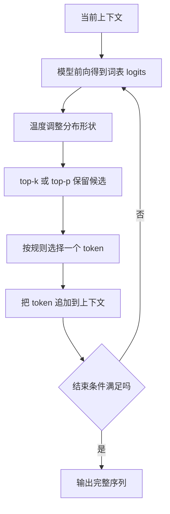
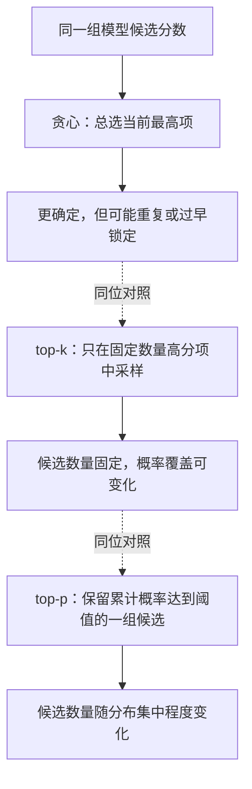
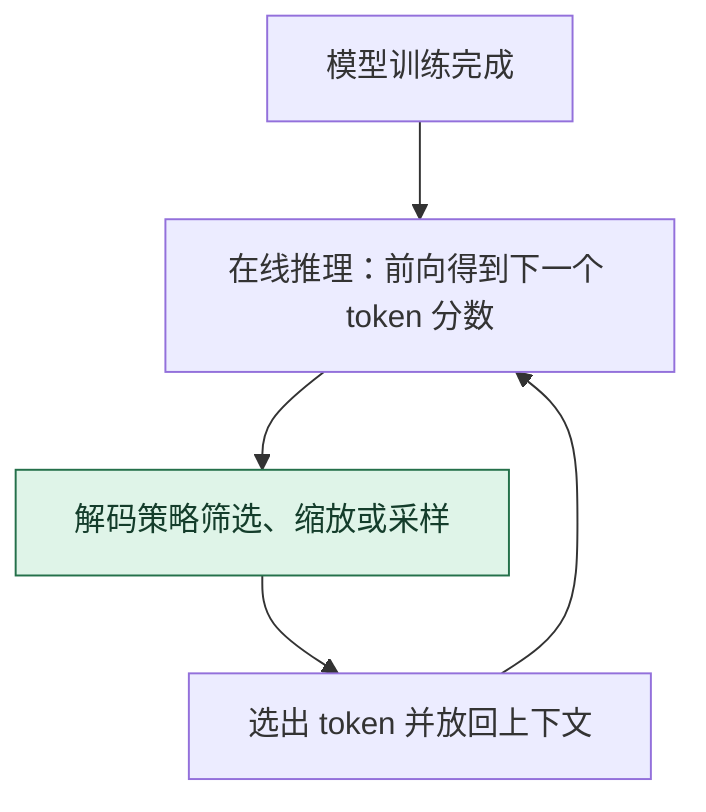

# 采样解码：在候选分布上规定怎样选下一步

> **看图目标**：看完能区分模型 logits、候选过滤和 token 选择三个阶段，并解释温度、top-k 与 top-p 只改变选择规则，不会给模型增加知识。

## 为什么需要它

语言模型每一步给出的是全词表候选分数，不是已经完成的句子。解码策略把这些分数变成一次 token 选择，再把新 token 放回上下文继续生成。

## 主图

生成是一轮一轮重复的选择过程。每一轮的结果会改变下一轮上下文，因此早期选择可能把后续路径带向完全不同的方向。

## 为什么不是随便设计的

解码规则的顺序有实际含义：先应用硬约束和分数处理，再筛候选、重新归一化，最后贪心选择或随机采样。

| 拿掉什么 | 立即发生什么 |
|---|---|
| temperature 分母 | 等价于固定 `T=1`；不是采样失效，只是不再调分布锐度 |
| top-k/top-p 后的重新归一化 | 保留候选的概率和小于 1，不能直接作为完整采样分布 |
| 随机抽样 | 退化为从处理后候选中选最高项的确定性规则 |
| 停止条件 | 即使已生成 EOS 或达到上限，循环仍没有明确终止规则 |

`T=0` 不能代入 softmax 除法；接口常把它约定为贪心。任何筛选都只能重分配已有概率，不能补知识或保证事实。

## 对照图

虚线表示解码规则对照，不表示一次生成依次执行三种选择。这些规则没有统一的“最好”设置。创作、代码、事实问答与结构化输出对随机性、重复和稳定性的容忍度不同。

## 生命周期位置

采样位于每次前向之后的在线生成节点，通常不修改模型权重。它能改变确定性和多样性，不能创造模型没有学到的事实。

## 同一位置的不同选择

| 解码选择 | 怎样选下一个 token | 常见效果与代价 |
|---|---|---|
| 贪心解码 | 每步选当前最高分 | 确定、便宜，但容易局部重复或缺少多样性 |
| Temperature | 调整分布尖锐程度后采样 | 控制随机性，不限定候选数量 |
| top-k | 只保留固定数量高分候选 | 候选数固定，保留的概率质量会变化 |
| top-p | 保留累计概率达到阈值的最小集合 | 候选数随分布变化，仍不保证事实正确 |

## 采用判断

| 采用前后要问 | 采样解码的答案 |
|---|---|
| 主要优势 | 不改权重就能调节输出的确定性、多样性和探索范围，切换成本较低 |
| 主要局限 | 只能重排或筛选已有候选，不能补知识、保证事实或修复模型系统性错误 |
| 适合考虑 | 创作、开放问答或需要多个候选的任务，并能容忍和评测一定随机性时 |
| 不适合直接采用 | 严格结构化输出、可重复测试或高风险事实任务，却没有约束解码和验证器时 |
| 采用后必须检查 | 任务成功率、事实性、重复率、多样性、格式合规、随机种子可复现性和最坏样本 |

## 看图复述

遮住正文，只看三张图回答：

1. 模型输出 logits 后，还经过哪两个阶段才选出 token？
2. top-k 与 top-p 固定的对象分别是什么？
3. 降低随机性为什么不能保证事实正确？
4. 采样会修改模型权重，还是只影响在线 token 选择？

能说出“模型给分、规则筛选、逐 token 回环”即可。继续深入看 [D07：模型一次运行](../01-14天理论课/D07-模型一次运行到底发生什么.md)。

## 方法边界

- 图省略重复惩罚、停止词、约束解码、束搜索和服务端批处理。
- 温度与候选过滤的具体顺序取决于实现，必须以所用引擎文档为准。
- 解码策略只能重排或筛选模型已有候选，不能补齐参数与上下文中不存在的可靠知识。
