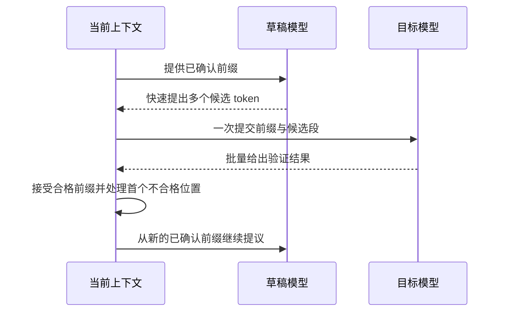
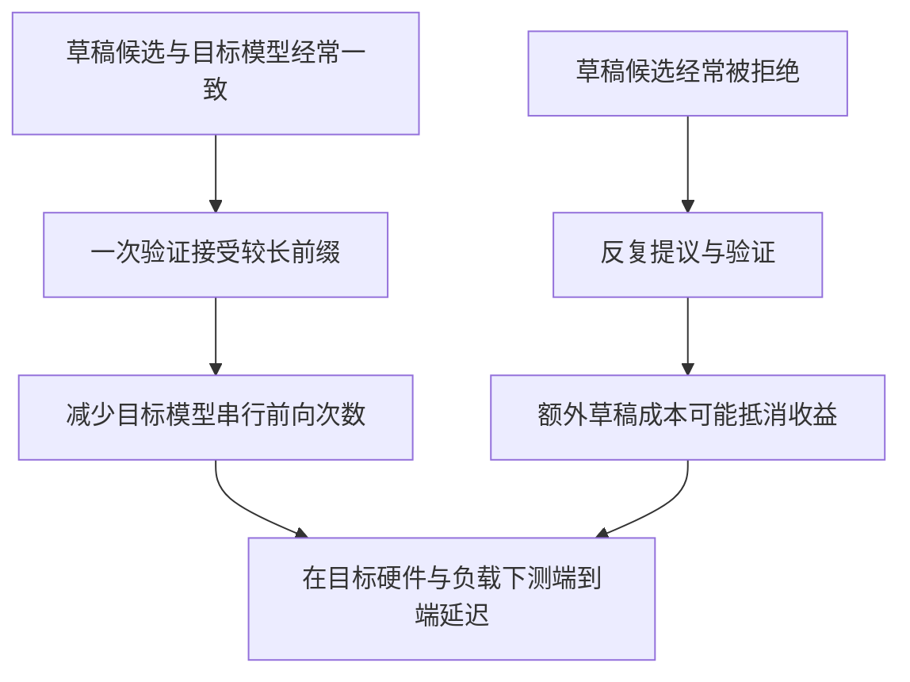
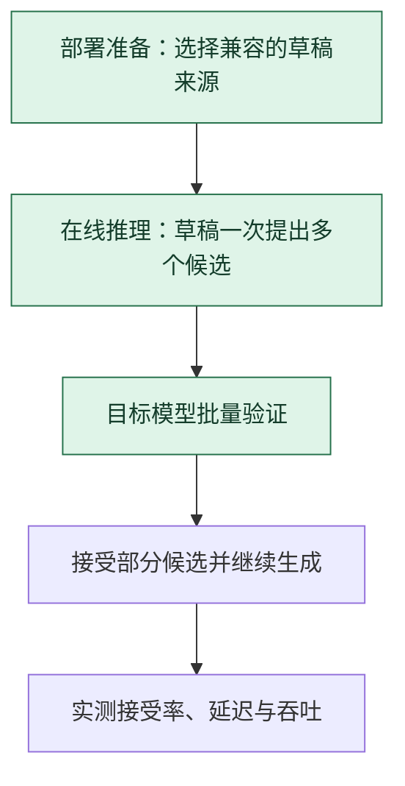

# 推测解码：草稿先提议，目标模型统一验收

> **看图目标**：看完能指出草稿模型只负责提出候选、目标模型负责验证与最终分布，并解释接受率决定是否可能获得加速。

## 为什么需要它

普通自回归生成常由目标模型一次确认一个新 token。推测解码让更便宜的草稿模型先提出一段候选，再让目标模型用一次较大的计算批量检查，希望减少昂贵的串行等待。

## 主图

草稿模型不能绕过目标模型。候选接受规则必须与具体方法匹配，某些规则可以保持目标模型原有分布，某些近似方法则会改变输出分布。

## 对照图

加速来自“用便宜提议换取更少昂贵的目标模型前向”，不是来自跳过目标模型。草稿质量、草稿成本、接受长度和批处理条件必须一起看。

## 生命周期位置

推测解码位于部署和在线推理节点，目标是减少昂贵串行步骤。它不替代模型训练、采样规则或目标模型的最终校验。

## 同一位置的不同选择

| 推理执行选择 | 怎样减少串行等待 | 常见效果与代价 |
|---|---|---|
| 普通自回归 | 目标模型每次确认一个 token | 路径简单，串行步数多 |
| 草稿模型推测 | 小模型提议，目标模型批量验证 | 接受率高时加速，额外占用草稿计算与内存 |
| 多 token 预测头 | 同一模型内部提出多个未来候选 | 不必维护独立草稿模型，但需结构或训练支持 |
| 并行采样多个回答 | 同时生成多条完整候选 | 提高探索，不等于减少单条回答延迟 |

## 采用判断

| 采用前后要问 | 推测解码的答案 |
|---|---|
| 主要优势 | 在接受率足够高时减少目标模型串行前向次数，部分方法还能保持目标分布 |
| 主要局限 | 草稿模型带来额外计算和内存；短输出、低接受率或带宽瓶颈下可能没有收益 |
| 适合考虑 | 服务主要受逐 token decode 延迟限制，且能找到便宜、兼容、与目标模型较一致的草稿来源时 |
| 不适合直接采用 | 请求很短、batch 很大、设备已被带宽或调度限制，或无法证明接受规则正确时 |
| 采用后必须检查 | 接受率、接受长度、TTFT、TPOT、端到端延迟、吞吐、显存和输出分布一致性 |

## 看图复述

遮住正文，只看三张图回答：

1. 谁提出多个候选，谁决定接受哪些候选？
2. 接受率很低时，新增了哪些没有换来收益的工作？
3. 为什么“使用推测解码”不能单独证明输出分布保持不变？
4. 推测解码优化的是训练质量还是在线执行速度？

能说出“草稿提议、目标验证、接受率决定收益”即可。继续深入看 [推理引擎与解码执行](../06-拓展知识库/软硬件瓶颈/03-推理引擎与解码执行.md)，再看 [Token 生成速度与并行解码](../06-拓展知识库/软硬件瓶颈/06-Token生成速度与并行解码.md) 了解完整的延迟拆分。

## 方法边界

- 图只表达草稿加目标模型的一类方法，省略树状候选、多头草稿和自推测等变体。
- 只有满足对应接受规则时才能声称保持目标分布；近似实现必须单独做质量评测。
- 真实收益依赖序列长度、batch、模型大小、内存带宽、内核与服务调度，不能只看理论接受长度。
