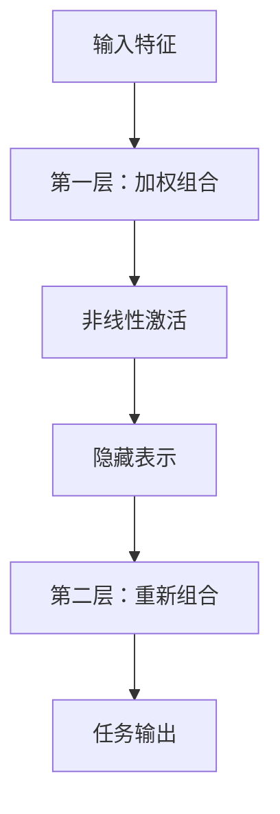
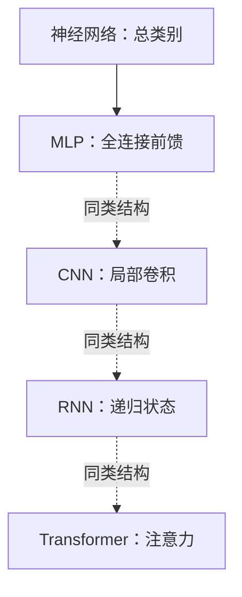
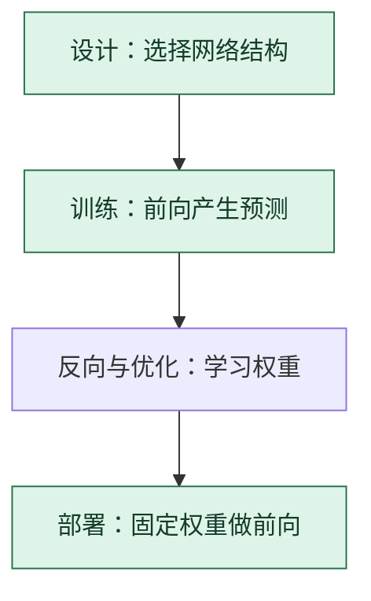

# 神经网络与 MLP：把多层可学习变换连起来

> **看图目标**：看完能说明“神经网络”是一个大类，MLP 是其中一种结构，并区分网络结构、反向传播和优化器的责任。

## 为什么需要它

单个线性变换只能做有限的模式组合。神经网络把多层“加权组合 + 非线性变换”连接起来，让后层能在前层特征上继续组织更复杂的表示。MLP（多层感知机）是最基础的前馈神经网络之一。

## 主图

“层”决定信息怎样前进；训练时再用反向传播得到梯度，由优化器修改层里的权重。三者不是同一个算法。

## 对照图

虚线只表示并列的结构家族，不表示运行顺序。看到“用了神经网络”仍不知道具体结构；还要继续问层怎样连接、信息在哪个维度交互。

## 生命周期位置

MLP 首先是**架构选择**；训练和推理都会执行它的前向计算。反向传播与 AdamW 只在训练时帮助它学习参数。

## 同一位置的不同选择

| 结构选择 | 更擅长利用的关系 | 常见效果与代价 |
|---|---|---|
| MLP | 固定长度特征之间的全连接组合 | 简单通用，但不主动利用空间或时间结构 |
| CNN | 邻近位置和重复局部模式 | 局部性强、参数共享，但全局关系需逐层扩大 |
| RNN / LSTM / GRU | 按顺序累积的状态 | 适合流式序列，但长距离与并行训练受限 |
| Transformer | 内容相关的全局或受限交互 | 并行性强，但注意力可能带来较高计算和缓存成本 |

## 采用判断

| 采用前后要问 | 神经网络与 MLP 的答案 |
|---|---|
| 主要优势 | 结构通用、实现成熟，能通过多层非线性组合学习复杂特征，也是其他网络的重要子模块 |
| 主要局限 | 纯 MLP 不主动利用空间、时间或图关系，全连接规模也可能快速增加参数和过拟合风险 |
| 适合考虑 | 输入是固定长度特征，或需要在更大模型中对每个位置变换特征时 |
| 不适合直接采用 | 图像、长序列或图关系是任务核心，却没有比较 CNN、递归、注意力或 GNN 等结构先验时 |
| 采用后必须检查 | 训练与验证差距、参数规模、输入缩放、延迟、校准和数据分布变化后的表现 |

## 看图复述

遮住正文，只看三张图回答：

1. 神经网络、MLP、反向传播和优化器分别是什么角色？
2. MLP 的信息会按什么方向流动？
3. 为什么“使用神经网络”还不足以说明模型结构？

能说出“网络是大类，MLP 是结构，反向传播算梯度，优化器改权重”即可。继续深入看 [D04：神经网络如何学习](../01-14天理论课/D04-神经网络如何学习.md)。

## 方法边界

- 图省略了偏置、具体激活函数、归一化、残差和张量形状。
- MLP 不只用于分类，也常作为更大网络中的子模块。
- 层数或参数更多不自动代表效果更好，仍受数据、目标、训练和评测约束。
