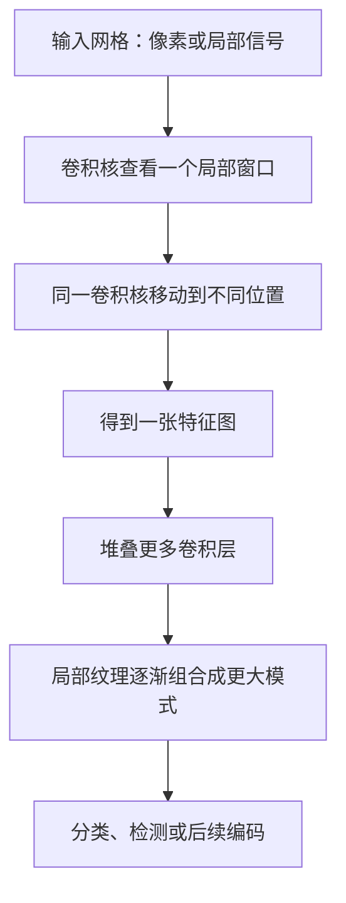
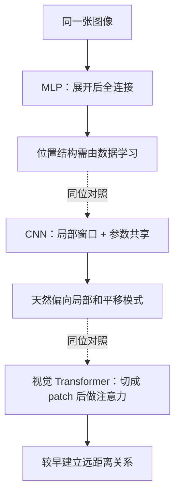
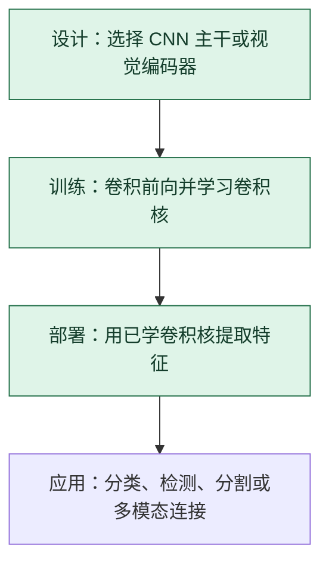

# 卷积神经网络 CNN：用同一组局部探测器扫描输入

> **看图目标**：看完能说出卷积核、特征图和逐层扩大感受范围的关系，并知道 CNN 是模型结构，不是训练优化器。

## 为什么需要它

图像、音频谱图和某些时序数据常有“邻近位置相关、同一种局部模式会在不同位置出现”的特点。CNN 用共享卷积核反复扫描局部区域，不必为每个位置各学一套独立参数。

## 主图

共享参数让同一种探测器能在多个位置寻找相似模式。深层特征来自多层组合，不是某个卷积核直接“看懂整个物体”。

## 对照图

虚线表示结构方案对照，不表示图像依次经过三种网络。三者都能参与视觉任务，但把什么关系写进结构先验、需要多少数据以及计算方式不同。

## 生命周期位置

CNN 在**架构设计**时被选定，训练和推理都会执行卷积；反向传播和优化器负责学习卷积核数值。

## 同一位置的不同选择

| 视觉主干选择 | 结构偏好 | 常见效果与代价 |
|---|---|---|
| CNN | 局部连接、参数共享 | 数据效率和局部模式较好，全局关系通常要靠层叠 |
| 视觉 Transformer | patch 间注意力 | 全局交互直接，但训练数据和计算预算可能更高 |
| CNN + Transformer | 先提局部特征再建全局关系 | 能结合两类偏好，也增加结构与调参复杂度 |

## 采用判断

| 采用前后要问 | CNN 的答案 |
|---|---|
| 主要优势 | 局部连接和参数共享天然适合重复空间模式，通常具有较好的数据效率和成熟硬件支持 |
| 主要局限 | 远距离和全局关系需要层叠、扩大感受范围或加入其他模块；对尺度和分辨率变化也可能敏感 |
| 适合考虑 | 图像、音频谱图或局部模式明确，数据和部署预算不适合大型全局注意力时 |
| 不适合直接采用 | 任务主要依赖任意远距离关系，或只是因为 CNN 经典而忽略视觉 Transformer 与混合主干基线时 |
| 采用后必须检查 | 不同分辨率和尺度、位置偏移、长尾类别、鲁棒性、特征图成本以及目标设备延迟 |

## 看图复述

遮住正文，只看三张图回答：

1. 同一个卷积核为什么可以出现在输入的多个位置？
2. CNN 与 MLP、视觉 Transformer 的主要结构差异是什么？
3. CNN 在生命周期中何时被决定、何时真正运行？

能说出“设计时选结构，训练和推理都做卷积，优化器只负责学参数”即可。

## 方法边界

- 图省略步幅、填充、通道、池化、空洞卷积和具体任务头。
- CNN 不只处理图片，也可用于一维序列和二维时频表示。
- 局部先验不是永远更好；效果依赖任务尺度、数据量、分辨率和计算预算。
