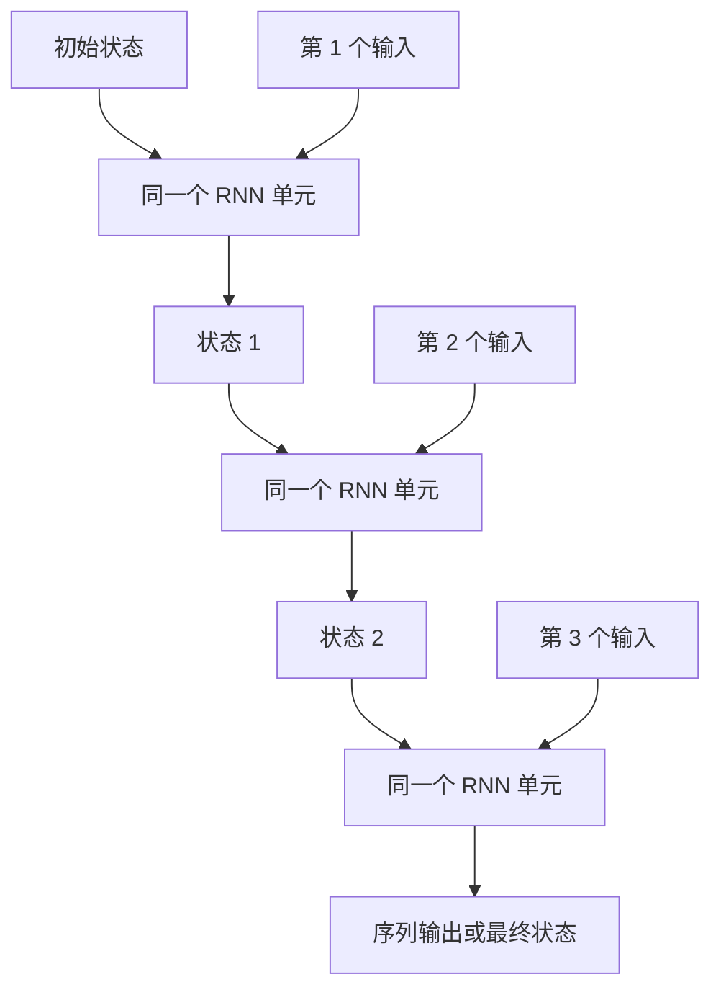
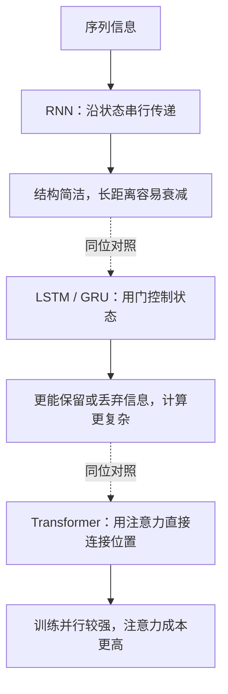
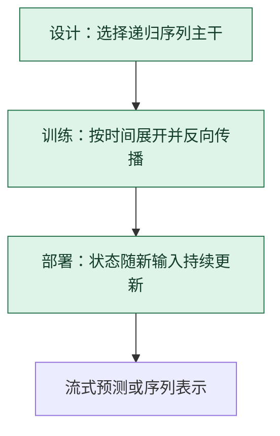

# 循环神经网络 RNN：让状态沿时间一步步传下去

> **看图目标**：看完能说明 RNN 怎样复用同一个单元处理序列，以及为什么顺序依赖会限制并行和长距离记忆。

## 为什么需要它

序列中的当前输出常依赖过去。RNN 把上一步隐藏状态与当前输入一起送入同一个循环单元，让一个固定大小的状态沿时间传递。

## 主图

图中画了三个单元，但参数通常共享；真正随时间变化的是输入和隐藏状态。

## 对照图

虚线表示同位选择。它们是在序列主干位置上的不同选择，不是训练阶段先后执行的三个步骤。

## 生命周期位置

RNN 是**结构选择**；训练时常用时间反向传播学习共享参数，推理时只沿序列更新状态。

## 同一位置的不同选择

| 序列结构 | 历史怎样保存 | 常见效果与代价 |
|---|---|---|
| 简单 RNN | 每步覆盖更新隐藏状态 | 参数少、流式自然，但长依赖和梯度稳定性较弱 |
| LSTM / GRU | 用门决定保留、写入和输出 | 长依赖通常更稳，但单步计算更复杂 |
| Transformer | 让位置按内容直接读取其他位置 | 训练并行性强，长上下文计算和缓存成本更高 |
| 状态空间模型 | 用结构化状态递推压缩历史 | 长序列效率有优势，但信息保留方式与实现不同 |

## 采用判断

| 采用前后要问 | RNN 的答案 |
|---|---|
| 主要优势 | 状态自然随输入流更新，参数共享、单步结构紧凑，适合持续到达的序列 |
| 主要局限 | 时间依赖限制训练并行，固定状态容易遗失长距离细节，梯度也可能不稳定 |
| 适合考虑 | 流式传感器、小型时序模型或严格按顺序处理、状态预算固定的场景时 |
| 不适合直接采用 | 需要大规模并行训练、任意位置直接交互或可靠保留超长历史时 |
| 采用后必须检查 | 不同序列长度、状态重置、跨样本泄漏、长距离任务、梯度稳定和单步尾延迟 |

## 看图复述

遮住正文，只看三张图回答：

1. 图中多个 RNN 单元是否各有一套参数？
2. 为什么后一步不能完全脱离前一步状态并行计算？
3. RNN、LSTM 和 Transformer 是生命周期阶段还是同一位置的结构选择？

能说出“共享单元、状态串行、结构可替换”即可。

## 方法边界

- 图省略双向 RNN、多层堆叠、序列掩码和输出头。
- 固定状态不保证无损保存任意长历史。
- RNN 没有因 Transformer 流行而消失，流式、低延迟和小模型场景仍可能使用。
