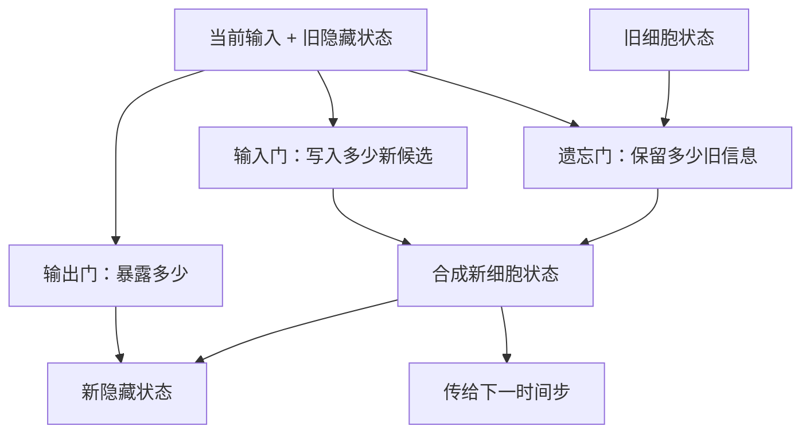
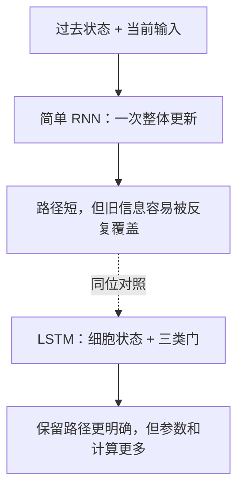
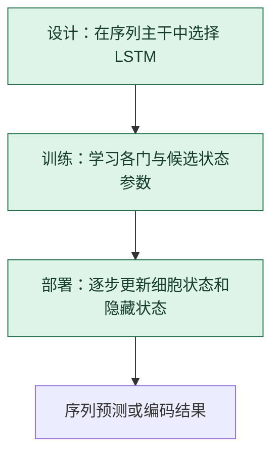

# LSTM：用门控制哪些历史继续通过

> **看图目标**：看完能区分遗忘门、输入门和输出门的职责，并说明 LSTM 是 RNN 家族的结构变体。

## 为什么需要它

简单 RNN 的状态每一步都被整体改写，较早信息容易衰减。LSTM 增加一条细胞状态通路，并用多个门决定丢掉多少旧信息、写入多少新信息、向外暴露多少状态。

## 主图

“门”是介于少保留与多保留之间的连续控制，不是硬开关，也不是人工写好的规则。

## 对照图

虚线表示递归单元的替代选择。LSTM 改变的是单元内部结构；训练仍需要反向传播与优化器。

## 生命周期位置

LSTM 在架构设计时确定；训练和推理使用同一组门控计算，区别在于训练会继续更新参数。

## 同一位置的不同选择

| 递归单元 | 状态控制 | 常见效果与代价 |
|---|---|---|
| 简单 RNN | 单一隐藏状态整体更新 | 最简洁，但较难保留长距离信息 |
| LSTM | 细胞状态、遗忘门、输入门、输出门 | 控制细，参数和单步计算较多 |
| GRU | 合并部分状态与门 | 通常更紧凑，具体效果依任务而定 |
| Transformer | 不递归传单一状态 | 并行性更强，但运行形态与缓存不同 |

## 采用判断

| 采用前后要问 | LSTM 的答案 |
|---|---|
| 主要优势 | 门控和细胞状态为信息保留提供更清楚的路径，通常比简单 RNN 更能处理较长依赖 |
| 主要局限 | 仍然按时间串行，门和状态增加参数与单步计算，也不能无损记住任意长历史 |
| 适合考虑 | 需要流式递归、简单 RNN 长依赖表现不足，而 Transformer 成本或并行方式不合适时 |
| 不适合直接采用 | 超长全局关系和大规模并行训练是核心需求，或只因“能记忆”就假设不会遗忘时 |
| 采用后必须检查 | 长跨度任务、状态泄漏、截断长度、门饱和、训练稳定、流式延迟和 GRU 基线 |

## 看图复述

遮住正文，只看三张图回答：

1. 哪个门决定旧信息保留多少？
2. 细胞状态与隐藏状态是否完全相同？
3. LSTM 替代的是优化器还是序列单元？

能说出“三类门控制一条状态通路，LSTM 是结构选择”即可。

## 方法边界

- 图省略门的具体激活、逐元素运算和张量形状。
- 门控能改善信息与梯度路径，但不保证记住任意长序列。
- LSTM、GRU 与 Transformer 的优劣必须结合数据规模、延迟和部署约束评测。
