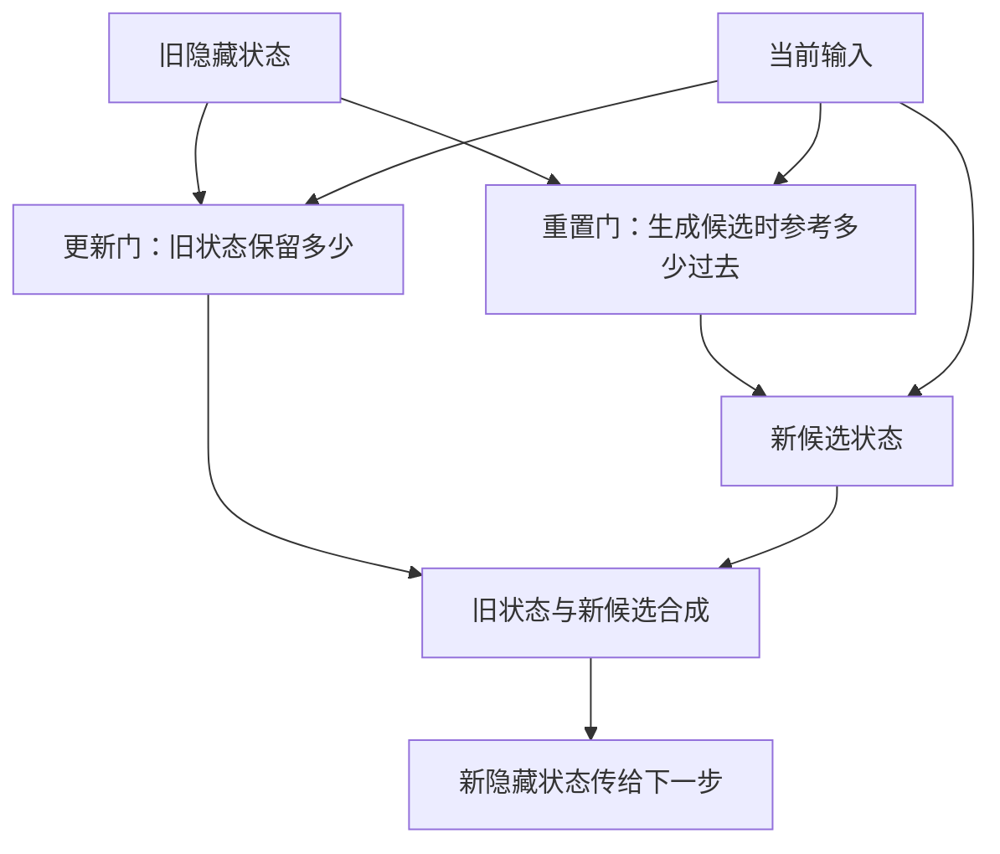
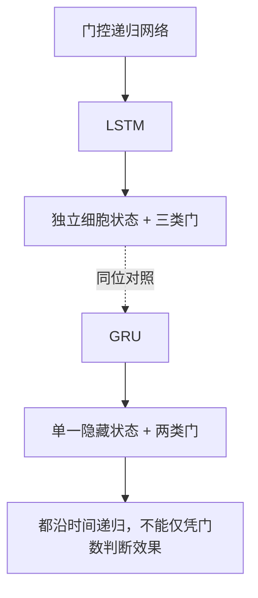
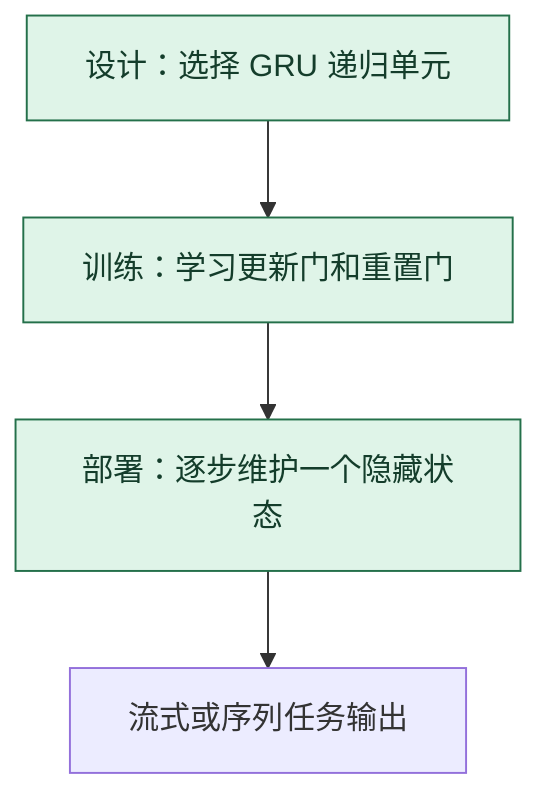

# GRU：用两类门合并控制旧状态与新信息

> **看图目标**：看完能说明更新门和重置门分别控制什么，并看出 GRU 与 LSTM 是同一递归单元位置的不同设计。

## 为什么需要它

GRU 也想解决简单 RNN 难以保留长距离信息的问题，但把 LSTM 的细胞状态与隐藏状态合并，并用较少的门控制状态更新。

## 主图

更新门决定旧状态与新候选的混合比例；重置门主要影响新候选怎样读取过去。

## 对照图

虚线表示同位替代，不是 LSTM 先变成 GRU。GRU 通常更紧凑，但“参数更少”不自动等于“更快”或“效果更好”。

## 生命周期位置

GRU 是架构选择；它和 LSTM 通常不会在同一层按生命周期先后各跑一次。

## 同一位置的不同选择

| 递归单元 | 主要结构差异 | 常见效果与代价 |
|---|---|---|
| 简单 RNN | 无显式门控 | 参数少，长依赖较弱 |
| LSTM | 独立细胞状态与三类门 | 控制细，状态和参数更多 |
| GRU | 合并状态与两类门 | 结构紧凑，效果需按任务验证 |

## 采用判断

| 采用前后要问 | GRU 的答案 |
|---|---|
| 主要优势 | 比 LSTM 更紧凑地提供门控状态更新，常适合资源受限的递归序列模型 |
| 主要局限 | 状态控制更合并，仍受串行计算和固定状态限制；参数较少不保证更快或更准 |
| 适合考虑 | 需要门控递归但希望降低模型和状态复杂度，并能与 LSTM 做同条件比较时 |
| 不适合直接采用 | 仅按门的数量或参数量作决定，尚未测量目标任务质量和硬件单步延迟时 |
| 采用后必须检查 | 与简单 RNN、LSTM 的质量差异、长跨度遗忘、状态重置、梯度和真实设备延迟 |

## 看图复述

遮住正文，只看三张图回答：

1. 更新门混合哪两部分？
2. 重置门主要影响旧状态的哪次使用？
3. GRU 与 LSTM 是先后阶段还是替代选择？

能说出“GRU 用两类门维护单一隐藏状态，与 LSTM 同位竞争”即可。

## 方法边界

- 图省略具体方程、逐元素运算、双向结构与多层堆叠。
- 不同框架可能在门的排列和实现细节上存在差异。
- 选择 GRU 仍需比较任务质量、训练速度、推理延迟和硬件实现。
