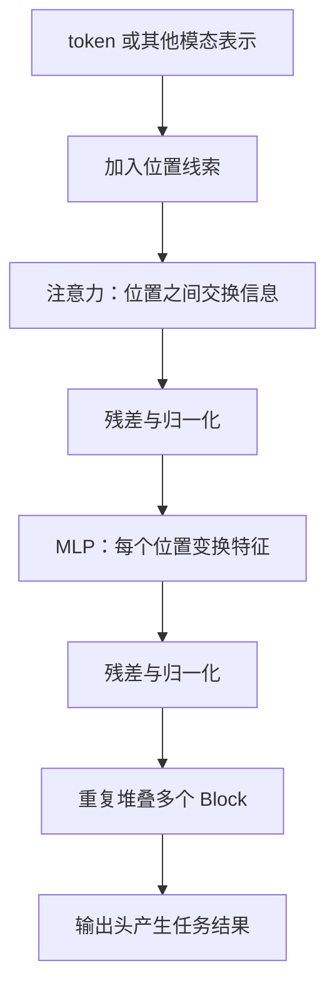
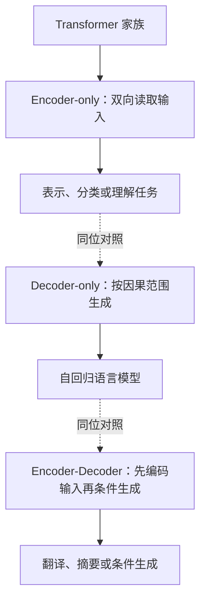
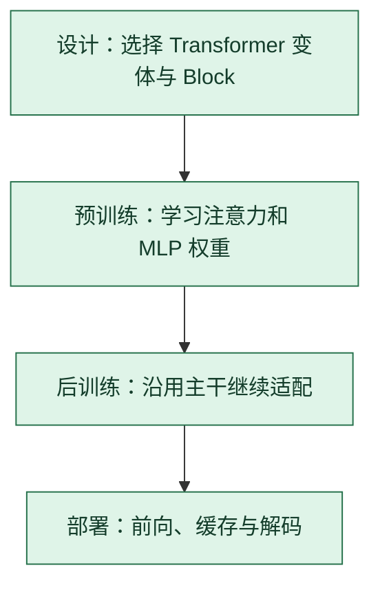

# Transformer：让位置先交换信息，再各自变换特征

> **看图目标**：看完能把注意力、MLP、残差与堆叠 Block 放回同一架构，并区分 Transformer 与单独的自注意力算法。

## 为什么需要它

自注意力只负责位置之间的信息汇总，还不是完整模型。Transformer 把注意力、MLP、残差连接和归一化组合成可重复堆叠的 Block，再接输入表示和任务输出头。

## 主图

注意力混合位置，MLP 变换每个位置内部的特征；残差路径保留原信息并帮助深层训练。

## 为什么不是随便设计的

Transformer Block 把“跨位置混合”的注意力与“逐位置特征变换”的 MLP 分工，再用残差和归一化维持深层信号路径。

| 拿掉什么 | 立即发生什么 |
|---|---|
| 注意力 | Block 内没有内容相关的跨位置读取，只剩逐位置变换 |
| MLP | 仍能交换位置，但少了每个位置内部的非线性特征变换 |
| 残差通路 | 每层必须完整重写表示，深层的恒等信息与梯度捷径消失 |
| 位置机制 | 纯注意力对输入排列缺少足够的顺序区分；具体影响依架构实现 |

这些部件解释标准 Block 的职责，不证明所有 Transformer 必须采用同一种归一化顺序或 MLP 比例。

## 对照图

虚线表示家族变体对照，不表示三个模型依次运行。“Transformer”不是一种唯一网络；可见范围、模块组合和输出方式会改变它适合的任务。

## 生命周期位置

Transformer 贯穿训练与推理，但它首先是架构；DPO、LoRA、量化和采样是在生命周期的其他位置作用于它。

## 同一位置的不同选择

| 序列主干 | 信息路径 | 常见效果与代价 |
|---|---|---|
| RNN / LSTM / GRU | 状态沿时间传递 | 流式自然，训练并行和长依赖受限 |
| Transformer | 注意力直接连接可见位置 | 并行训练强，长上下文成本和缓存较高 |
| 状态空间或混合架构 | 固定状态递推并穿插注意力 | 长序列效率可能更好，信息保真和实现各异 |

## 采用判断

| 采用前后要问 | Transformer 的答案 |
|---|---|
| 主要优势 | 注意力支持内容相关的位置交互，训练并行性强，模块化架构适合扩展到文本和多模态 |
| 主要局限 | 长上下文注意力、KV Cache、训练数据和计算成本高；结构主流不代表所有任务最优 |
| 适合考虑 | 任务依赖灵活上下文关系，有足够数据和算力，并能承担目标长度的训练部署成本时 |
| 不适合直接采用 | 小型流式任务或极端长序列受硬件限制，却没有比较 CNN、递归、状态空间或混合架构时 |
| 采用后必须检查 | 不同长度质量、位置外推、KV Cache、显存、TTFT、TPOT、数据污染和旧能力回归 |

## 看图复述

遮住正文，只看三张图回答：

1. 注意力与 MLP 分别混合什么？
2. Decoder-only 的因果范围与 Encoder-only 有何不同？
3. Transformer、LoRA 和量化分别位于哪个决策层？

能说出“Transformer 是主干，注意力是子算法，适配和部署方法作用在其他节点”即可。继续深入看 [D06：拼出完整 Transformer](../01-14天理论课/D06-拼出完整Transformer.md)。

## 方法边界

- 图省略多头、具体位置机制、Norm 放置和训练目标。
- 不同 Transformer 变体的注意力范围、激活函数、路由和缓存方式可能不同。
- 架构主流不代表对所有模态、序列长度和硬件约束都最优。
