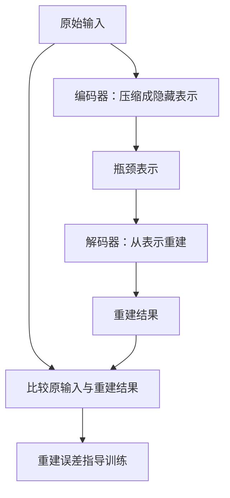
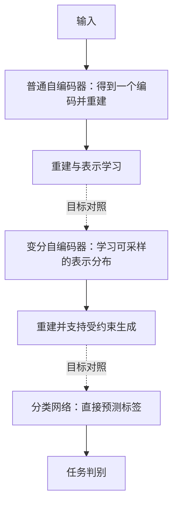
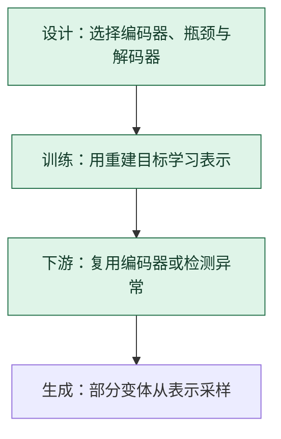

# 自编码器：先压成表示，再尝试还原输入

> **看图目标**：看完能说明编码器、瓶颈表示和解码器的关系，并区分自编码器与直接分类模型。

## 为什么需要它

当训练信号来自输入本身时，自编码器让网络先把输入压成较紧凑的表示，再从该表示重建原输入。瓶颈迫使模型保留对重建有用的信息。

## 主图

模型学习的是“怎样保留足以重建的信息”，不保证瓶颈中的每个方向都自动对应人类可命名概念。

## 为什么不是随便设计的

自编码器用编码器产生受限表示，再让解码器从该表示重建输入；限制或扰动阻止网络只建立毫无约束的复制通道。

| 拿掉什么 | 立即发生什么 |
|---|---|
| 编码器 | 没有从输入到潜表示的学习过程 |
| 解码器 | 潜表示没有重建目标提供训练信号 |
| 瓶颈、噪声或其他约束 | 容量足够时可能学近似恒等复制，未必形成有用压缩特征 |
| 重建目标 | “还原什么”没有可计算标准，需换成其他自监督目标 |

重建误差低只能证明对该数据和损失重建得好，不能直接证明语义、异常检测或下游性能好。

## 对照图

虚线表示训练目标对照，不表示依次处理。它们的输出目标不同；不能只看都含“编码器”就认为训练目的相同。

## 生命周期位置

自编码器通常是**训练目标与架构的组合**；训练完成后可以只保留编码器，也可以继续使用完整重建路径。

## 同一位置的不同选择

| 表示学习选择 | 学习信号 | 常见效果与代价 |
|---|---|---|
| 普通自编码器 | 输入重建 | 直观，但可能学到复制细节而非任务语义 |
| 变分自编码器 | 重建 + 分布约束 | 可采样、表示更平滑，但重建可能更模糊 |
| 对比学习 | 样本间相似与差异 | 强调不变特征，需要设计正负或配对规则 |

## 采用判断

| 采用前后要问 | 自编码器的答案 |
|---|---|
| 主要优势 | 可以利用输入自身构造训练信号，学习压缩表示、重建路径或异常检测基线 |
| 主要局限 | 可能只学会复制表面细节；重建误差低不等于语义表示好，也不天然给出可靠异常阈值 |
| 适合考虑 | 标签有限，但重建、压缩、去噪或与正常样本差异确实对应任务目标时 |
| 不适合直接采用 | 真正目标是分类、因果解释或高保真生成，却只准备按重建 loss 选择模型时 |
| 采用后必须检查 | 重建质量与下游质量的相关性、瓶颈利用、异常阈值、分布漂移和不同群体误报漏报 |

## 看图复述

遮住正文，只看三张图回答：

1. 瓶颈前后分别是哪两个组件？
2. 重建目标和分类目标有何不同？
3. 训练结束后是否必须保留解码器？

能说出“输入经瓶颈重建，编码器可单独复用”即可。

## 方法边界

- 图省略去噪自编码器、稀疏约束和变分推断细节。
- 重建质量好不等于表示对所有下游任务都有用。
- 压缩维度、数据与目标共同决定表示保留什么信息。
