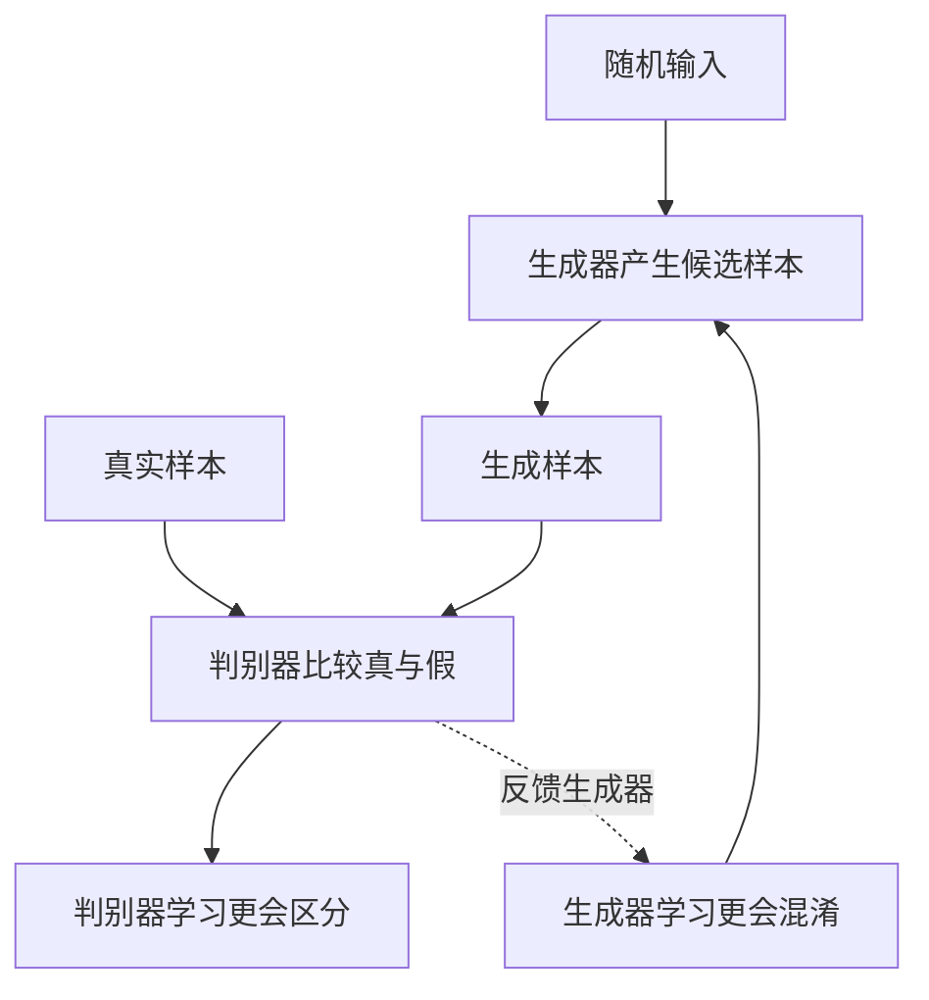
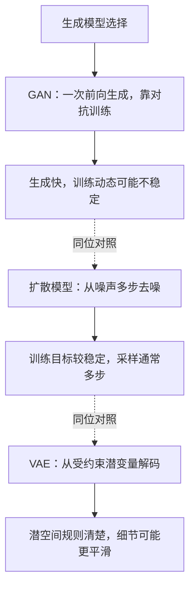
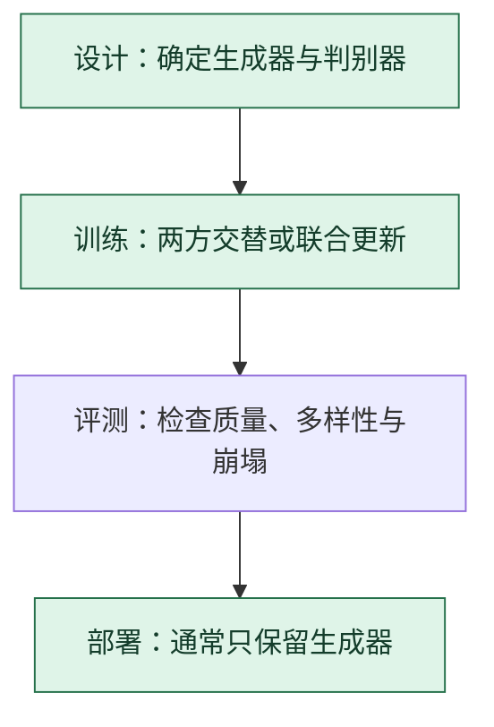

# 生成对抗网络 GAN：生成器与判别器互相提供压力

> **看图目标**：看完能说出生成器和判别器各自接收什么、优化什么，并知道 GAN 是训练框架，不是单个网络层。

## 为什么需要它

GAN 用两个网络形成对抗：生成器把随机输入变成候选样本，判别器尝试区分真实样本与生成样本。判别器的反馈迫使生成器逐渐产生更像数据分布的结果。

## 主图

两个网络的目标相互牵制。训练稳定时，判别器提供有用方向；任何一方过强都可能让另一方学不到有效信号。

## 对照图

虚线表示生成方案对照。这是同一位置的不同选择；它们并非同一个模型生命周期中必须连续执行的阶段。

## 生命周期位置

判别器主要服务训练；部署生成时通常只运行生成器。它与在线内容审核判别器不是同一必然组件。

## 同一位置的不同选择

| 生成方案 | 生成路径 | 常见效果与代价 |
|---|---|---|
| GAN | 生成器一次前向 | 采样快，但训练可能不稳定并发生模式崩塌 |
| 扩散模型 | 多步从噪声还原 | 质量和覆盖常较稳，采样延迟较高 |
| VAE | 从受约束潜变量解码 | 潜空间连续，细节锐度取决于目标与实现 |

## 采用判断

| 采用前后要问 | GAN 的答案 |
|---|---|
| 主要优势 | 部署时生成器通常一次前向即可产生样本，可能获得清晰结果和较低单样本延迟 |
| 主要局限 | 两方训练容易失衡、振荡或模式崩塌，判别器分不清也不代表结果真实、安全或覆盖完整 |
| 适合考虑 | 低延迟生成重要、数据充足，并有能力同时评测质量与多样性时 |
| 不适合直接采用 | 任务要求稳定覆盖长尾、训练资源有限，或无法持续观察生成器和判别器动态时 |
| 采用后必须检查 | 质量、多样性、重复与模式崩塌、不同条件覆盖、训练稳定、安全风险和推理延迟 |

## 看图复述

遮住正文，只看三张图回答：

1. 判别器同时看哪两类样本？
2. 部署生成时通常还需要判别器吗？
3. GAN 与扩散模型是阶段关系还是生成方案选择？

能说出“两方对抗训练、部署多保留生成器、与扩散同位选择”即可。

## 方法边界

- 图省略具体损失、条件生成、正则化和训练交替频率。
- 判别器分不清不等于生成结果符合人类需求或事实。
- GAN 的质量、稳定性和多样性必须分开评测。
