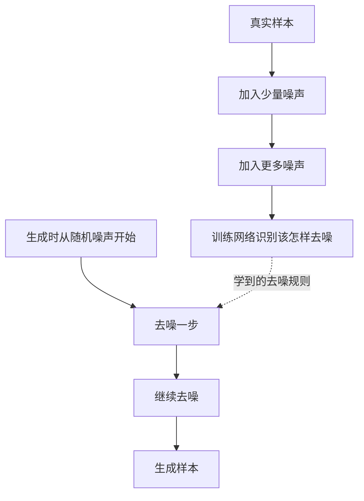
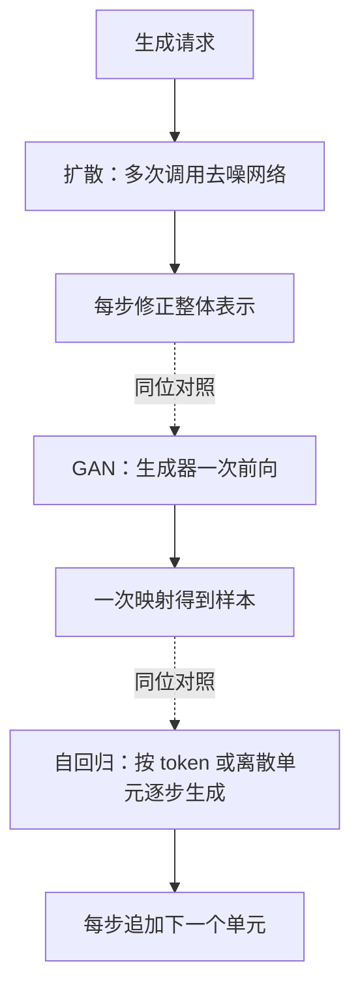
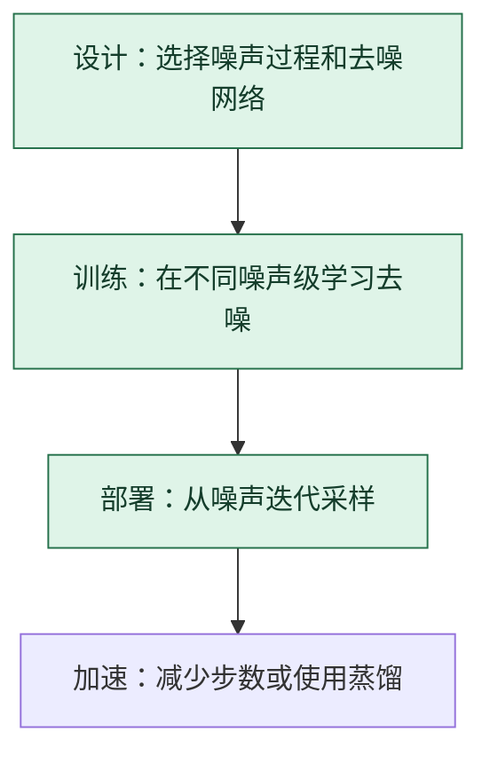

# 扩散模型：学习把逐渐加上的噪声一步步去掉

> **看图目标**：看完能区分训练时的加噪监督与生成时的迭代去噪，并说明扩散模型和 GAN 是生成方案的不同选择。

## 为什么需要它

扩散模型把复杂数据生成拆成许多较小的去噪步骤。训练时从真实样本构造不同噪声程度的样本，让网络学习预测噪声或恢复方向；生成时从噪声开始反复调用网络。

## 主图

训练中的加噪是制造监督任务；真正生成时走相反方向。不是把一张图加噪后再原样取回。

## 对照图

虚线表示生成方案对照，不表示先后运行。三者的“多步”含义不同：扩散反复修正表示，自回归逐步追加内容。

## 生命周期位置

扩散模型同时包含训练规则和生成流程；部署优化通常在不重新定义任务的前提下减少采样成本。

## 同一位置的不同选择

| 生成方案 | 每次生成怎样推进 | 常见效果与代价 |
|---|---|---|
| 扩散模型 | 多步修正噪声表示 | 生成质量与覆盖常较稳，延迟取决于采样步数 |
| GAN | 生成器一次前向 | 生成快，训练稳定性与模式覆盖需关注 |
| 自回归模型 | 逐个生成离散单元 | 条件控制自然，长输出延迟随步数增长 |

## 采用判断

| 采用前后要问 | 扩散模型的答案 |
|---|---|
| 主要优势 | 把生成拆成稳定的去噪任务，通常能兼顾样本质量、覆盖和条件控制 |
| 主要局限 | 生成需要多步网络调用，延迟和能耗较高；减少步数、引导增强和蒸馏都可能改变质量 |
| 适合考虑 | 图像、音频或视频生成重视质量和可控性，且部署能承担多步采样成本时 |
| 不适合直接采用 | 严格实时、低功耗或高吞吐场景，尚未证明扩散收益足以覆盖采样延迟时 |
| 采用后必须检查 | 采样步数与质量曲线、多样性、条件遵循、伪影、安全过滤、端到端延迟和单位样本成本 |

## 看图复述

遮住正文，只看三张图回答：

1. 训练时为什么要主动给真实样本加噪？
2. 生成时从真实样本还是随机噪声开始？
3. 减少采样步数主要改变训练数据还是部署成本？

能说出“训练学去噪，生成从噪声多步还原，与 GAN 是同位方案”即可。

## 方法边界

- 图省略噪声调度、预测目标、潜空间扩散、条件引导和采样器差异。
- 去噪步数更少不保证质量不变，必须在目标任务上比较。
- 图像最常见，但扩散思想也可用于音频、视频和其他连续或离散表示。
