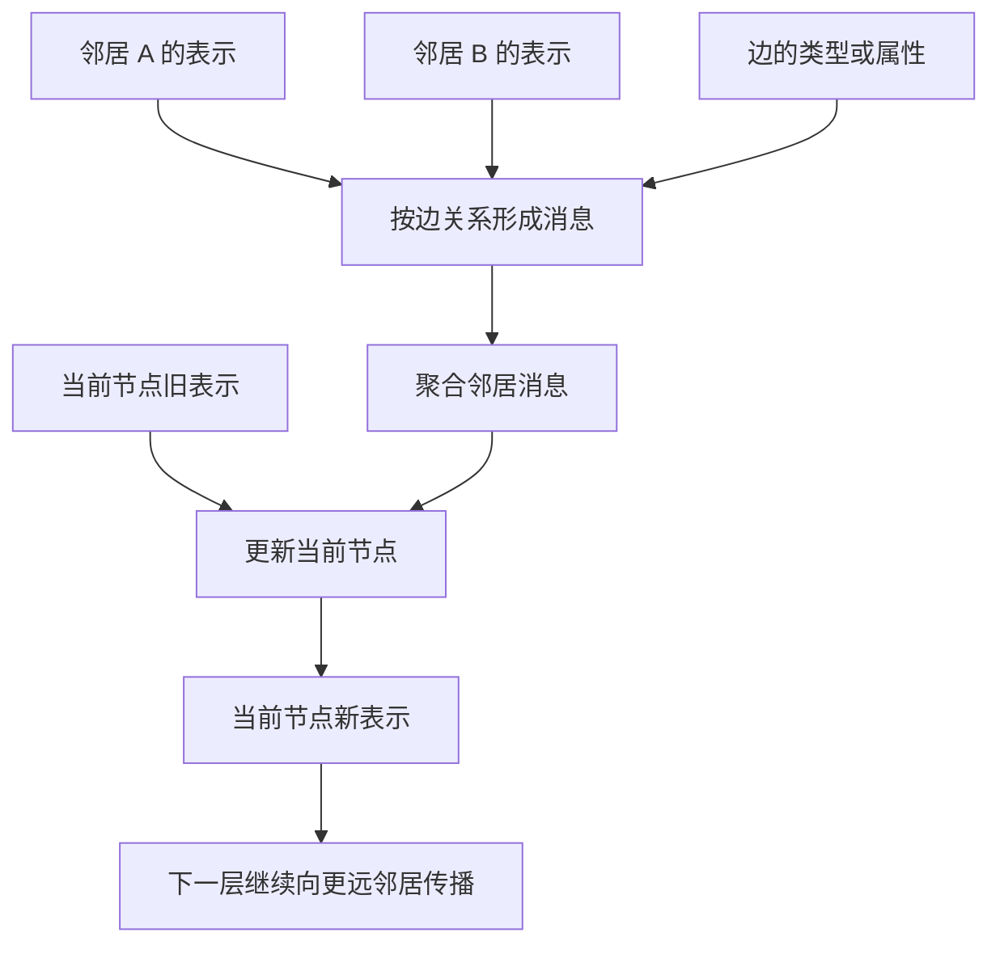
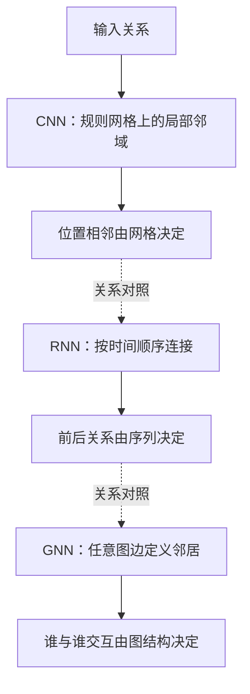
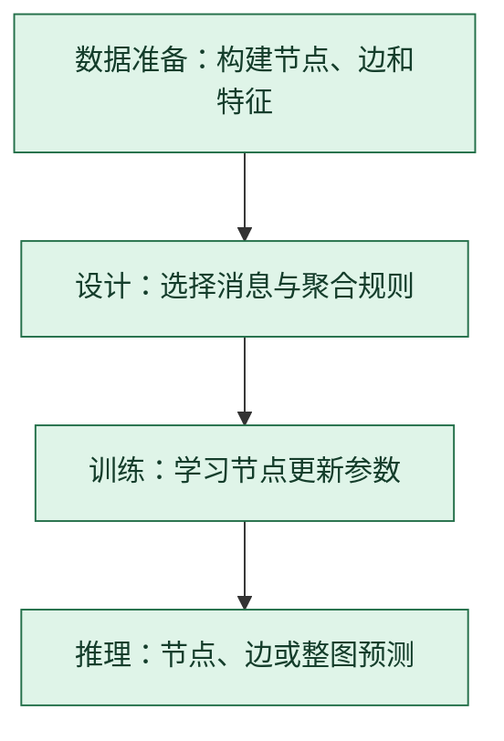

# 图神经网络 GNN：让节点从邻居收集消息

> **看图目标**：看完能说出消息传递中的邻居聚合与节点更新，并区分图结构、序列结构和网格结构。

## 为什么需要它

分子、社交关系、知识图谱和推荐系统中的对象常由任意连接关系组成，既不是规则网格，也不是单一序列。GNN 让每个节点从相邻节点和边收集消息，再更新自己的表示。

## 主图

一层通常只直接读取一跳邻居；堆叠多层后，信息可以传播到更远节点。

## 对照图

虚线表示关系结构对照，不表示依次运行。三者都可做局部信息传播，但“邻居”由不同结构定义。

## 生命周期位置

GNN 不只在架构层有选择，图怎样构建也会直接改变模型能看到的关系。

## 同一位置的不同选择

| 关系建模选择 | 邻居来源 | 常见效果与代价 |
|---|---|---|
| CNN | 固定网格窗口 | 规则高效，不适合任意连接 |
| RNN | 时间前后关系 | 适合有顺序的数据，结构较单一 |
| GNN | 显式图边 | 能利用关系结构，但图构建和大图计算成本重要 |
| 图 Transformer | 图上注意力或全局连接 | 交互更灵活，内存与计算可能更高 |

## 采用判断

| 采用前后要问 | GNN 的答案 |
|---|---|
| 主要优势 | 把显式关系结构写进信息流，能让节点、边和整图任务直接利用邻居证据 |
| 主要局限 | 结果高度依赖图构建；大图计算、邻居爆炸、过平滑和关系泄漏都可能造成问题 |
| 适合考虑 | 节点与边有明确业务或科学含义，而且这些关系能在推理时合法获得时 |
| 不适合直接采用 | 只是把普通表格勉强连成图，边来源不可信，或数据切分会让测试关系泄漏到训练时 |
| 采用后必须检查 | 边与标签泄漏、不同度数节点、孤立节点、关系漂移、层数过平滑、大图延迟和采样偏差 |

## 看图复述

遮住正文，只看三张图回答：

1. 当前节点的新表示来自哪些对象？
2. GNN 与 CNN 对“邻居”的定义有何不同？
3. 为什么图构建属于生命周期中的重要决策？

能说出“沿图边收消息、聚合后更新、图结构决定可见关系”即可。

## 方法边界

- 图省略有向边、多关系图、注意力聚合、采样和批处理。
- 堆叠更多层可能带来过平滑或信息瓶颈，不保证看得越远越好。
- 图中的边可能来自规则、数据或模型预测，错误边会限制后续结论。
