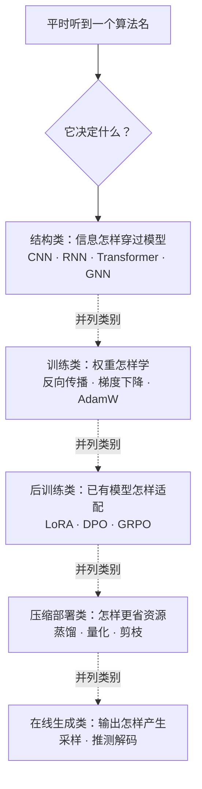
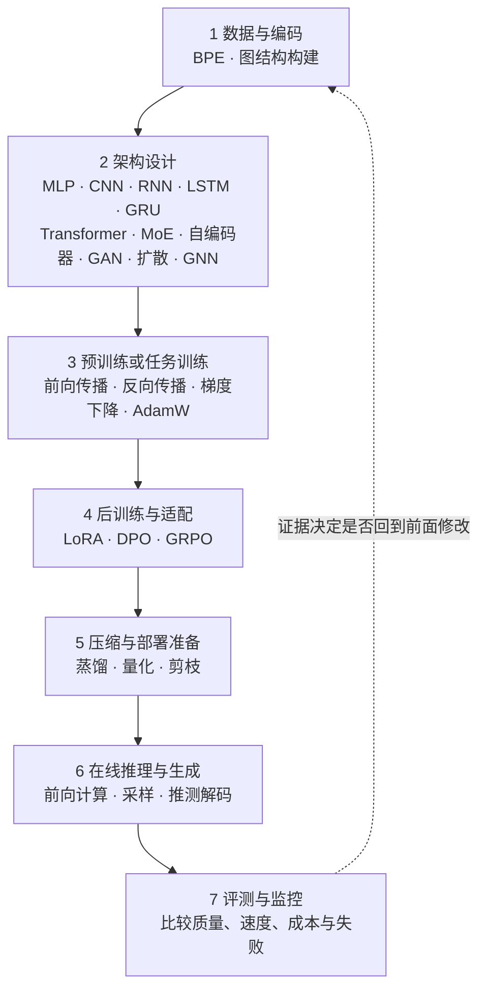
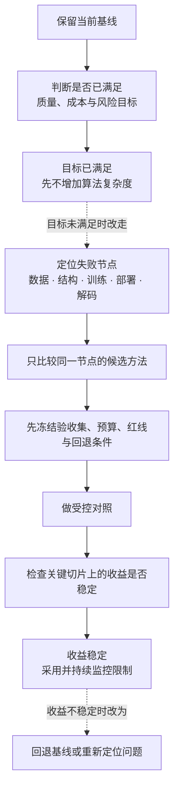
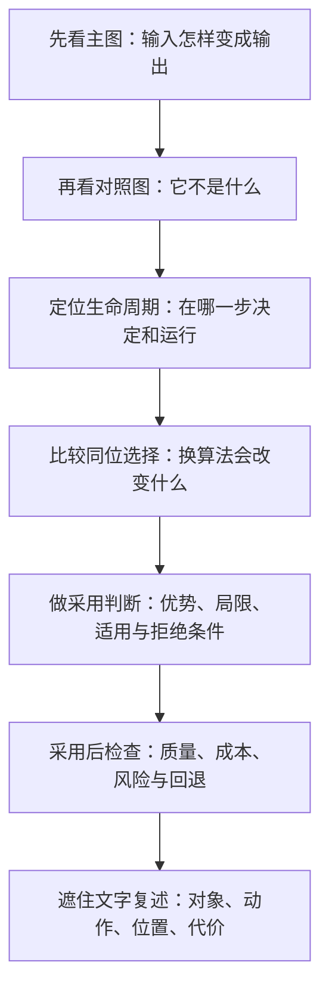

# 模型算法图解

这个目录集中回答三个问题：**算法在搬什么信息、位于模型生命周期哪一段、同一个位置换成别的算法会发生什么？**

这里不把一张图冒充完整实现。每章用图讲信息流、生命周期位置和同类选择，并用“为什么不是随便设计的”做部件删减检查；当公式正是核心机制时，给出最小可核对关系，再把完整推导回链正式课程。公式不是核心时，用状态转移、约束或反例证明。质量、速度和泛化收益仍以受控实验为准。

## 先分清：它们不是同一种“算法”

虚线只是把五类名称纵向排开，不表示生命周期先后。CNN 与 Transformer 可以是同一“模型主干”位置上的不同选择；AdamW 不替代 CNN，它负责训练 CNN 或其他网络中的权重；量化也不替代 Transformer，它改变训练后权重的表示和执行方式。

## 一张图定位模型生命周期

同一算法可能跨多个节点：模型结构在设计时确定，训练与推理都会运行；BPE 的规则在数据准备时建立，训练与推理必须一致；蒸馏通常发生在部署前，但本身仍是一段训练。

## 该不该用：从失败证据出发

虚线表示条件不满足时改走另一条路径，不表示先采用再回退。算法名不是采用理由。“别人都在用”“参数更多”“理论计算更少”都只是线索，不能替代目标设备、真实数据和固定验收口径下的证据。

| 决策阶段 | 必须回答 |
|---|---|
| 采用前 | 当前基线到底失败在哪里？新方法作用在同一个节点吗？ |
| 对照时 | 质量、延迟、吞吐、显存、成本和风险是否使用同一口径？ |
| 采用后 | 哪些输入、长度、群体或负载最容易触发该方法的固有限制？ |
| 持续运行 | 指标漂移到什么程度必须降级、回滚或重新训练？ |

## 模型结构：同一位置的不同信息路线

| 图解 | 主要关系 | 常见效果与代价 |
|---|---|---|
| [神经网络与 MLP](15-神经网络与MLP.md) | 多层前馈特征组合 | 基础通用，但不主动利用空间或时间结构 |
| [卷积神经网络 CNN](16-卷积神经网络CNN.md) | 共享卷积核扫描局部邻域 | 局部先验强，全局关系通常靠层叠扩大 |
| [循环神经网络 RNN](17-循环神经网络RNN.md) | 状态沿时间递归传递 | 流式自然，训练并行与长依赖受限 |
| [LSTM](18-LSTM长短期记忆网络.md) | 三类门控制细胞状态 | 长依赖通常更稳，参数和计算更多 |
| [GRU](19-GRU门控循环单元.md) | 两类门维护单一状态 | 比 LSTM 紧凑，效果仍需按任务验证 |
| [Transformer](20-Transformer架构.md) | 注意力交换位置，MLP 变换特征 | 并行性强，长上下文计算和缓存较高 |
| [自注意力](02-自注意力.md) | 当前位置按内容读取其他位置 | 动态全局或受限交互，但不是完整模型 |
| [MoE 专家路由](06-MoE专家路由.md) | 每个 token 选择少数专家 | 总容量可增大，也引入路由和负载问题 |
| [自编码器](21-自编码器.md) | 编码到瓶颈再重建 | 适合表示学习，重建好不等于任务效果好 |
| [生成对抗网络 GAN](22-生成对抗网络GAN.md) | 生成器与判别器对抗 | 生成快，训练稳定性与模式覆盖需关注 |
| [扩散模型](23-扩散模型.md) | 从噪声多步还原 | 生成质量常较稳，采样步数影响延迟 |
| [图神经网络 GNN](24-图神经网络GNN.md) | 节点沿图边聚合邻居 | 利用任意关系，图构建与大图成本重要 |

## 数据、训练、后训练与部署

### 数据与编码

- [BPE 分词](01-BPE分词.md)：文本怎样按固定规则切成 token；同位选择还有 WordPiece、Unigram 和字符级方案。

### 训练与优化

- [反向传播](03-反向传播.md)：输出误差怎样逐层变成梯度。
- [梯度下降](04-梯度下降.md)：梯度怎样变成局部下降方向。
- [AdamW 优化器](05-AdamW优化器.md)：历史方向、尺度和权重衰减怎样共同影响更新；同位选择还有 SGD、Momentum、Adam 等。

### 后训练与对齐

- [LoRA 低秩适配](07-LoRA低秩适配.md)：冻结基座时，少量新增参数怎样形成权重增量；它与全参数微调、Adapter、提示调优同位比较。
- [DPO 偏好优化](08-DPO偏好优化.md)：成对偏好怎样直接推动策略靠近获选回答。
- [GRPO 组相对策略优化](09-GRPO组相对策略优化.md)：同一问题的一组回答怎样形成相对更新信号；它与 PPO、DPO 等后训练路线比较。

### 压缩与生成

- [知识蒸馏](10-知识蒸馏.md)：学生模型怎样学习教师信号。
- [模型量化](11-模型量化.md)：怎样用更少 bit 表示数值，并保留校准与任务检查。
- [模型剪枝](12-模型剪枝.md)：怎样删除部分结构，并确认硬件是否真的受益。
- [采样解码](13-采样解码.md)：候选分数出来后，贪心、temperature、top-k、top-p 怎样改变确定性和多样性。
- [推测解码](14-推测解码.md)：草稿模型怎样提议、目标模型怎样验证；它优化速度，不替代采样质量规则。

## 每章统一回答什么

听到一个新名词时，不要先背缩写。先问：它改变的是**数据、结构、训练更新、权重表示，还是输出选择**？只有作用在同一个对象、同一个节点的方法，才值得直接比较“谁效果更好”；只有通过预设验收且限制可监控、可回退的方法，才值得采用。

## 建议阅读路线

- 刚听到“神经网络、CNN”：先看 [神经网络与 MLP](15-神经网络与MLP.md)，再看 [CNN](16-卷积神经网络CNN.md)。
- 想理解 Transformer 为何流行：按 [RNN](17-循环神经网络RNN.md) → [LSTM](18-LSTM长短期记忆网络.md) → [Transformer](20-Transformer架构.md) → [自注意力](02-自注意力.md) 阅读。
- 想理解图像生成：对照 [自编码器](21-自编码器.md)、[GAN](22-生成对抗网络GAN.md) 与 [扩散模型](23-扩散模型.md)。
- 想定位大模型训练：按 BPE → Transformer → 反向传播 → AdamW → LoRA / DPO / GRPO → 量化 → 采样阅读。

## 收录边界

这一目录现在覆盖与神经网络、大语言模型和常见多模态模型直接相关的稳定算法家族，不声称收录所有机器学习算法。线性回归、逻辑回归、决策树、SVM、k-means 等经典机器学习方法属于另一条基础路线；不应为了“数量完整”把它们与大模型生命周期硬塞在一张图里。后续新增章节仍按“一个稳定家族、一章主图、明确生命周期和同位选择”的规则进入。

当前目录按课程责任覆盖数据编码、模型内部机制与架构、训练优化、后训练、压缩部署和在线推理等层。这里的“完整”指这些层都有入口，并且每章都回答机制、生命周期、同位选择、采用条件与方法边界；它不是“全部模型算法大全”。

跨算法的基础机制继续由正式课程承担：激活函数与损失函数见 [D04：神经网络如何学习](../01-14天理论课/D04-神经网络如何学习.md)，位置机制、归一化与残差见 [D06：拼出完整 Transformer](../01-14天理论课/D06-拼出完整Transformer.md)。

SFT、PPO 与 RLHF 见 [D11](../01-14天理论课/D11-SFT、LoRA与QLoRA.md) 和 [D12](../01-14天理论课/D12-对齐、强化学习与评测.md)，KV Cache 与执行优化见 [D07](../01-14天理论课/D07-模型一次运行到底发生什么.md) 和 [软硬件瓶颈](../06-拓展知识库/软硬件瓶颈/00-AI-Infra全栈责任地图.md)。它们没有被遗漏，只是不在本目录重复拆章。

CNN、RNN、LSTM、GRU、自编码器、GAN、扩散模型与 GNN 目前只有独立图解，没有一一对应的正式课程。相关章节提供的是第一张机制地图和采用边界，不能据此声称已经覆盖完整公式、训练证据或工程实现；后续补正式课程时再建立直接回链。
